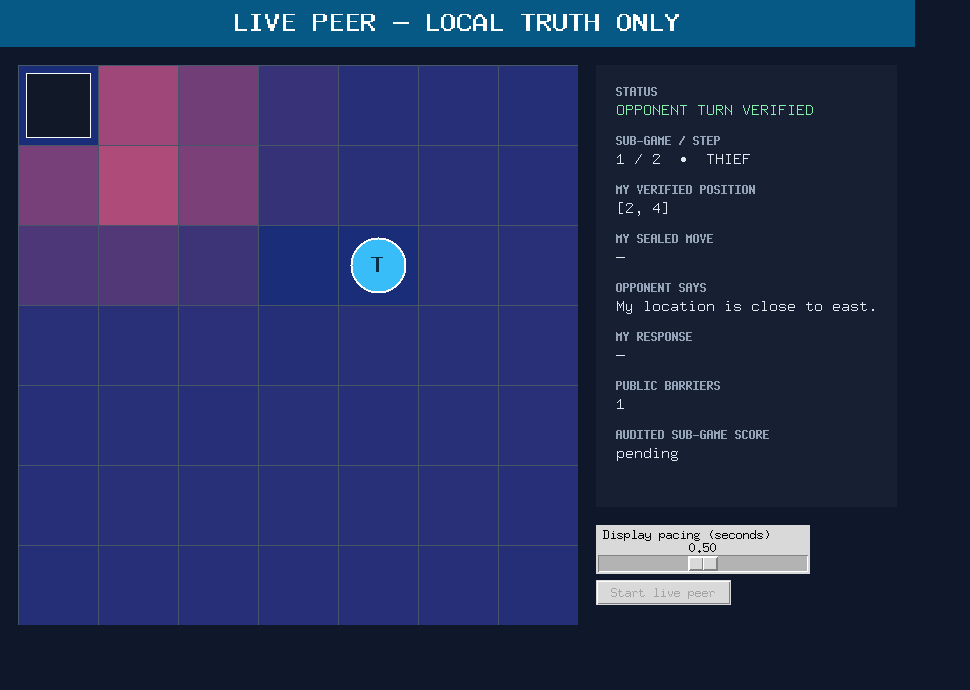
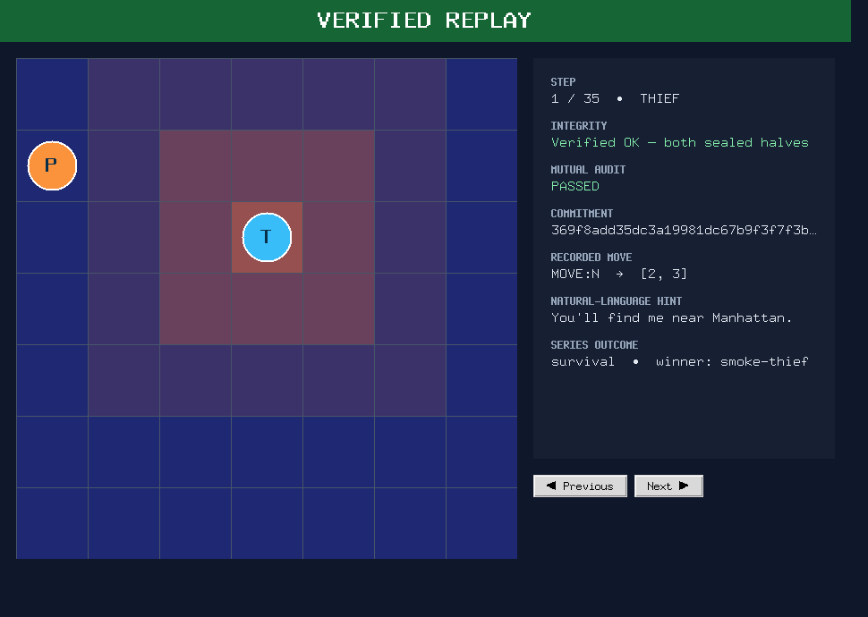
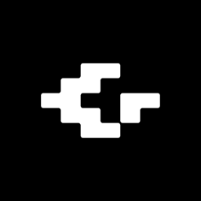

# ZeroOne0 Thief Peer

> A decentralized evasion agent that survives through partial information, seals every move, and proves every result without a central referee.

[](https://www.python.org/)
[](https://docs.astral.sh/uv/)
[](https://github.com/evya1/thief_repo/actions/workflows/ci.yml)
[](LICENSE)

**Course:** [Final Project](docs/PRD.md) · **Group:** [`ZeroOne0`](docs/evidence/games/ZeroOne0-vs-bestteam/game.json) · **Sibling:** [Police repository](https://github.com/evya1/police_repo)

| Live GUI — local truth and belief | Replay GUI — verified result |
| --------------------------------- | ---------------------------- |
| [](docs/assets/live-gui.png) | [](docs/assets/replay-gui-verified.png) |

**Live GUI:** actual runtime output; the local player sees its own local state and belief representation while the opponent's hidden state remains private.

**Replay GUI:** revealed tracks are displayed after transcript and commitment verification succeeds.

## 60-second verified demo

Run from the repository root. It installs the locked environment, runs the quality gate, completes a credential-free loopback series, verifies the real counted match through the Replay GUI service, and audits all six subgames.

```sh
uv sync --locked --all-groups
uv run ruff check .
uv run pytest
DEMO_ROOT="$(mktemp -d)"
uv run python scripts/smoke_replay_integration.py \
  --config config/game.json --artifact-root "$DEMO_ROOT" --json
uv run python scripts/replay_gui.py \
  docs/evidence/games/ZeroOne0-vs-bestteam/kit-reference-v3 --verify-only
uv run python scripts/replay.py \
  docs/evidence/games/ZeroOne0-vs-bestteam/internal-replay/a42b2bb2-2312-c679-5e69-fa3d5ea0aad9 --json
```

Expected: Ruff and pytest pass; the loopback result is settled with `replay_verdict: verified_ok`; Replay GUI verification reports `verified_ok`; the audit reports six verified subgames and zero tampered subgames.

## What the agent does

The Thief peer evades from a probability distribution rather than hidden opponent truth. Its deterministic policy scores every legal move by distance, mobility, freshness, and trap risk, excludes confident threat cells, and preserves escape routes without placing barriers.

The peer also:

- owns only local truth and never sends objective hidden state to strategy or Live GUI;
- exchanges natural-language hints and protocol messages over FastMCP;
- commits before reveal, validates peer evidence, and rejects tampering;
- completes six-subgame series with alternating roles and deterministic scoring;
- publishes replay, declaration, configuration, log, result, audit, and reporting evidence;
- keeps optional model wording and Gmail delivery behind one rate-limited Gatekeeper.

## System architecture

| Layer | Responsibility | Primary location |
| --- | --- | --- |
| Domain/config | Board rules, movement, barriers, scoring, shared contract | `common/domain/`, `config/` |
| Belief/scent | Local opponent distribution and deterministic observations | `src/thief_peer/belief/` |
| Strategy | Role-specific action choice; no objective opponent state | `src/thief_peer/strategy/` — evasion policy |
| Runtime | Lifecycle, deadlines, retry, recovery, six-game orchestration | `src/thief_peer/runner.py` |
| Transport | Symmetric FastMCP server/client and wire profiles | `common/transport/` |
| Integrity | Canonical bytes, Commit-Reveal, replay and audit | `common/transport/canonical.py`, `common/transport/audit.py`, `common/transport/replay.py` |
| Reporting | Replay/kit bundles, agreement, Gmail composition | `src/thief_peer/reporting/` |
| UI | Production Live GUI and verified read-only Replay GUI | `src/thief_peer/live_gui.py`, `src/thief_peer/replay_gui.py` |

The programmatic entry point is [`src/thief_peer/sdk.py`](src/thief_peer/sdk.py). Architecture decisions and protocol boundaries are documented in [`docs/PLAN.md`](docs/PLAN.md) and [`docs/contracts/`](docs/contracts/).

## Game and protocol flow

1. Both peers load the same shared JSON contract and lock its digest.
2. Step 0 exchanges identity, repositories, role commits, model declaration, and protocol profile.
3. The acting peer derives a legal move from local state, scent, and belief.
4. State, move, intent, and nonce are sealed before the peer receives the reveal.
5. FastMCP transports the symmetric request/response without a central judge.
6. Each peer validates legality, ordering, deadlines, commitments, and revealed records.
7. Belief and local runtime state advance; retry and watchdog logic preserve bounded recovery.
8. Six subgames settle under the agreed role schedule and scoring table.
9. Result agreement, replay publication, audit, reporting, and GUI replay use the same immutable evidence.

Protocol details: [CLI](docs/CLI.md), [peer wire contract](docs/contracts/CT-03-peer-wire.md), [Commit-Reveal](docs/mechanisms/M-05-commit-reveal-integrity.md), and [result agreement](docs/contracts/CT-08-result-agreement.md).

## Installation

Prerequisites are Git and [`uv`](https://docs.astral.sh/uv/). Python 3.12 and all dependency versions are resolved from `uv.lock`.

```sh
git clone https://github.com/evya1/thief_repo.git
cd thief_repo
git checkout master
uv sync --locked --all-groups
```

No credentials are required for tests, local loopback play, replay, or audit verification. OpenRouter and Gmail integrations fall back or remain dry-run unless explicitly configured.

## Running a local match

This public-SDK smoke command composes both roles over an in-memory loopback, runs all six subgames, publishes internal and reference-kit bundles, reloads them, and verifies the replay:

```sh
LOCAL_ARTIFACTS="$(mktemp -d)"
uv run python scripts/smoke_replay_integration.py \
  --config config/game.json \
  --artifact-root "$LOCAL_ARTIFACTS" \
  --seed 42 \
  --json
```

For a two-process FastMCP run, start the Police and Thief commands documented in [`docs/CLI.md`](docs/CLI.md) from their respective repositories.

## Running against an external peer

Copy `config/game.toml.example` to an untracked private file, fill only the publication-intended identity and runtime endpoint values, and agree on the byte-identical shared match contract before Step 0.

```sh
PEER_MCP_URL="https://opponent.example/mcp"
PUBLIC_MCP_URL="https://zeroone0.example/mcp"
uv run thief-peer \
  --listen-host 0.0.0.0 \
  --listen-port 8102 \
  --peer-url "$PEER_MCP_URL" \
  --public-url "$PUBLIC_MCP_URL" \
  --shared-config config/game.json \
  --private-config config/game.toml.example \
  --group-id ZeroOne0 \
  --group-code-confirmed \
  --mode counted \
  --wire-profile reference-v3 \
  --artifacts-dir artifacts/counted
```

The opponent runs its symmetric role command. Public URLs are operator-supplied; secrets, OAuth files, private endpoints, and keys are never committed. See [configuration](config/README.md).

## GUI usage

Start the production peer with its local-truth window:

```sh
uv run python scripts/live_gui.py \
  --mode live \
  --shared-config config/game.json \
  --artifacts-dir artifacts/live
```

Open the verified real-match replay:

```sh
uv run python scripts/replay_gui.py \
  docs/evidence/games/ZeroOne0-vs-bestteam/kit-reference-v3
```

Use `--verify-only` on a headless host. The Live GUI receives redacted production events; Replay remains read-only and reveals both tracks only after verification.

## Replay and audit verification

Headless Replay GUI verification:

```sh
uv run python scripts/replay_gui.py \
  docs/evidence/games/ZeroOne0-vs-bestteam/kit-reference-v3 --verify-only
```

Full six-subgame immutable-bundle audit:

```sh
uv run python scripts/replay.py \
  docs/evidence/games/ZeroOne0-vs-bestteam/internal-replay/a42b2bb2-2312-c679-5e69-fa3d5ea0aad9 \
  --json
```

Cross-repository parity:

```sh
uv run python scripts/check_replay_parity.py \
  --sibling-root ../police_repo
```

Exit `0` means verified; replay verification distinguishes illegal, invalid/incomplete, and tampered evidence with dedicated nonzero statuses.

## Confirmed match results

The canonical completed game artifact is [`game.json`](docs/evidence/games/ZeroOne0-vs-bestteam/game.json).

| Field | Confirmed value |
| --- | --- |
| Game ID | `ZeroOne0-vs-bestteam` |
| Game UID | `a42b2bb2-2312-c679-5e69-fa3d5ea0aad9` |
| Mode | `counted` |
| Opponent | `bestteam` |
| Match time | 2026-08-24, approximately 22:31–22:44 |
| Natural role | Thief |
| Series | Six completed subgames; settled `true` |
| Audit | `audit_ok: true` in every subgame |
| Roles | ZeroOne0 Police in 1, 3, 5; Thief in 2, 4, 6 |
| Final score | ZeroOne0 35 — bestteam 75 |

This completed external series contains real play by ZeroOne0 in both Police and Thief roles. Replay verification checks 309 sealed records: six verified subgames, zero tampered.

## Evidence and submission artifacts

| Evidence | Repository path |
| --- | --- |
| Canonical game artifact | [`game.json`](docs/evidence/games/ZeroOne0-vs-bestteam/game.json) |
| Match configuration/agreement | [`config/matches/ZeroOne0-vs-bestteam-20260824.json`](config/matches/ZeroOne0-vs-bestteam-20260824.json) |
| Declaration/identity evidence | [`declaration_ZeroOne0-vs-bestteam.json`](docs/evidence/games/ZeroOne0-vs-bestteam/kit-reference-v3/declaration_ZeroOne0-vs-bestteam.json) |
| Six per-subgame configurations | [`kit-reference-v3/`](docs/evidence/games/ZeroOne0-vs-bestteam/kit-reference-v3/) |
| Six logs and transcript records | [`kit-reference-v3/`](docs/evidence/games/ZeroOne0-vs-bestteam/kit-reference-v3/) |
| Result and agreement evidence | [`result_ZeroOne0-vs-bestteam.json`](docs/evidence/games/ZeroOne0-vs-bestteam/kit-reference-v3/result_ZeroOne0-vs-bestteam.json) |
| Immutable replay and manifest | [`internal-replay/a42b2bb2-2312-c679-5e69-fa3d5ea0aad9/`](docs/evidence/games/ZeroOne0-vs-bestteam/internal-replay/a42b2bb2-2312-c679-5e69-fa3d5ea0aad9/) |
| Audit/reporting provenance | [`provenance.json`](docs/evidence/games/ZeroOne0-vs-bestteam/provenance.json) |
| GUI proof | [Live](docs/assets/live-gui.png) · [Replay](docs/assets/replay-gui-verified.png) |
| Match evidence index | [`docs/evidence/games/ZeroOne0-vs-bestteam/README.md`](docs/evidence/games/ZeroOne0-vs-bestteam/README.md) |

Reporting composition, validation, settlement, replay publication, and Gmail delivery are documented under [`docs/reporting/`](docs/reporting/).

## Testing and quality gates

The release gate is reproducible locally and in [GitHub Actions](https://github.com/evya1/thief_repo/actions/workflows/ci.yml):

```sh
uv sync --locked --all-groups
uv run ruff check .
uv run pytest
uv run python scripts/check_markdown_links.py
uv run python scripts/check_docs_present.py
uv run python scripts/run_quality_gates.py
git diff --check
```

The suite enforces Ruff, 85% aggregate coverage, documentation presence, local Markdown links, task IDs, the 150-logical-line policy, secret/archive checks, and least-privilege workflows. Replay and parity commands above are part of release verification.

## Submission readiness

- [x] Completed Thief implementation and production FastMCP wiring
- [x] Completed local-truth Live GUI and verified Replay GUI
- [x] Completed Commit-Reveal, replay, audit, and tamper rejection
- [x] Completed six-subgame counted external match against `bestteam`
- [x] Completed reporting, agreement, declaration, and artifact integration
- [x] Completed tests, coverage, documentation, links, and quality gates
- [x] Confirmed group code `ZeroOne0` and sibling repository
- [x] Merged release on `master` with annotated `v1.0-submission` tag

The exact tagged commit is the submission release. No generated credentials, private identifiers, or secret material are part of the repository.

## Repository structure

| Path | Contents |
| --- | --- |
| `common/` | Shared deterministic domain, protocol, integrity, and replay code |
| `src/thief_peer/` | Thief-specific strategy, runtime, UI, SDK, reporting, and infrastructure |
| `config/` | Shared contract, role-local example, quality policy, completed match configuration |
| `scripts/` | Live/Replay entry points, smoke test, parity, quality, and reporting utilities |
| `tests/` | Unit, property, integration, interoperability, GUI, replay, and reporting tests |
| `docs/` | Architecture, contracts, mechanisms, detailed reports, tasks, and evidence |
| `docs/evidence/games/` | Completed real-match artifact bundles |
| `.github/workflows/ci.yml` | Locked install, Ruff, pytest/coverage, and repository gates |

## AI/LLM usage and costs

<!-- ai-usage:start -->
<!-- generated aggregate data only -->
## AI Usage

This dashboard combines private-input OpenRouter activity with a committed, sanitized Claude Code aggregate. Only aggregate categories and calendar-day buckets are published.

<picture>
  <source media="(prefers-color-scheme: dark)" srcset="docs/assets/ai-usage-dark.svg">
  <source media="(prefers-color-scheme: light)" srcset="docs/assets/ai-usage-light.svg">
  
</picture>

### Reconciliation

| Metric | Aggregate |
| --- | ---: |
| Combined reported spend | **$292.07** (`$292.074392` reconciled) |
| OpenRouter reported spend | $40.874392 |
| Claude Code reported spend | $251.20 |
| OpenRouter requests | 4,142 |
| Claude Code sessions | 18 |
| Combined non-cache input / prompt tokens | 309,147,592 |
| Combined non-cache output / completion tokens | 3,191,327 |

OpenRouter covers calendar days `2026-08-17` through `2026-08-21`. No Claude Code date range was inferred. Requests and sessions remain separate activity units.

### Claude Code model summary

| Model | Session appearances | Input | Output | Cache read | Cache write | Attributed reported cost |
| --- | ---: | ---: | ---: | ---: | ---: | ---: |
| Opus 5 | 12 | 21,178 | 499,000 | 1,058,600,000 | 31,504,200 | $197.17 |
| Sonnet 5 | 7 | 3,887 | 31,910 | 508,600,000 | 13,444,900 | $38.19 |
| Opus 4.8 | 1 | 877 | 3,200 | 190,200,000 | 10,300,000 | $0.00 |
| Haiku 4.5 | 1 | 452 | 106 | 1,800,000 | 508,200 | $0.19 |
| Unallocated multi-model session | — | — | — | — | — | $15.65 |
| **Total** | **18 sessions** | **26,394** | **534,216** | **1,759,200,000** | **55,757,300** | **$251.20** |

Session appearances are not additive because a session may use more than one model. Cache reads and cache writes are reported separately and are not treated as normal input tokens.

### OpenRouter model summary

| Model | Provider | Requests | Prompt tokens | Completion tokens | Total reported cost | Share of cost |
| --- | --- | ---: | ---: | ---: | ---: | ---: |
| [Google: Gemini 3.7 Flash](https://openrouter.ai/google/gemini-3.7-flash) | Google | 3,077 | 249,543,651 | 1,613,321 | $23.81 | 58.23% |
| [Z.ai: GLM 5.2](https://openrouter.ai/z-ai/glm-5.2) | <a href="https://openrouter.ai/provider/baidu"> Baidu Qianfan</a>, <a href="https://openrouter.ai/provider/crusoe"> Crusoe</a>, <a href="https://openrouter.ai/provider/decart"> Decart</a>, <a href="https://openrouter.ai/provider/friendli"> Friendli</a>, <a href="https://openrouter.ai/provider/gmicloud"> GMICloud</a>, <a href="https://openrouter.ai/provider/novita"> NovitaAI</a>, <a href="https://openrouter.ai/provider/siliconflow"> SiliconFlow</a>, <a href="https://openrouter.ai/provider/streamlake"> StreamLake</a> | 447 | 37,572,921 | 517,421 | $9.25 | 22.63% |
| [DeepSeek: DeepSeek V4 Pro 0813](https://openrouter.ai/deepseek/deepseek-v4-pro-0813) | <a href="https://openrouter.ai/provider/alibaba"> Alibaba Cloud Int.</a>, <a href="https://openrouter.ai/provider/gmicloud"> GMICloud</a>, <a href="https://openrouter.ai/provider/novita"> NovitaAI</a>, <a href="https://openrouter.ai/provider/parasail"> Parasail</a>, <a href="https://openrouter.ai/provider/siliconflow"> SiliconFlow</a>, <a href="https://openrouter.ai/provider/together"> Together</a> | 242 | 12,337,550 | 366,486 | $4.35 | 10.62% |
| [Google: Gemini 3.1 Pro Preview](https://openrouter.ai/google/gemini-3.1-pro-preview) | Google | 76 | 3,382,625 | 28,152 | $2.14 | 5.21% |
| [DeepSeek: DeepSeek V4 Pro 0423](https://openrouter.ai/deepseek/deepseek-v4-pro) | <a href="https://openrouter.ai/provider/baidu"> Baidu Qianfan</a> | 53 | 1,587,579 | 32,999 | $0.87 | 2.11% |
| [Google: Gemini 2.5 Pro](https://openrouter.ai/google/gemini-2.5-pro) | Google | 18 | 205,051 | 4,663 | $0.26 | 0.62% |
| [DeepSeek: DeepSeek V4 Flash 0731](https://openrouter.ai/deepseek/deepseek-v4-flash-0731) | <a href="https://openrouter.ai/provider/baidu"> Baidu Qianfan</a>, <a href="https://openrouter.ai/provider/digitalocean"> DigitalOcean</a>, <a href="https://openrouter.ai/provider/fireworks"> Fireworks</a>, <a href="https://openrouter.ai/provider/gmicloud"> GMICloud</a>, <a href="https://openrouter.ai/provider/morph"> Morph</a>, <a href="https://openrouter.ai/provider/novita"> NovitaAI</a>, <a href="https://openrouter.ai/provider/relace"> Relace</a> | 163 | 4,066,925 | 90,406 | $0.14 | 0.33% |
| [MoonshotAI: Kimi K2.6](https://openrouter.ai/moonshotai/kimi-k2.6) | <a href="https://openrouter.ai/provider/baidu"> Baidu Qianfan</a>, <a href="https://openrouter.ai/provider/decart"> Decart</a> | 8 | 100,584 | 826 | $0.03 | 0.07% |
| Other (15 models) | Multiple providers | 58 | 324,312 | 2,837 | $0.07 | 0.17% |

> Claude Code includes four sessions that reported $0.00. One $15.65 multi-model session is retained as unallocated rather than assigning its cost to a model without evidence.

Regenerate with a private input kept outside the repository:

```bash
python scripts/generate_usage_dashboard.py \
  --openrouter-input /absolute/private/path/openrouter_activity.csv \
  --claude-input data/claude-code-usage-aggregate.json \
  --output-dir docs/assets \
  --update-readme README.md
```
<!-- ai-usage:end -->

## Authors, course, and sibling repository

- **Team:** ZeroOne
- **Group code:** `ZeroOne0`
- **GitHub:** [evya1](https://github.com/evya1) · [Us5rName](https://github.com/Us5rName)
- **Course:** [Final Project requirements and implementation contract](docs/PRD.md)
- **Repositories:** [Police](https://github.com/evya1/police_repo) · [Thief](https://github.com/evya1/thief_repo)
- **License:** [Educational Use EULA](LICENSE), copyright © 2026 Dr. Yoram Segal / Gal Technologies Artificial Intelligence Ltd. (GTAI), all rights reserved

See [`CONTRIBUTING.md`](CONTRIBUTING.md) for development workflow. Use is limited by the binding terms in [`LICENSE`](LICENSE); licensing requests may be sent to `segal@gal-tech.ai`.
