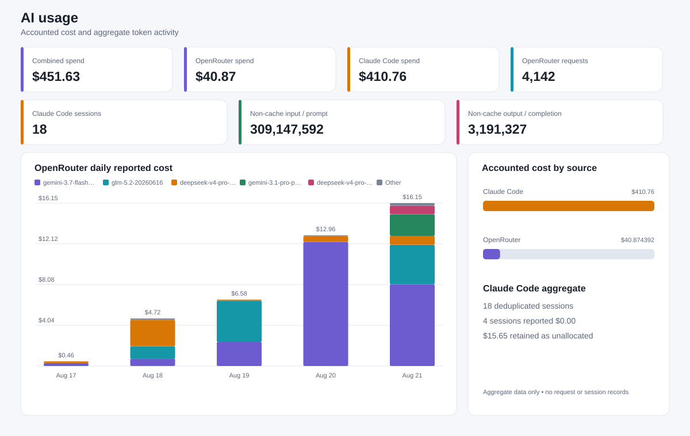

# P2P Thief Peer

> **Status** (verified against branch `claude/replay-llm-completion-20260823`, evidence-based, not
> a claim of full project completion): the C01 foundation (domain, scent/belief, configuration),
> C02 role strategy, C03 FastMCP transport/Commit-Reveal integrity, C04 orchestration/reliability,
> the headless Replay verifier and its internal-interop bundle/SDK/CLI (T033/T034/T046/T047), the
> central external-service Gatekeeper with reporting/llm lane reservation (T048), and the
> deterministic LLM hint boundary (T027) are implemented and tested. Not yet done: the
> provider-neutral/vendor LLM adapter and full LLM composition (T049/T013/T051), the selected-vendor
> LLM client (T050, blocked on `PLANQ-003`), league-kit protocol/lifecycle compatibility and its
> artifact projection (T052/T053) and the four live external kit runs under T022, official
> submission-schema compliance (blocked on `INPUT-001`/T016), a real GUI, real Replay/GUI
> screenshots, any counted external match, live Gmail-send evidence, and the `v1.0-submission` tag.
> No screenshot, benchmark, or league result exists yet. Per-task state is in `docs/TODO.md`.

This repository implements the autonomous Thief side of a two-peer Police/Thief system. It owns only its local truth and communicates with the sibling peer through FastMCP/MCP. The shared intent is in `docs/PRD.md`; the role-specific strategy is in `docs/PLAN.md`; execution state lives in `docs/TODO.md` and individual task files.

## Project overview

The target is a decentralized hidden-state pursuit game: the Thief process maintains local state, opponent belief, scent evidence, a separate strategy, Commit-Reveal integrity, Live GUI, Replay, resilience, and signed reporting. Its strategy objective is to evade through local belief, preserve escape routes, and answer capture claims truthfully.

Confirmed public team metadata:

- Team name: `ZeroOne`
- Team number: `01`
- GitHub handles: `evya1`, `Us5rName`
- Repository URLs: `https://github.com/evya1/police_repo`, `https://github.com/evya1/thief_repo`

Candidate awaiting confirmation:

- Final-project group code: `ZeroOne1` — eight characters, recorded here as a candidate. It must be confirmed against a human-approved team record (OPEN-003, OPEN-010) before it is used in any submitted artifact.

Legal names, government identifiers, and other private identity fields are never stored in repository artifacts.

Sibling repository: <https://github.com/evya1/police_repo>.

## Source-of-truth order

1. Official project specification and official software-quality guide.
2. Repository-local canonical requirements, open items, and traceability in `docs/spec/`, plus authoritative input status in `docs/inputs/INPUT_REGISTER.md`.
3. `docs/PRD.md` for intent and required behavior.
4. `docs/PLAN.md` for this repository's technical strategy.
5. `docs/TODO.md` and `docs/tasks/T###-*.md` for execution state and evidence.

Conflicts stop work and go to the orchestrator. Workers do not silently update the PRD, PLAN, task dependencies, or scope.

## Architecture

The architecture separates domain rules, scent/belief, thief strategy, orchestration/state, FastMCP transport, integrity/audit, reliability, reporting, and GUI/Replay, exposing business behavior through one thin programmatic facade. See `docs/PLAN.md` for the boundaries and the target tree; a path in that tree is not an implementation-status claim.

Implemented on this branch: shared domain and configuration modules under `common/`; the role
strategy under `src/thief_peer/strategy/`; the FastMCP transport and Commit-Reveal integrity
core; the orchestrator state machine and reliability layer; the headless Replay
verifier/service/SDK/CLI (`src/thief_peer/replay_service.py`, `thief_peer.sdk.verify_replay_bundle`,
`scripts/replay.py`) over the internal-interop bundle (`src/thief_peer/reporting/replay_bundle.py`,
`replay_documents.py`); the central `ExternalApiGatekeeper` with `reporting`/`llm` lane reservation
(`src/thief_peer/infra/`); and the deterministic, privacy-bounded LLM hint plan (T027). Not yet
implemented: the real-time Live GUI, the provider-neutral/selected-vendor LLM adapter and full
composition (T049/T013/T051/T050), and league-kit protocol compatibility (T052/T053, see
`docs/decisions/ADR-011-league-kit-interoperability-boundary.md`).

## Installation

Prerequisite: a compatible `uv` installation. T002's validated `uv.lock` is committed; use:

```sh
uv sync --locked --all-groups
```

Do not install with `pip`, create a separate `requirements.txt`, or commit a lock outside `uv`'s
own resolution.

## Usage

Minimal CLI example:

```sh
uv run thief-peer --help
```

See [`docs/CLI.md`](docs/CLI.md) for entry points, options, local and remote examples, mode
behavior, configuration precedence, exit codes, and artifact boundaries.

See [`docs/reporting/README.md`](docs/reporting/README.md) for the reporting API and artifact flow.

**Replay (verified, works today).** `thief_peer.sdk.verify_replay_bundle(path)` is the sole
public entrypoint; `scripts/replay.py` is a thin CLI over it:

```sh
uv run python scripts/replay.py <bundle-dir>          # human-readable report
uv run python scripts/replay.py <bundle-dir> --json    # machine-readable report
```

Exit codes: `0` verified, `4` illegal, `5` invalid or incomplete, `6` tampered, `2` path/usage
error. A bundle directory has one `manifest_<game_uid>.json`, one `declaration_*`, six
`config_*_g<NN>.json`, six `log_*_g<NN>.json`, and one `result_*.json` — `schema_status:
internal_interop`, `external_authenticity=false`; this is not an official submission schema. See
`docs/evidence/replay/README.md`, `scripts/smoke_replay_integration.py` (produces a bundle from a
real settled series), and `scripts/check_replay_parity.py` (reciprocal cross-repo verification).

## Configuration

- `config/game.json`: shared, identical, cryptographically locked match contract.
- `config/game.toml`: private role-local choices; it cannot override or weaken a shared value.
- `.env`: local secret-bearing environment only; never commit it.
- `credentials.json` and `token.json`: local Gmail OAuth material; never commit them.
- Optional language-model hint boundary: T027's deterministic, privacy-bounded hint plan is
  implemented (local wording only, `NON_CLAIM` makes no provider call). The provider-neutral
  adapter that would let a real model render wording (T049), full composition (T051), and any
  selected vendor (T050) are not yet implemented; T050 stays blocked on `PLANQ-003`. No credential
  variable is predefined before a vendor is selected.

See `config/README.md`. Official reporting templates and the remaining private/team values are still missing and must not be guessed.

## Academic and technical explanation

### Dec-POMDP framing

The two agents act under partial observation: each knows its own position and locally known state, observes opponent scent and natural-language hints, maintains a belief distribution, and selects an action without a central judge. Rewards follow the fixed capture/survival/tie rules. `TODO_BEFORE_SUBMISSION`: relate the implemented state, observation, action, transition, and reward code to this framing with precise file links.

### Discrete pursuit on a bounded graph

There is no external judge: both agents compute the same transition function and terminal conditions from one pre-agreed, byte-identical contract (`config/game.json`, `CFG-001`), so there is no dispute about legality before play starts. One orthogonal step or stay per turn with no diagonal movement (`GAME-004`, `GAME-005`) ties the game to the cops-and-robbers pursuit family studied in graph theory. The board's minimum size of 7×7 (`GAME-001`) keeps the joint state space — the product of both agents' positions and every barrier layout — large enough that brute-force search over it is not a viable strategy, which is why heuristic and learned policies (`STRAT-007`) are the intended approach rather than exhaustive enumeration. The barrier quota (`GAME-008`) makes Police a spatial-resource manager: barriers must squeeze the Thief without accidentally cutting off Police's own reachable cells, since a placed barrier is irreversible for the rest of the game (`GAME-007`).

Scoring is asymmetric by design, not a binary win/lose: every terminal outcome pays both sides differently, and a technical loss zeros both sides regardless of position (`GAME-013`) — so protocol correctness is worth more than winning on the clock alone. `docs/decisions/ADR-001-shared-game-contract-shape.md` records the negotiated (non-official) shape of the contract file that carries these values, and `docs/spec/OPEN_QUESTIONS.md` OPEN-011 tracks the one unresolved ambiguity in the terminal-condition rules (whether the move cap and survival threshold are one event or two).

### FastMCP and orchestration dilemmas

The planned solution uses symmetric server/client peers, an explicit lifecycle state machine, immutable request deadlines, bounded retry, and audit evidence. `TODO_BEFORE_SUBMISSION`: document the implemented tool surface, public-connectivity procedure, failure handling, and measured interoperability evidence after OPEN-001/OPEN-007 are resolved.

### Implemented strategy

`TODO_BEFORE_SUBMISSION`: describe only the Thief strategy actually implemented and tested. Do not claim reinforcement learning. Add learning curves only if RL is genuinely used and its experiment is reproducible.

### Live GUI evidence

`TODO_BEFORE_SUBMISSION`: insert a real screenshot showing local truth and the opponent-belief heatmap without revealing objective opponent position.

### Replay evidence

`TODO_BEFORE_SUBMISSION`: insert a real Replay screenshot showing per-step `Verified OK` from a verified final log. Never manufacture a screenshot or edit a status into one.

## Testing and quality gates

Local and CI checks use the same three command groups:

```sh
uv run ruff check .
uv run pytest
uv run python scripts/run_quality_gates.py
```

The quality configuration enforces Ruff zero, 85% global coverage, required docs, task-ID/TODO
consistency, local Markdown links, secret/archive protection, and least-privilege workflow
permissions. The 150-logical-line cap now scans `src/` and `common/` as well as `tests/` and
`scripts/` (T040 repaired the earlier `source_dirs = []` blind spot); a small pinned
`[line_cap_baseline]` ratchet in `config/repo_quality.toml` names the historical files still over
the cap — no new file may join that list, and each entry must exactly match the file's current
line count.

Verification proceeds as a ladder — deterministic unit and golden-vector tests, a local two-process protocol smoke test, a full practice series, artifact validation, network readiness, an uncounted external game, and only then a counted game. The stages, their owning tasks, and their gates are recorded in `docs/PLAN.md`.

## Troubleshooting

- **Task cannot start:** inspect `depends_on` in its task file and the status of each prerequisite in `docs/TODO.md`.
- **Contract/config mismatch:** stop before Step 0; compare only the approved shared terms and record the exact mismatch without secrets.
- **Request timeout:** retain the original deadline, apply bounded configured retry, and preserve failure evidence.
- **Audit mismatch:** do not repair history; preserve the received commitment and revealed record and follow the TAMPERED path.
- **Gmail/OAuth issue:** do not broaden scopes or commit credential files; use mocks until the human live-send gate.
- **Optional provider timeout, 429, or budget limit:** preserve the already selected legal move, fall back to deterministic template text, and never make a live provider call from CI.
- `TODO_BEFORE_SUBMISSION`: add observed platform-specific failures and verified remedies.

## Contributing

Read `CONTRIBUTING.md` and `AGENTS.md`. Claim exactly one ready task, use its write set, run its verification, and hand off structured evidence. GitHub Issues and Pull Requests assist review but never replace the Markdown task graph.

## License and credits

`TODO_BEFORE_SUBMISSION`: the team must choose and document the repository license/credits policy before public release. Do not add a license notice or third-party attribution without verifying what is actually distributed and legally required.

<!-- ai-usage:start -->
<!-- generated aggregate data only -->
## AI Usage

This dashboard combines private-input OpenRouter activity with a committed, sanitized Claude Code aggregate. Only aggregate categories and calendar-day buckets are published.

<picture>
  <source media="(prefers-color-scheme: dark)" srcset="docs/assets/ai-usage-dark.svg">
  <source media="(prefers-color-scheme: light)" srcset="docs/assets/ai-usage-light.svg">
  
</picture>

### Reconciliation

| Metric | Aggregate |
| --- | ---: |
| Combined reported spend | **$292.07** (`$292.074392` reconciled) |
| OpenRouter reported spend | $40.874392 |
| Claude Code reported spend | $251.20 |
| OpenRouter requests | 4,142 |
| Claude Code sessions | 18 |
| Combined non-cache input / prompt tokens | 309,147,592 |
| Combined non-cache output / completion tokens | 3,191,327 |

OpenRouter covers calendar days `2026-08-17` through `2026-08-21`. No Claude Code date range was inferred. Requests and sessions remain separate activity units.

### Claude Code model summary

| Model | Session appearances | Input | Output | Cache read | Cache write | Attributed reported cost |
| --- | ---: | ---: | ---: | ---: | ---: | ---: |
| Opus 5 | 12 | 21,178 | 499,000 | 1,058,600,000 | 31,504,200 | $197.17 |
| Sonnet 5 | 7 | 3,887 | 31,910 | 508,600,000 | 13,444,900 | $38.19 |
| Opus 4.8 | 1 | 877 | 3,200 | 190,200,000 | 10,300,000 | $0.00 |
| Haiku 4.5 | 1 | 452 | 106 | 1,800,000 | 508,200 | $0.19 |
| Unallocated multi-model session | — | — | — | — | — | $15.65 |
| **Total** | **18 sessions** | **26,394** | **534,216** | **1,759,200,000** | **55,757,300** | **$251.20** |

Session appearances are not additive because a session may use more than one model. Cache reads and cache writes are reported separately and are not treated as normal input tokens.

### OpenRouter model summary

| Model | Provider | Requests | Prompt tokens | Completion tokens | Total reported cost | Share of cost |
| --- | --- | ---: | ---: | ---: | ---: | ---: |
| google/gemini-3.7-flash-20260813 | Google | 3,077 | 249,543,651 | 1,613,321 | $23.801643 | 58.23% |
| z-ai/glm-5.2-20260616 | Baidu, Crusoe, Decart, Friendli, GMICloud, Novita, SiliconFlow, StreamLake | 447 | 37,572,921 | 517,421 | $9.248167 | 22.63% |
| deepseek/deepseek-v4-pro-20260813 | Alibaba, GMICloud, Novita, Parasail, SiliconFlow, Together | 242 | 12,337,550 | 366,486 | $4.341338 | 10.62% |
| google/gemini-3.1-pro-preview-20260219 | Google | 76 | 3,382,625 | 28,152 | $2.130202 | 5.21% |
| deepseek/deepseek-v4-pro-20260423 | Baidu | 53 | 1,587,579 | 32,999 | $0.863910 | 2.11% |
| google/gemini-2.5-pro | Google | 18 | 205,051 | 4,663 | $0.252814 | 0.62% |
| deepseek/deepseek-v4-flash-20260731 | Baidu, DigitalOcean, Fireworks, GMICloud, Morph, Novita, Relace | 163 | 4,066,925 | 90,406 | $0.136798 | 0.33% |
| moonshotai/kimi-k2.6-20260420 | Baidu, Decart | 8 | 100,584 | 826 | $0.029599 | 0.07% |
| Other (15 models) | Multiple providers | 58 | 324,312 | 2,837 | $0.069921 | 0.17% |

> Claude Code includes four sessions that reported $0.00. One $15.65 multi-model session is retained as unallocated rather than assigning its cost to a model without evidence.

Regenerate with a private input kept outside the repository:

```bash
python scripts/generate_usage_dashboard.py \
  --openrouter-input /absolute/private/path/openrouter_activity.csv \
  --claude-input data/claude-code-usage-aggregate.json \
  --output-dir docs/assets \
  --update-readme README.md
```
<!-- ai-usage:end -->
