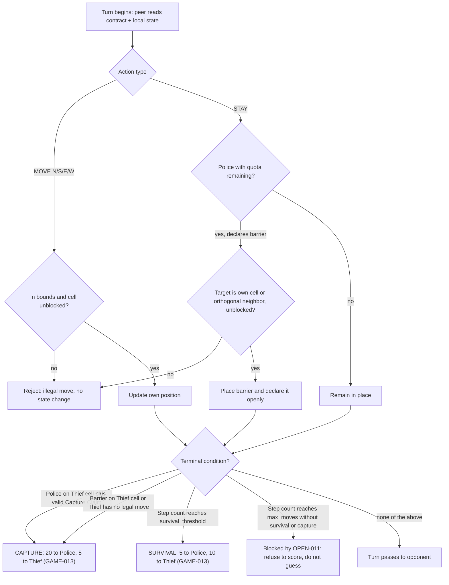

# Thief implementation PLAN

## Approach summary

Build one autonomous Thief peer around a pure local domain model, a thin Orchestrator/state machine, a separate role strategy focused on evasion, escape preservation, and truthful capture responses, symmetric FastMCP server/client adapters, a single integrity path, and isolated GUI/reporting adapters. The repository begins greenfield. Requirement IDs refer to `docs/spec/CANONICAL_REQUIREMENTS.md`; this PLAN selects technical strategy and does not redefine intent.

## Proposed repository structure

The following tree is proposed, not evidence of existing implementation. Directories are created only by the task that owns them.

```text
src/thief_peer/
  sdk.py
  config/
  domain/
  scent/
  belief/
  strategy/
    providers/          # optional text providers; T027 only
  integrity/
  transport/
  orchestration/
  reliability/
  infra/                # central external-service Gatekeeper
  evidence/
  reporting/
  league/
  ui/
tests/
  unit/
  property/
  contract/
  integration/
config/
docs/
  spec/
  inputs/
  tasks/
  decisions/
  changes/
  evidence/
scripts/
notebooks/             # P2 only if T025 is approved
data/derived/          # P2 only if T025 produces real data
```

## Architecture and boundaries

| Boundary | Responsibility | Must not own |
|---|---|---|
| Domain/game logic | Board, local state, legal actions, barriers, capture, scoring | Network, GUI, clock, credentials |
| Scent and belief | Deterministic scent model; probabilistic opponent belief | Objective opponent position |
| Strategy | evasion, escape preservation, and truthful capture responses; hint intent | Transport, persistence, report sending |
| Orchestration | Legal lifecycle transitions and subsystem sequencing | Move heuristics or protocol encoding |
| Transport/protocol | FastMCP server/client and negotiated wire adaptation | Game decisions or hidden state |
| Integrity | One canonicalization/hash path, nonce custody, audit | Alternative local sanctions or scoring |
| Reliability/state | Deadlines, retry journal, watchdog snapshot/recovery | Indefinite waits or silent repair |
| Configuration | Shared JSON, private TOML, precedence and version checks | Secrets or unsigned weakening |
| Reporting | Official artifacts, reconciliation, Gatekeeper/Gmail adapter | Direct external calls outside Gatekeeper |
| GUI/replay | Local-truth projection and immutable replay verification | Omniscient live state or a second rules engine |

All live state belongs to this process. The sibling repository exchanges only the approved protocol and never imports this package or shares memory (`ARCH-001`–`ARCH-003`).

**Hidden-position constraint on the domain boundary** (derived from `STRAT-001`, `OBS-002`, `GAME-009`–`GAME-011`): the domain/game-logic boundary holds only this role's own position and never computes or stores the opponent's true position; barriers are public once declared and are held identically by both sides' domain state; a terminal condition that depends on the opponent's position is decided only by the side entitled to know it — the Thief's own domain state detects a barrier on its cell and its own entrapment, and the Police side emits the Capture Claim while the Thief's domain state answers from its own local position. This is enforced in `T004`'s acceptance criteria.

## Technical decisions

### TD-01 — Pure domain core with thin adapters

- **Choice:** Keep deterministic rules/scent/belief/integrity functions independent of FastMCP, GUI, filesystem, and Gmail; expose application behavior through one SDK facade.
- **Alternatives:** Put rules inside handlers; create multiple service entry points.
- **Reason:** Supports local-truth isolation, testability, and the quality-guide facade criterion (`ARCH-003`, `QR-006`, `QR-009`).
- **Consequences:** Adapters translate typed inputs; orchestration cannot bypass domain validation.

### TD-02 — Explicit immutable lifecycle and event journal

- **Choice:** Use an explicit transition table plus append-only receipt/commit evidence; persist only safe checkpoints.
- **Alternatives:** Boolean flags; mutable global session object; rebuild from logs without validation.
- **Reason:** Required invalid-transition rejection, audit binding, retry idempotency, and restart safety (`ARCH-005`, `ARCH-006`, `ARCH-008`, `NET-005`).
- **Consequences:** More explicit events and tests; no silent state mutation after terminal failure.

### TD-03 — One negotiated serialization boundary

- **Choice:** Isolate canonical serialization and schemas behind one contract module; approve it through T001 before interoperability code is frozen.
- **Alternatives:** Let each feature serialize independently; guess missing official attachments.
- **Reason:** SHA-256 interoperability is byte-sensitive while OPEN-001/OPEN-007 remain unresolved (`SEC-001`–`SEC-005`, `REPORT-005`–`REPORT-009`).
- **Consequences:** T008 may build local primitives, but cross-peer fixtures and report schemas remain blocked until approval.
- **Compatibility gate:** Before approval, tests may compare compact/spaced JSON, nonce-inside/nonce-appended preimages, Unicode/float encodings, and signature-field insertion order; no candidate is a production default.

### TD-04 — Bounded at-least-once receive safety

- **Choice:** Absorb exact duplicates, retain commitments for accepted steps, detect equivocation/stale traffic, buffer only a configured small reorder window, and reopen one dropped session before bounded retry exhaustion.
- **Alternatives:** Assume exactly-once/in-order delivery; accept any late frame; retry by reapplying side effects.
- **Reason:** Derived protection for mandatory deadlines, retries, audit, and no-indefinite-wait behavior.
- **Consequences:** Idempotency keys and stored receive evidence become part of internal design, not official wire requirements.

### TD-05 — One external-service Gatekeeper

- **Choice:** Route Gmail and any optional paid model call through a central configured Gatekeeper; movement never depends on an LLM.
- **Alternatives:** Call APIs from strategy/report modules; independent rate limiters.
- **Reason:** `REPORT-010`–`REPORT-013`, `QR-008`, and deterministic move deadlines.
- **Consequences:** Queue/backoff/DOS behavior is unit-testable; live OAuth remains a human gate.

### TD-06 — Project-native contracts with compatibility evidence

- **Choice:** Implement from canonical requirements and approved contracts; derive edge-case and compatibility tests from explicit project ambiguities and failure modes, and require a requirement/design justification for every production behavior.
- **Alternatives:** Let components choose conflicting local defaults; omit compatibility tests around unresolved contracts.
- **Reason:** Preserves artifact authority and exposes interoperability failures without introducing unsupported schemas or hidden assumptions.
- **Consequences:** Workers justify behavior from official IDs. Third-party code or configuration may be added only after license obligations are verified and required notices are preserved.

### TD-07 — Optional provider-neutral language-model adapter with deterministic fallback

- **Choice:** Keep the P2 verbal-hint/behavior-analysis adapter provider-neutral behind the existing text boundary. Select and lock the legal movement action first; template mode is the default/fallback, and the provider/model is selected only through PLANQ-003/PLANQ-004.
- **Alternatives:** Template-only operation; an approved local provider; an approved external provider; a direct provider call from strategy code.
- **Reason:** `STRAT-008` permits template or configured provider modes without establishing a vendor, while `SEC-009`, `QR-008`, and `QR-018` govern metering and external-call quality.
- **Consequences:** No provider-specific credential or model setting is predefined before selection. External calls use the Gatekeeper, real usage is metered, all tests use doubles, and T027 never blocks T026.

### TD-08 — Minimal Python application shape

- **Choice:** Use the local, non-standard label `PY-2-minimal`: a maintained Python application with meaningful deterministic rules and external I/O. Keep the existing pure domain core and thin adapters, wire dependencies manually at the SDK/bootstrap boundary, prefer plain functions for stateless behavior, and use classes only when they own state, invariants, or lifecycle.
- **Alternatives:** Put rules and I/O together in flat handlers; introduce a full DDD/CQRS/event-bus architecture.
- **Reason:** The system has multiple external boundaries and substantial rules, but no demonstrated need for transaction-heavy abstractions or a general extension framework.
- **Consequences:** Use narrow `Protocol`/`Callable` seams at owned boundaries; make mutability and state ownership explicit; bound concurrent work with timeouts, cancellation, and cleanup. A DI container, generic Repository/Unit of Work, domain-event bus, or CQRS requires a concrete need and an approved PLAN update or ADR. This is a derived engineering decision, not a course requirement.

### TD-09 — Negotiated nested shape for the shared game contract

- **Choice:** Adopt the nested-section `config/game.json` layout and canonical Appendix F key names recorded in `docs/decisions/ADR-001-shared-game-contract-shape.md`, authored and validated by `T028`/`T003`.
- **Alternatives:** A flat key list 1:1 with `docs/spec/CANONICAL_REQUIREMENTS.md`; deferring the shape as an OPEN item.
- **Reason:** `CFG-001`/`CFG-004` fix which values the contract must carry, not its JSON shape; the reconstructed source material never attests a mandatory field structure, so this is our own negotiable engineering choice, explicitly labeled non-official pending `OPEN-001`.
- **Consequences:** `T028` owns the example contract file; `T003` validates it against the Appendix F status register regardless of section nesting. If the official schema (once received) differs, only this ADR and `T028`'s output change — no approved requirement is contradicted.

## Interfaces and data contracts

| Contract | Officially known | Unresolved/derived handling |
|---|---|---|
| `config/game.json` | Shared, identical, locked; contains Appendix F terms | Exact attached template is not supplied; T001 records approved form; `ADR-001` fixes our negotiated shape, authored by `T028`, pending official confirmation |
| `config/game.toml` | Private/local; shared JSON wins conflicts | Local schema is implementation-owned and must not carry secrets |
| MCP peer exchange | FastMCP server/client; natural-language channel; scent, integrity, barrier/capture lifecycle | Exact tool/envelope schema is negotiated and versioned; no claim that it is official |
| Commit-Reveal record | SHA-256; State, Move, Intent, Nonce minimum; Commit/Acknowledge/Reveal/Audit | Exact canonical bytes/envelope blocked by OPEN-007 |
| Four reporting artifacts | Exact filenames, common identifier, signed JSON, broad contents | Official JSON templates blocked by OPEN-001 |
| Verbal text provider | Template mode satisfies the official natural-language boundary | T027 keeps the optional adapter provider-neutral; PLANQ-003/004 approve whether a provider is needed and its model, budget, cadence, and scope |
| SDK facade | Internal programmatic entry for UI/CLI/MCP | Derived design; not a cross-peer protocol |

## State model

| State | Entry evidence | Legal next states |
|---|---|---|
| BOOTSTRAP | Config/version/secrets checks pass | NEGOTIATING, FAILED |
| NEGOTIATING | Peer, terms, scent/integrity models exchanged | READY, FAILED |
| READY | Signed agreement and Step 0 complete | COMPUTING, FAILED |
| COMPUTING | Local turn begins | COMMITTED, FAILED |
| COMMITTED | Commitment stored/sent and input locked | ACKNOWLEDGED, FAILED |
| ACKNOWLEDGED | Required acknowledgement retained | REVEALING, FAILED |
| REVEALING | Approved reveal/peer frame processed | WAITING, AUDITING, FAILED |
| WAITING | Peer obligation and deadline registered | COMPUTING, AUDITING, FAILED |
| AUDITING | Final reveals complete | REPORTING, TAMPERED, FAILED |
| REPORTING | Consistent signed artifacts accepted | COMPLETE, FAILED |
| COMPLETE/TAMPERED/FAILED | Terminal evidence written | none |

The exact event vocabulary is finalized with the wire contract. Any transition not listed in the implemented map is rejected without side effects.

### Domain-layer turn adjudication (T004)

This is the per-turn decision structure inside the `COMPUTING`/`COMMITTED` states above — it operates only on locally available state (`ARCH-001`–`ARCH-003`, the hidden-position constraint above) and is exercised end-to-end by `T029`'s stage-1 gate.



## Failure / retry / recovery

| Failure | Planned response | Evidence |
|---|---|---|
| Invalid config/model mismatch | Refuse before Step 0; show exact differing field | Sanitized negotiation record |
| Request expiry | Bounded configured retry/backoff, then explicit technical-loss path | Deadline and attempt events |
| Exact duplicate | Return prior acknowledgement/result without reapplying state | Idempotency receipt |
| Conflicting duplicate | Quarantine as equivocation/tamper evidence | Both commitments retained |
| Bounded reordering | Buffer until predecessor; reject beyond policy | Ordered receipt journal |
| Session termination | Re-establish once within original deadline; do not renew obligation | Connection attempt log |
| Process stall/crash | Watchdog persists safe state and performs controlled shutdown/recovery | Redacted checkpoint |
| Hash/audit failure | Mark TAMPERED, prevent repair/scoring as clean | Failed-step verification |
| Gmail 429/quota | Gatekeeper backoff/queue or explicit unsent failure | Rate/quota metrics without secrets |
| Optional provider timeout/429/budget exhaustion | Keep the already selected legal action and return bounded deterministic template text | Mocked provider failure event plus real usage metadata only when available |

## Security / integrity

- Generate nonces with a cryptographic source, keep them secret until audit, and never log credentials (`SEC-004`, `SEC-010`).
- Retain the commitment actually received during play and bind the final reveal to it; self-consistent fabricated history is insufficient (`SEC-005`, derived verification hardening).
- Keep one canonical hashing implementation and test Unicode, numeric representation, ordering, missing/extra steps, and impossible motion after OPEN-007 is approved.
- OAuth is send-only, and `credentials.json`, `token.json`, `.env`, keys, and private material remain local and ignored (`REPORT-003`, `REPORT-004`).
- Reports derive totals from verified sub-game records and do not send plaintext or silently reconcile conflicts (`REPORT-005`, `REPORT-009`).

## Observability

- Structured local events identify game/sub-game/step, lifecycle state, deadline, retry, connection, audit status, and token totals without revealing nonce-before-audit, credentials, or unobserved opponent truth.
- The GUI projects only local state plus belief; the Replay projects immutable final evidence (`OBS-001`–`OBS-006`).
- Gatekeeper metrics include queue depth, tokens, rejections, retry/backoff, DOS lock state, and daily quota only when configured (`REPORT-010`–`REPORT-013`).
- README screenshots and performance/league claims remain `TODO_BEFORE_SUBMISSION` until traceable real evidence exists (`OBS-007`, `SUB-012`).

## Testing strategy

1. **Component TDD:** rules, scent, belief, strategy, state machine, hashing, deadlines, rate limiting, artifact validation, and any optional language-model provider adapter with happy/error cases and test doubles.
2. **Properties:** legal-motion invariants, no probability outside legal cells, scent bounds/decay, fresh nonces, score derivation, idempotent duplicate receipt, and absorbing terminal states.
3. **Contract tests:** approved FastMCP surface, shared-config equality, model lock, canonical bytes, JSON templates, filenames, and common identifiers.
4. **Two-process integration:** separate configurations/processes, six sub-games, disconnect/retry/reorder/crash/audit/report failure matrix, and no live external services in tests.
5. **GUI/Replay:** view-model tests plus manual evidence capture from a verified real run.
6. **Quality gates:** Ruff zero, at least 85% global coverage, 150 logical-code-line threshold, docs/links/task IDs/secrets/archives/workflow permissions.

### Compatibility decision matrix

These branches are derived test cases, not requirements or defaults. T001 must record the authoritative resolution before a counted-game contract selects one.

| Contract risk | Differential cases to retain | Selection gate |
|---|---|---|
| Reporting JSON | Flat versus nested configuration; differing declaration/log/result fields; premature/finalized lifecycle mutation | Exact official templates and canonical rules, OPEN-001/OPEN-007 |
| Commit/report bytes | Compact versus spaced JSON; Nonce inside versus appended; Unicode and float forms; signature field excluded/inserted after hashing | Approved canonical byte envelope, OPEN-007 |
| Scent | Clamp/no-clamp; add/max/replace merge; decay/deposit order; rounding; transmitted versus recomputed field | Numeric repeated-emission decision and model lock, OPEN-009 |
| Series/tie | Series-add, series-replace, and per-sub-game tie behavior; candidate role schedules | Lecturer-approved terminology, role schedule, and aggregation, OPEN-008 |
| Gmail | Actual `users.messages.send` with exact JSON attachment bytes versus draft creation or pretty body text | Send-only OAuth, human live-send gate, T017/T018 |

## Requirement coverage

| Requirement | Design element | Verification strategy |
|---|---|---|
| ARCH-001–ARCH-009 | Process isolation, boundaries, Orchestrator/state machine, watchdog | Isolation/integration tests; transition and recovery tests |
| GAME-001–GAME-014 | Pure board/rules/scoring core | Boundary/property tests and fixed-score vectors |
| NET-001–NET-005 | Symmetric FastMCP adapters, natural language, deadlines | Contract tests and two-process fault injection |
| STRAT-001–STRAT-009 | Scent, belief, separate Thief strategy and hints | Numeric scent tests, belief properties, seeded policy tests |
| SEC-001–SEC-010 | Single Commit-Reveal/audit path, Step 0, secret controls | Tamper vectors, audit binding, secret gate |
| CFG-001–CFG-010 | Shared/private config, precedence, status validation, per-game evidence | Schema/config tests and replay round-trip |
| OBS-001–OBS-007 | Local GUI, belief heatmap, input lock, verified Replay | View-model tests, tamper test, real evidence gate |
| REPORT-001–REPORT-013 | Official artifacts and Gmail Gatekeeper | Schema/golden tests and mocked pipeline failures |
| LEAGUE-001–LEAGUE-007 | Six-game series, eligibility, scores, fairness evidence | Series and preflight tests |
| SUB-001–SUB-012 | Repository/docs/release/submission gates | Quality audit plus human release checklist |
| QR-001–QR-019 | Minimal modular package and aligned quality tooling | CI/pre-commit and evidence audit; excellence work only when justified |

## Execution phases

1. Resolve external inputs and dependency baseline (T001–T002).
2. Establish package/config and deterministic core (T003–T008, T028–T029).
3. Establish peer lifecycle and resilience (T009–T013).
4. Build visible/auditable operation and reporting (T014–T020).
5. Close verification, documentation, optional extensions/excellence, compliance, and release (T021–T027).

### Phase 2 checkpoints — deterministic domain core

The next phase (peer lifecycle, transport, strategy) starts only after these checkpoints pass with recorded evidence; each is a subset of an existing task's acceptance criteria, not a new gate mechanism.

| Checkpoint | Owning task | Exit criteria |
|---|---|---|
| CP-1 | T028 | Example `config/game.json`/`config/game.toml.example` committed in the `ADR-001` shape; loads through T003's validator with no error |
| CP-2 | T003 | Appendix F Fixed/Minimum/Negotiated status validation green for every configuration test vector |
| CP-3 | T004 | Board/movement/barrier test vectors green (domain test vectors table) |
| CP-4 | T004 | Capture/terminal-condition/scoring test vectors green, including the OPEN-011 refusal case |
| CP-5 | T029 | Local two-agent scripted run reaches CAPTURE and SURVIVAL outcomes with correct scores; double-run determinism evidence recorded in `docs/evidence/stage1-gate.md` |

## Parallel execution waves

| Wave | Tasks | Prerequisites | Proposed write sets |
|---|---|---|---|
| 0 | T001, T002 | Human input collection; none for dependency research | `config/official`, `docs/inputs`, affected local OPEN records; versus `pyproject.toml`, `uv.lock`, CI |
| 1 | T003 | T002 | Package facade/config and config-focused tests |
| 2 | T004, T008, T009, T017, T028 | T003; T009 also T001 | Domain; integrity; transport; reporting Gatekeeper; shared game contract — disjoint |
| 2-opt | T029 | T004, T028 | Stage-1 domain gate (scripted two-agent run) — depends on wave 2, runs after it |
| 3 | T005, T016 | T001; T005 also T004 | Scent/model lock; official reporting schemas — disjoint |
| 4 | T006, T010 | T005; T010 also T008/T009 | Belief; orchestration — disjoint |
| 5 | T007, T011, T012, T013, T014 | T006/T010 as declared in task files | Strategy; reliability; inbox; evidence; live UI — disjoint |
| 6 | T015, T019, T021 | Wave 5 dependencies | Replay; league series; property/coverage tests — disjoint |
| 7 | T018 | T012–T017 as declared | Reporting pipeline |
| 8 | T020, T022 | T018/T019 and reliability dependencies | League preflight; cross-cutting integration tests — disjoint |
| 9 | T023 | T014/T015/T020/T022 as declared | README and real evidence; run serially because it reconciles cross-cutting documentation |
| 9-opt | T025, T027 | T022 and T027 dependencies as declared | Optional experiment versus optional text provider — disjoint and parallel-safe |
| 10 | T024 | T021–T023 | Compliance evidence only |
| 11 | T026 | T001/T020/T024 | Submission evidence; tag/remote are human actions |

Before each wave, the orchestrator checks dependencies, claims, expiry, and exact write sets. Tasks in a wave may run concurrently only when those sets remain non-overlapping.

## Human approval gates

- Approve PRD v0.1 before implementation scope is treated as stable.
- Supply/verify official JSON templates, official form, valid eight-character final-project group code, remaining repository/endpoint values, serialization agreement, and unresolved sanctions in T001; confirmed public team metadata is retained.
- Approve runtime dependency versions and committed lock in T002.
- Authorize public endpoint exposure and cross-team counted-match terms before live play.
- Authorize Gmail OAuth/send-only recipient and the first real automatic report; tests never send mail.
- Approve PLANQ-003/PLANQ-004, including whether a provider is needed and any selected provider/model, budget, cadence, and text-only scope, before a live external call; tests and CI remain mocked.
- Verify screenshots, results, repository access, Moodle form, annotated tag, and per-member submissions in T026.

## Risks

| Risk | Mitigation |
|---|---|
| Byte-level integrity mismatch | Single contract boundary; approved cross-peer vectors; no guessed schema |
| Local-truth leak through GUI/log/report | Typed local view model, redaction tests, no objective opponent field |
| Retry duplicates or forked state | Idempotent receipt journal, immutable deadlines, bounded reordering |
| False clean audit from self-consistent fabricated log | Compare final reveals to commitments retained from live play and validate physics |
| Report inconsistency harms both sides | Pre-send schema/identifier/result reconciliation and OPEN-004 approval |
| Secret/token exposure | Ignore rules, secret scanner, minimal OAuth scope, redacted logs |
| Overengineering | Task write sets, one facade/gateway, no speculative plugins/services/notebooks |

## Unresolved decisions

- OPEN-001: official JSON templates/schemas.
- OPEN-002: official Moodle Word form.
- OPEN-003: valid eight-character final-project group code, repository URLs, endpoints, opponent values, and private form-only identity fields; team name/number and GitHub handles are confirmed.
- OPEN-004: conflicting missing-report sanction text.
- OPEN-005: direction of “harder” changes for operational Minimum maxima.
- OPEN-006: signing-key generation/distribution/rotation procedure.
- OPEN-007: canonical commit/report serialization, signature scope, Unicode behavior, and identifier relation.
- OPEN-008: game/match/series terminology, role schedule, and tie aggregation.
- OPEN-009: scent saturation/merge semantics under repeated emission.
- OPEN-011: move-cap-versus-survival-threshold termination and round-versus-half-turn step counting.
- PLANQ-001 through PLANQ-008: team-owned implementation choices to resolve during the relevant task-planning step; they do not close official blockers.
