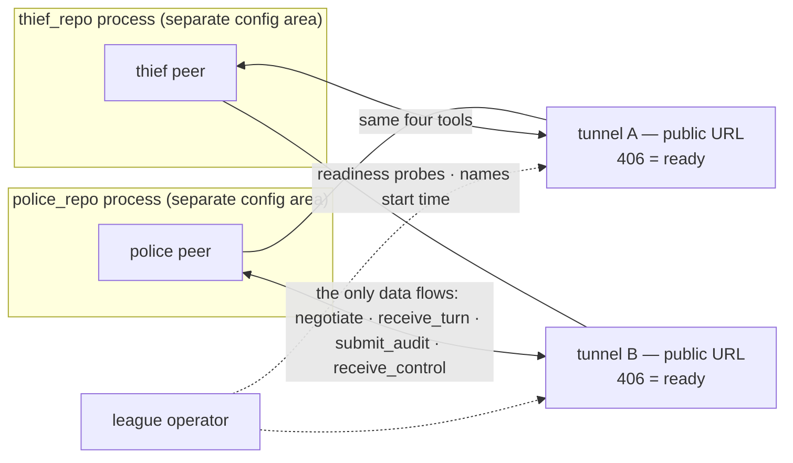
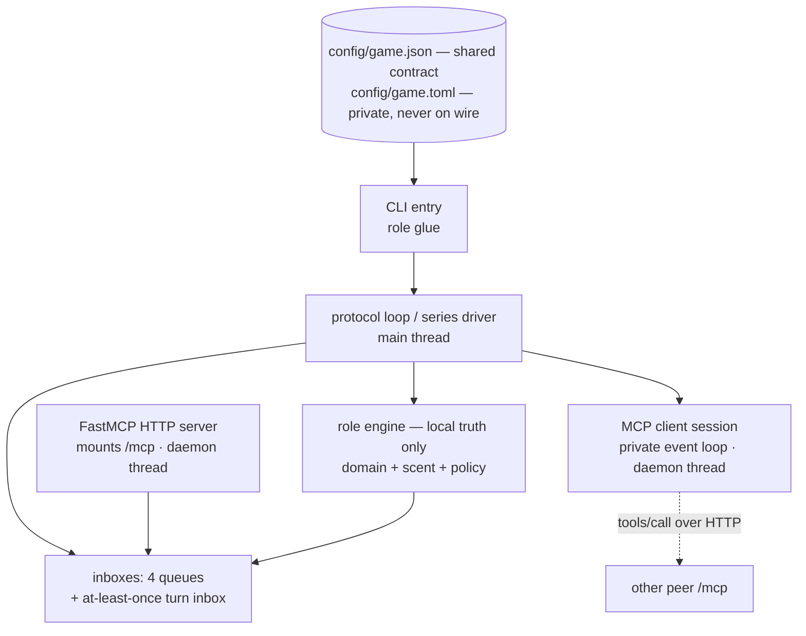
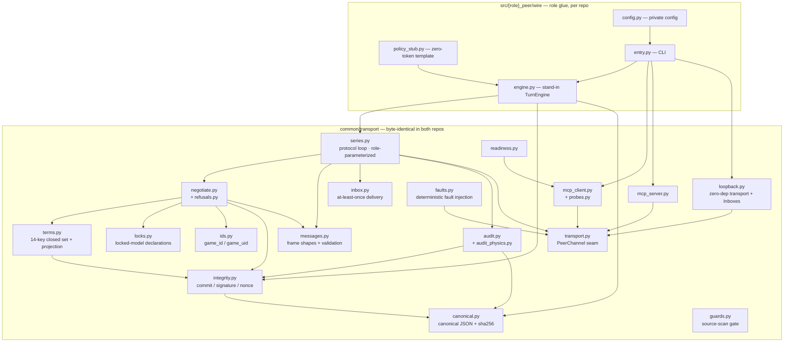
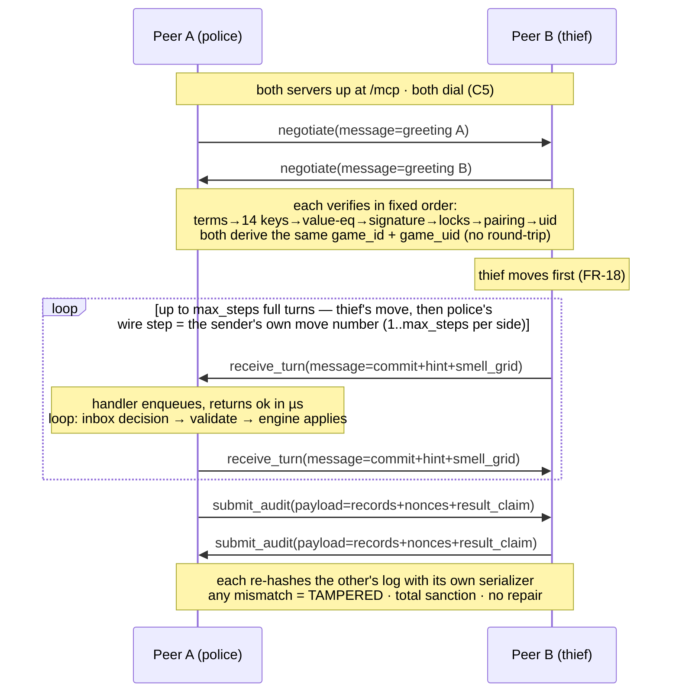
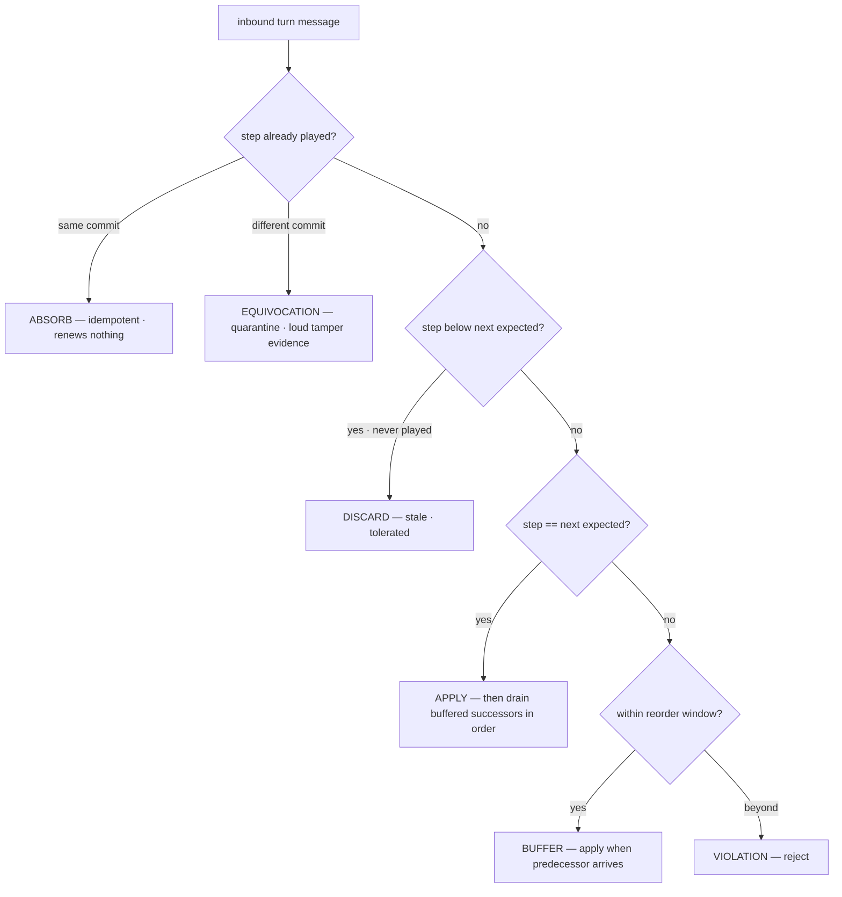
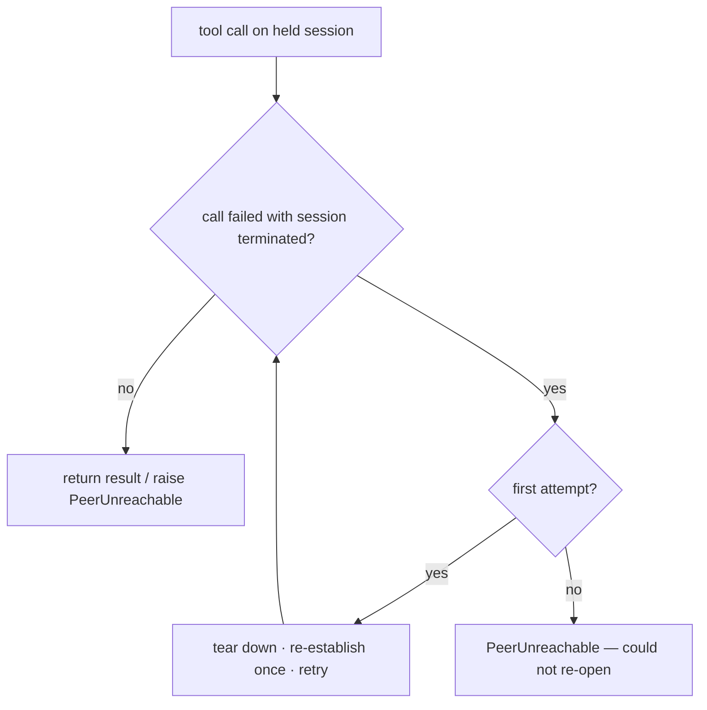
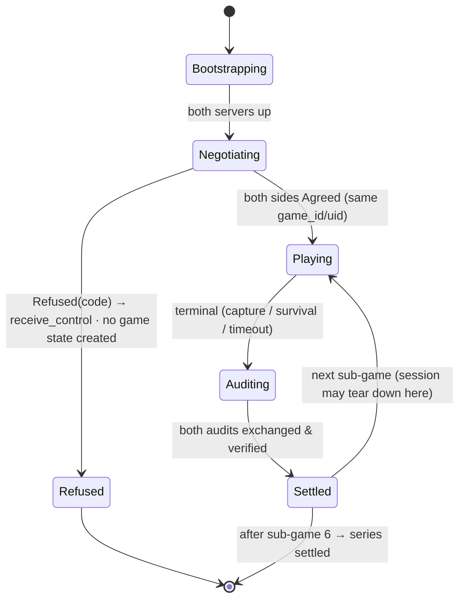
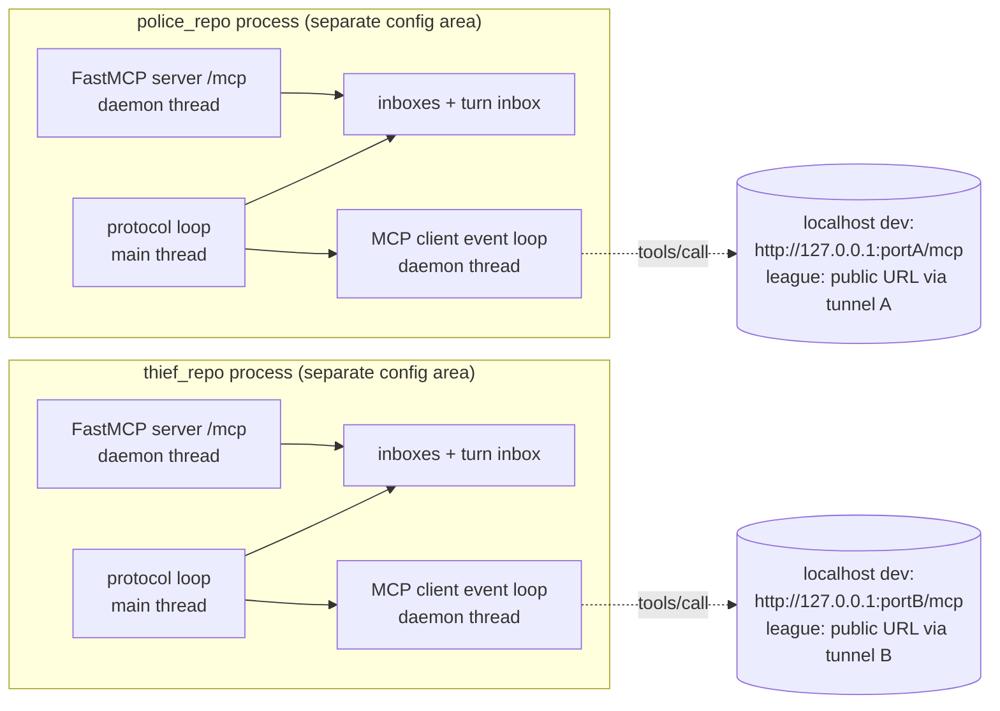

# PLAN — MCP Infrastructure (Stage 2): P2P Peer Protocol & FastMCP Transport

**Scope of this document.** This is the *build* plan for `PRD_mcp_infrastructure.md`. The PRD is normative (the "what"); this PLAN fixes the technical shape (the "how"); `TODO_mcp_infrastructure.md` fixes the order of execution. The reference kit (`references/copthief-league-protocol/`, wire profile `reference-v3`) is the **compatibility target only** — non-authoritative evidence (PRD C1). It is cited below as the byte-level reference for every shared primitive.

**Audience.** An implementation agent that will write the code from PRD + this PLAN + the TODO, without any other source. Where a detail is normative, the FR id is cited; where a detail is a draft engineering choice, it is labeled **draft**.

---

## 1. Approach summary

Build one role-agnostic protocol layer in `common/transport/` (byte-identical in both repositories, ADR-005) plus thin role-local glue in `src/<role>_peer/wire/`. The layer implements, per the PRD:

- the byte-level integrity primitives (canonical JSON, commit, terms signature, uid derivation) — §10 below pins the exact recipes;
- the four-tool wire surface (`negotiate`, `receive_turn`, `submit_audit`, `receive_control`) with the argument-name asymmetry (FR-6/FR-7);
- the handshake with the fixed verification order and the refusal channel (FR-10…FR-20);
- the turn frames with all-or-nothing validation (FR-21…FR-27);
- the at-least-once inbound inbox (FR-32/FR-33);
- the mutual audit with the TAMPERED sanction (FR-28/FR-29);
- the FastMCP server/client transport (FR-3, FR-4, FR-8, FR-9, FR-30, FR-31, FR-37);
- the tunnel readiness discipline (FR-35…FR-36) and the shared-layer guard gate (FR-39).

### 1.1 Top-down integration strategy (binding for this stage)

**No big-bang integration.** The stage is built top-down over a pluggable transport seam:

1. **First, the top of the tree is real and running.** Stage ST-02/ST-03 (TODO) builds the integration spine end-to-end: a role-parameterized protocol loop, a real zero-dependency loopback transport (NFR-2), a minimal stand-in role engine, and *stub* implementations of every inner primitive. The deliverable is a **full six-sub-game series that settles, over loopback, on day one** — with stubs clearly marked.
2. **Then, stubs are replaced one layer at a time**, top-down, each replacement ending in the same series still settling (now with more of the real behavior). A replacement is a drop-in behind a shared function — the series loop, the engine, and the tests do not change when a stub is swapped for the real primitive.
3. **The last swap is the transport itself**: loopback → real FastMCP server/client over HTTP, same seam, two processes on `localhost` (no public endpoint), which is the `local_mcp_smoke` / `reference_v3_contract` proof (PRD M2).

Why not build all modules first and integrate at the end (the anti-pattern this stage forbids): the protocol layer is the one surface whose output must be *byte-identical* between two independently written implementations; a mismatch discovered only at a final big-bang integration voids the whole match for both sides and cannot be localized. Keeping the series green after every step means every primitive is verified end-to-end the moment it lands, and every later failure is localized to the last replacement.

**Spine invariant.** `tests/integration/test_series_loopback.py` (the full series over loopback) is written in ST-03 and **must stay green after every stage**, with its assertions growing. No stage is complete while the spine is red; no shared module is written without being wired into the series in the same stage.

---

## 2. C4 — Level 1: Context



- **No central server, no referee, no judge** (FR-1, PRD C8). The diagram contains exactly two participants and nothing else.
- **No out-of-band channel** carries game data (FR-2): no file, mail, shared memory, environment variable, or sidecar.
- Each peer holds **only its own local truth**; the rival's true position never crosses the wire (FR-17, PRD §5.2).
- League play requires public reachability through a tunnel (FR-35); `localhost`-only is early development.

## 3. C4 — Level 2: Container (one peer process)



| Container | Thread | Owns |
|---|---|---|
| CLI entry (role glue) | main | config load, channel choice (loopback / MCP), facade assembly, exit codes |
| Protocol loop (shared `series.py`) | main | negotiation, sub-game sequencing, turn order, inbox drain, audit exchange, outcome ledger |
| FastMCP server (shared `mcp_server.py`) | daemon | the four tools; handlers **validate-then-enqueue-and-return only** (FR-8); preflight + port-occupancy check before bind (FR-37) |
| MCP client (shared `mcp_client.py`) | private event loop in daemon thread | one session held across the series (FR-30); re-established exactly once (FR-31); synchronous facade for the game loop |
| Inboxes (shared) | touched by server thread + main thread | 4 deques (thread-safe) + the at-least-once turn inbox |
| Role engine (role glue) | main | local board state, scent grid computation, record sealing, hint production, audit reveal — the **only** place local truth lives |
| Config | — | shared `game.json` (byte-identical, CFG-001) + private `game.toml` (never crosses the wire, CFG-002/003) |

## 4. C4 — Level 3: Component



**Dependency rules (checked by the guard gate, FR-39):**

1. `common/transport/` imports **no** role code (`src/<role>_peer/`) and no `common/domain/` game logic beyond what a frame needs — the protocol layer transports and verifies, it does not decide (C03 constraint).
2. Role glue imports the shared layer; never the reverse.
3. `fastmcp` is imported **only** inside `mcp_server.py` / `mcp_client.py` (lazily, at construction) (NFR-5).
4. Network primitives (`socket`, `urllib`, …) only in `mcp_server.py`, `mcp_client.py`, `probes.py`, `readiness.py` (FR-39 NM-5 pattern).
5. No module-level mutable state anywhere in `common/transport/` (SC-6).
6. One canonical hash path: `canonical.py` → `integrity.py`; no second hash construction anywhere (C03 invariant).

## 5. C4 — Level 4: Code (module APIs)

This is the build specification. Signatures are Python 3.12; public boundaries are typed (AGENTS.md). Files respect the 150 non-blank/non-comment line cap — suggested splits are marked.

### 5.1 `common/transport/canonical.py` — byte-level core

| API | Behavior |
|---|---|
| `canonical_json(obj: object) -> str` | `json.dumps(obj, sort_keys=True, ensure_ascii=False, separators=(",", ":"))` — the **exact** kit recipe (`verify_vectors._canonical_str`); any deviation voids the match for both sides |
| `canonical_bytes(obj: object) -> bytes` | `canonical_json(obj).encode("utf-8")` |
| `sha256_digest(text: str) -> bytes` | raw 32-byte `hashlib.sha256(text.encode("utf-8")).digest()` |
| `sha256_hex(text: str) -> str` | lowercase 64-hex `sha256_digest(text).hex()` |

Invariants: the only module that imports `json`/`hashlib` for canonicalization; no float normalization beyond shortest-repr (a float that fails shortest round-trip must fail the vector suite, T008 `{#early_byte_vectors}`).

### 5.2 `common/transport/integrity.py` — commit & signature (draft, OPEN-007-gated)

| API | Behavior |
|---|---|
| `new_nonce() -> str` | `secrets.token_hex(16)` — fresh per step; **never logged or transmitted before the audit** (SEC-004, NFR-6) |
| `commit(payload: dict, nonce: str) -> str` | `SHA256((canonical_json(payload) + "\|" + nonce).encode("utf-8"))` — nonce **pipe-appended**, not inside the hashed object (PRD §1.3, kit `ref_commit`) |
| `terms_signature(terms: dict, nonce: str) -> str` | `commit(terms, nonce)` — identical construction over the 14-key terms (kit `ref_terms_signature`) |

### 5.3 `common/transport/ids.py` — derived identifiers

| API | Behavior |
|---|---|
| `game_id(group_a: str, group_b: str) -> str` | `"-vs-".join(sorted([group_a, group_b]))` — **sorted pair, never self-first** (FR-15) |
| `game_uid(terms: dict, group_a: str, group_b: str) -> str` | `str(uuid.UUID(bytes=sha256_digest(canonical_json(terms) + "\|" + "\|".join(sorted([group_a, group_b])))[:16]))` — the first **16 raw digest bytes** (not hex characters), exactly as the kit builds it (FR-15, kit `ref_game_uid`) |

### 5.4 `common/transport/terms.py` — the closed 14-key signed set

| API | Behavior |
|---|---|
| `TERMS_KEYS: tuple[str, ...]` | exactly the 14 keys of PRD FR-11: `board_size, smell_grid_size, decay_per_step, emit_intensity, min_center_intensity, max_steps, barriers_max, setting, hint_max_words, axis_origin_corner, axis_start_index, thief_start, cop_start, num_games` — flat and closed; renamed/missing/extra keys are refused |
| `project_terms(shared: dict, private: dict) -> dict` | implements the PRD §9.2 projection table from the validated `config/game.json` snapshot + private overrides (incl. `min_center_intensity` from private TOML or fixed default 0.5, labeled non-official; `num_games` must be 6 — O-2) |
| `terms_diff(ours: dict, theirs: dict) -> list[str]` | per-key diff lines for the refusal diagnostic (names the offending key, prints both canonical strings — FR-12) |

### 5.5 `common/transport/locks.py` — locked-model declarations (FR-16)

| API | Behavior |
|---|---|
| `LOCK_FAMILIES: tuple[str, ...]` | `("scent_model", "wire_shape", "info_mode", "smell_binding")` |
| `lock_doc(family: str, profile: str) -> dict` | the pinned parameter document for a profile choice (draft; kit `ref_lock_doc`) |
| `lock_hash(family: str, profile: str) -> str` | `sha256(canonical_json(lock_doc(...)))` — only the hash crosses the wire |
| `lock_decision(ours: str \| None, theirs: str \| None) -> str` | refuse **only** when both declare and disagree; omission never refuses (FR-16, kit `ref_lock_decision`) |

Declared profile values (ADR-004): `wire_shape: reference-v3`, `scent_model: subtractive_chebyshev_v1` (default; `multiplicative_book_v1` supported), `info_mode: belief`, `smell_binding: unbound`.

### 5.6 `common/transport/negotiate.py` + `refusals.py` (split for line cap)

| API | Behavior |
|---|---|
| `Greeting` (dataclass) | `terms, nonce, signature, group_id` + optional `role, sub_game_number, identity, scent_model_sha256, wire_shape_sha256, info_mode_sha256, smell_binding_sha256, info_mode, game_uid`; `to_wire()` **omits `None` fields** (FR-20); `from_wire()` tolerates unknown keys (extension seam) |
| `Agreed` (frozen dataclass) | `game_id, game_uid, opponent_group, opponent_role, terms` |
| `Refused(Exception)` | carries `.code` (stable, grep-able) + `.message` (actionable diagnostic) |
| `our_greeting(cfg, role, sub_game_number, nonce, locks, opponent_group=None) -> Greeting` | builds our greeting; `game_uid` omitted when the opponent is unknown (sub-game 1), declared from sub-game 2 onward (FR-15) |
| `verify_greeting(ours: Greeting, raw: dict) -> Agreed` | runs the **fixed order** (FR-13): terms present → all 14 keys → value-equality → signature re-verify (with our own serializer, printing both canonical strings on failure) → locked-model comparison → pairing (same `sub_game_number`, complementary `role`; **omission is silence, never refusal** — FR-14) → declared `game_uid` (mismatch refuses at handshake, SPAR-N10). Raises `Refused` otherwise |
| `pairing_decision(ours: dict, theirs: dict) -> str` | `"play" \| "refuse:sub_game" \| "refuse:role"` (kit `ref_pairing_decision`); two peers both defaulting to `police` is the classic self-inflicted collision |
| `uid_declaration_decision(ours, theirs) -> str` | refuse only when both declare and differ (kit `ref_uid_declaration_decision`) |
| `refusals.py` | the refusal code table (SPAR-N00…N10 classes) + diagnostic text, incl. the turn-order diagnostic wording (FR-18 — names the disagreement, never a bare timeout) |

**Refusal channel:** every tool returns `{"ok": True}`; a refusal travels only as a `receive_control` message (PRD C4). The series driver sends the control frame and stops without creating game state (US-MCP-006).

### 5.7 `common/transport/messages.py` — frame shapes & validation

| API | Behavior |
|---|---|
| `TurnMessage` (dataclass) | required `step, sender, commit, hint, smell_grid, timestamp`; optional `barrier_placed, capture_claim, claim_response, win_claim`; `to_wire()` emits the four optionals as **explicit `null`s** (FR-20, matches the reference wire); `from_wire()` drops unknown keys |
| `ControlMessage` (dataclass) | `kind ∈ enable\|status\|restart\|quit`, `sender, sub_game_number, status, step_budget, payload` — the only refusal channel |
| `AuditPayload` (dataclass) | `sender, records: list[{payload, nonce, commit}], result_claim ∈ capture\|survival\|timeout` |
| `validate_turn(raw: dict) -> TurnMessage` | **all-or-nothing, before any state change** (FR-25): missing required key refused (never defaulted); `smell_grid` present with `{"r,c": number}` values, stringified intensity refused (FR-22); `commit` is 64-char **lowercase** hex (FR-23); `timestamp` non-empty (FR-24); unknown keys tolerated and ignored (FR-20). Raises `TurnRefused(reason)` — never mutates |
| `validate_audit(raw: dict) -> AuditPayload` | shape check for the audit frame (FR-28) |
| `assert_no_position_leak(frame: dict) -> None` | structural scan: no field (other than the explicitly public `barrier_placed`, `capture_claim`) carries the sender's numeric position (FR-26/FR-27, TC-13) |

### 5.8 `common/transport/inbox.py` — at-least-once delivery (FR-32/FR-33)

| API | Behavior |
|---|---|
| `delivery_decision(state: dict, arrival: dict) -> str` | **pure** pinned table (kit `ref_delivery_decision`, vector `delivery_contract.json`): `absorb` (already played, **same commit** — duplicates are keyed on the commit, not `(kind, step)`), `equivocation` (played, different commit — stays loud), `apply` (next expected), `buffer` (within window), `violation` (beyond window), `discard` (below next, never played — stale) |
| `deadline_decision(deadline_at, now, arrived, tolerated) -> str` | **pure** (kit `ref_deadline_decision`): `"expired" \| "waiting"` — judged **every lap**; tolerated traffic renews nothing (FR-33) |
| `Inbox` (dataclass) | state: `window` (default 4, **never 0** — FR-32), `next_step=1` — the **opponent's next own move number** (there is no step-0 turn, FR-19; fresh per sub-game), `played: dict[int, str]` (step→commit map; also the audit binding map), `buffered`, `absorbed` counter |
| `Inbox.offer(msg: dict) -> list[dict]` | returns messages now ready to apply, in step order; `[]` means absorbed/buffered (never an error); raises `Equivocation` / `ProtocolViolation` for the loud cases |
| `Inbox.reset_for_subgame()` | per-sub-game boundary (rolling-window topology, FR-31 context) |

### 5.9 `common/transport/audit.py` + `audit_physics.py` (split for line cap) — mutual audit (FR-28/FR-29)

| API | Behavior |
|---|---|
| `AuditResult` (dataclass) | `passed, verified_steps, failed_steps, skipped` (+ `tampered_steps` internal detail); `to_wire()` emits the 4-key verdict shape (PRD §5.2) |
| `audit_records(records, played=None, terms=None) -> AuditResult` | layer 1 (always): re-hash every revealed record **with our own serializer** — `commit(payload, nonce) == claimed`, else the step is TAMPERED; a single mismatch ⇒ `passed=False`, technical loss, **total sanction, no repair path** (FR-29). Layer 2 (armed with `played`): revealed commits must equal the commits received in play, and every received step must be revealed (steps past the consumed frontier tolerated). Layer 3 (`audit_physics.py`, armed with `terms`): position trail on-board, ≤ one orthogonal step per move, barrier quota, step ceiling — judged from the **position trail**, never from the peer's move spelling. The trail is read from the record's own state representation: our records carry the SPEC-pinned `state` string (`grid=…;self=[r, c];barriers=…`, from `GameEngine.state_string`); a peer record under a different schema may carry a `position` key instead — the degradation contract applies: a reveal that carries no readable positions gets the checks its evidence supports, **never an accusation** (kit `audit_records`; a payload schema is not an interop constraint, PRD C2) |

### 5.10 `common/transport/transport.py` — the integration seam (heart of the top-down spine)

```python
class PeerChannel(Protocol):
    """Outbound calls to the peer + inbound drain. The protocol loop depends only on this.
    Two real implementations: LoopbackTransport (zero-dep tier, NFR-2) and
    McpChannel (FastMCP over streamable HTTP). The four tool names and the
    argument-name asymmetry are part of this surface, not an accident of it (FR-6/FR-7)."""
    def send_agreement(self, message: dict) -> dict: ...   # negotiate(message=...)
    def send_turn(self, message: dict) -> dict: ...        # receive_turn(message=...)
    def send_audit(self, payload: dict) -> dict: ...       # submit_audit(payload=...)
    def send_control(self, message: dict) -> dict: ...     # receive_control(message=...)
    def poll_agreement(self) -> dict | None: ...           # drain our own inbox
    def poll_turn(self) -> dict | None: ...
    def poll_audit(self) -> dict | None: ...
    def poll_control(self) -> dict | None: ...
    def close(self) -> None: ...
```

The asymmetry is **enforced by the signature itself**: `send_audit(payload)` vs `send_agreement(message)` — a caller cannot accidentally send `message` to `submit_audit` (FR-7, TC-02).

### 5.11 `common/transport/loopback.py` — zero-dependency transport (NFR-2)

Not a mock (PRD §7, alternative rejected): same message dicts, same four tool names, same `{"ok": True}` returns; only the hop is a function call.

| API | Behavior |
|---|---|
| `Inboxes` | 4 deques (`agreements, turns, audits, controls`) + `drain()`; thread-safe for append/popleft (server thread + game loop) |
| `LoopbackPeer` | the callable surface one peer exposes: `negotiate(message)`, `receive_turn(message)`, `submit_audit(payload)`, `receive_control(message)` — each **validates shape, enqueues, returns `{"ok": True}`** (FR-8); never blocks on game progress |
| `LoopbackTransport` | implements `PeerChannel`; `send_*` call the other peer's tool; `poll_*` drain our own inboxes |
| `pair(a="A", b="B") -> tuple[LoopbackTransport, LoopbackTransport]` | wires the two peers together |

### 5.12 `common/transport/faults.py` — deterministic fault injection (NFR-3)

`FaultyTransport(inner: PeerChannel, *, duplicate_every=0, reorder_every=0, drop_then_retry_every=0)` — wraps a channel and mistreats the **turn channel** reproducibly: duplicate the nth message, hold one then release after the next (reorder), drop-then-retry the nth (lost ack → the sender retries, so the message arrives twice **by design**). `flush()` releases anything held. Everything else passes through (`__getattr__`). The flagship test: same seeded series, clean vs fault-injected ⇒ **byte-identical outcome ledger** (TC-17, NFR-1).

### 5.13 `common/transport/series.py` — the role-parameterized protocol loop

The top of the tree. Owns the protocol sequence only — never game decisions (those come through the `TurnEngine` seam, §5.14).

| API | Behavior |
|---|---|
| `Budgets` (frozen dataclass) | `poll_interval_sec, turn_timeout_sec, connect_timeout_sec, await_peer_budget_sec` — all from config (NFR-4) |
| `PeerConfig` (frozen dataclass) | `natural_role ∈ {"police","thief"}` (from private config; when unconfigured, the default follows the pairing-playbook convention — the alphabetically-first group in the `game_id` sort plays police in odd sub-games — **labeled a default, not a requirement**), `group_id, num_sub_games (6), max_steps (35), reorder_window (default 4, never 0), budgets, terms (14), locks (4 hashes), identity: dict, opponent_group: str \| None`. The per-sub-game role is derived with the stage-1 shared `role_for(natural_role, sub_game_number)` (odd sub-games: natural role; even: the opposite) and is the `role` the greeting declares for that sub-game |
| `TurnEngine` (Protocol) | the role seam — implemented by role glue: `next_turn_frame() -> dict` (called on our move: increments our own step, applies the move to local state, seals the step record, returns the full turn frame incl. `commit`, `hint`, `smell_grid`, and `win_claim` once our side has won), `apply_inbound(frame: dict) -> None` (applies a validated frame to local truth), `terminal() -> Outcome \| None` (our-side terminal: the thief's `self_captured`/`survived`, the police's answered claim), `audit_payload() -> dict` (reveals records + `result_claim`), `identity() -> dict` |
| `PeerFacade` | constructor `(cfg, channel: PeerChannel, engine: TurnEngine, clock)`. `play_series() -> SeriesResult` implements: **both sides dial** — each facade both serves (its channel drains) and pushes (FR-3, C5); negotiation per sub-game (both send `our_greeting` with that sub-game's role, each verifies the other's, on refusal → `receive_control` + no state); turn loop — **full-turn alternation, the thief (by per-sub-game role) moves first** (FR-18); the wire `step` is the **sender's own move number** (1..`max_steps` per side, fresh per sub-game) and the inbox tracks the opponent's next own step; a sub-game runs at most `max_steps` full turns; every lap: `Inbox.offer` on inbound + `deadline_decision` on the expected message (FR-33); terminal — CAPTURE (a claim answered caught, a barrier on one's own cell, or boxed-in — the thief sees it first), SURVIVAL (the thief claims `win_claim` at the survival threshold, or outlasts the step ceiling), TIMEOUT (a deadline expires) → the audit exchange: both sides `send_audit`, each verifies the other's records via `audit_records` (bound to its inbox `played` map); per-sub-game `Inbox.reset_for_subgame()`; loop over `num_sub_games` |
| `SeriesResult` (dataclass) | `game_id, game_uid, settled: bool, ledger: list[dict]` — ledger row: `{sub_game_number, role, outcome, steps, score, audit_ok}`. Settlement uses the stage-1 shared **`settled_outcome(outcome, audits_present, audits_passed)`** — the one settlement rule for both drivers: audits clean ⇒ the played outcome stands, settled; audits failed ⇒ **`TAMPER_FORFEIT`**, settled, both sides zeroed (the FR-29 total sanction, no repair path); a zeroed outcome (timeout/technical loss) settles with **no audit owed**; a played outcome (capture/survival) is **never** settled without a clean mutual audit (scores via `common.domain.scoring.score_for`) |
| `run_series(a: PeerFacade, b: PeerFacade) -> SeriesResult` | test/CLI harness: runs both facades (loopback: two threads in one process; MCP: two processes) until both settle |
| turn-order diagnostic | when both facades time out expecting the other to open, the refusal text **names the turn-order disagreement** (FR-18, TC-28), not a bare timeout |

**Stand-in deadline policy (draft, superseded by C04/T011):** on expiry the facade performs the one bounded retry within budget, then declares **TIMEOUT** for the sub-game (a zeroed outcome — zero both sides, no audit owed, per `settled_outcome`). The *envelope fields* (timestamp/expiry) are ours (FR-34); the *decision policy* belongs to C04 — flagged, not hidden.

### 5.14 Role glue — `src/<role>_peer/wire/` (per repository)

| File | Content |
|---|---|
| `engine.py` | `StandInEngine` — implements `TurnEngine` **over the existing stage-1 domain**, not beside it: one fresh `common.domain.rules.GameEngine` per sub-game (`legal_moves`, `barrier_targets`, `apply_own_move`, `place_own_barrier`, `observe_barrier`, `answer_capture_claim`, `self_captured`, `survived`, `state_string`) + the existing role-local scent model (`src/<role>_peer/scent`, T005) for the transmitted `smell_grid`. Seals step records with a **draft role-local payload** (labeled non-official, PRD C2): `{"step": own move number, "state": GameEngine.state_string() (the SPEC-pinned sealed state — own position only, never the rival's), "move": str, "intent": "truth"\|"lie", "barrier": [r, c] \| None, "claim": dict \| None}` + a fresh `integrity.new_nonce()`; `commit` via the shared `integrity.commit` (SEC-003 minimum State/Move/Intent/Nonce). Applies inbound frames to local truth only (opponent's scent grid → `observe_barrier` for the public `barrier_placed`; `capture_claim` → the obligatory honest `claim_response` via `answer_capture_claim`, SEC-007 — already enforced by the domain). The sealed step-0 record (identity declaration) is included in `audit_payload()` (FR-19 — it is disclosed in the audit, never sent as a tool/turn). **This engine is an integration stand-in**: C04's state machine (T010) supersedes its scheduling and C02's strategy (T007) supersedes its policy — both through this seam, with no shared-layer change |
| `policy_stub.py` | `StubPolicy` — the CT-02 stand-in (SD-03): seeded, deterministic; police: move toward the max-intensity cell of the last received grid (one-line stand-in heuristic, not belief), place a barrier on a fixed step cadence while under quota; thief: seeded walk, `win_claim: {"type": "survival"}` at the step ceiling. Hints: **zero-token templates only** (no tokens, no external call, FR-41 default) — fixed neutral text per role, `intent` declared per FR-42. A provider failure MUST NOT block a legal action (TC-27) — the template is the fallback by construction |
| `config.py` | `PrivateConfig` (role, group_id, host, port, peer_url, reorder_window, budgets) from `config/game.toml`; assembles `PeerConfig` from the validated shared `game.json` snapshot (C01's loader — consumed, never re-validated) + `project_terms` |
| `entry.py` | CLI: `--role --peer --host --port --config --loopback --await-peer --faults`; builds the channel (loopback pair for the in-process dev mode; `McpChannel` for real), assembles `PeerFacade`, runs, prints the ledger, exit codes (0 settled, 6 unsettled, 5 port held, 7 unreachable — mirroring the kit's) |

### 5.15 `common/transport/mcp_server.py` — the FastMCP server

| API | Behavior |
|---|---|
| `build_server(inboxes: Inboxes)` | constructs the FastMCP app — **lazy import** (`from fastmcp import FastMCP` inside the function, NFR-5); registers the four tools `negotiate(message)`, `receive_turn(message)`, `submit_audit(payload)`, `receive_control(message)`; each handler: validates the frame shape (`messages.validate_*`), enqueues into the inboxes, returns `{"ok": True}` — never awaits game progress, never does crypto, never mutates game state (FR-8); mounted at `/mcp` over streamable HTTP (FR-9) |
| `port_is_held(host: str, port: int) -> bool` | a **connect probe, never a trial bind** (FR-37 — binding to test races the real server, and on Windows two binds can both succeed, silently voiding the check) |
| `preflight(cfg) -> None` | runs the shared-layer guard scan (`guards.scan_shared_layer`) plus config checks; raises `PreflightRefused` on violation — **the server never binds a port if preflight refuses** (FR-37, FR-39) |
| `serve(cfg, inboxes, game_loop: Callable[[], int], peer_url: str \| None) -> int` | preflight → port check (held ⇒ refuse, exit 5, orphan-peer warning) → HTTP server on a **daemon thread**, `game_loop` on the caller's thread (FR-4 — serving never blocks the game and vice versa) → return the loop's exit code; tools-only mode (no `peer_url`) prints the "TOOLS ONLY — no game loop" banner: a peer that only listens never plays (FR-3) |

### 5.16 `common/transport/mcp_client.py` + `probes.py` — the FastMCP client & edge probes

| API | Behavior |
|---|---|
| `McpChannel(url, timeout, budgets)` | implements `PeerChannel` (`send_*` = client calls; `poll_*` = drain our own inboxes). **One session held across the whole series** (FR-30 — a bare `tools/call` without a session is `400 Missing session ID`, which reads like an unreachable peer and is not one) on a **private event loop in a daemon thread**; the synchronous facade keeps the game loop, state machine, and tests async-free. On a session-terminated failure: tear down, re-establish **exactly once**, retry within the original deadline, then `PeerUnreachable` (FR-31). Applies the `payload`/`message` asymmetry at the call site (FR-7) |
| `PeerUnreachable(Exception)` | the one opponent-failure class the loop sees: a refused connection, or a session death that could not be re-opened — never a bare timeout standing in for a re-establishable session death |
| `probes.edge_answers(url, timeout) -> bool` | true once **anything** HTTP answers (406 included) — all `--await-peer` needs; a refused connection is the one state that returns false |
| `probes.classify_probe(get_status, post_status, post_text) -> tuple[int, str]` | **pure** classifier (FR-36.1): `421` ⇒ Host header not rewritten (tunnel-side fix text — ngrok `--host-header=rewrite` / Cloudflare `originRequest.httpHostHeader`, never a code change); `502` ⇒ edge up, nothing behind (peer not started *or* no ingress — indistinguishable from outside, which is why each side proves its *own* path); `406` + a real `initialize` answer ⇒ ready; `30x`/`404` ⇒ forwarder/wrong path — each class with actionable text |
| `probes.diagnose(url, timeout) -> int` | CLI: runs the browser-shaped GET + the MCP `initialize` POST probes, prints the classification, returns the exit code |

### 5.17 `common/transport/readiness.py` — the readiness discipline (FR-36)

| API | Behavior |
|---|---|
| `loopback_nonce_proof(host, port, hostnames, timeout) -> tuple[bool, str]` | binds a throwaway listener on the series port (refuses to run if the port is already held — an orphaned peer answering would starve the real one), generates a nonce, fetches the **own** public hostname through the tunnel, and demands the nonce back: one shot exercises tunnel + ingress + Host-header rewrite (FR-36.2) |
| `await_peer(url, budget, poll_interval, clock) -> bool` | polls the opponent's edge (any HTTP answer, 406 included) for one handshake budget before the first greeting; the budget is the same value the arrived peer gets to greet — "how long will it wait for me" has one answer on both sides (FR-36.3, US-MCP-005) |

### 5.18 `common/transport/guards.py` + repo scripts — the shared-layer gate (FR-39)

| API | Behavior |
|---|---|
| `scan_shared_layer(root: Path) -> list[str]` | the source scan (the kit's NM-5 pattern, enforced rather than promised): no network imports (`socket`, `urllib`, `httpx`, …) outside `mcp_server.py` / `mcp_client.py` / `probes.py` / `readiness.py`; no `fastmcp` import outside the two transport modules; no module-level mutable state in `common/transport/`; no import of role code into `common/`; exactly one canonical hash path (`canonical` → `integrity`). Returns the violation list (empty = clean) |
| `scripts/check_shared_layer.py` | CLI over `scan_shared_layer`; **refuses to start on violation** (FR-39) — wired into `mcp_server.preflight` and run at every stage gate |
| `scripts/check_common_sync.py --sibling <path>` | diffs `common/` against the sibling repository; **0 differing files** (SC-6 — the KPI subject ADR-005 was waiting for); fails loudly on drift |

## 6. UML — Sequence: handshake and first sub-game



(Handshake/turn/audit semantics: PRD §8.1; every refusal in the sequence travels back as `receive_control` — it is never a return value.)

## 7. UML — Flows: inbound delivery & session re-establishment

**Inbound delivery decision** (FR-32 — the six-way map; duplicates keyed on commit):



**Session re-establishment** (FR-31 — exactly once, within the original deadline):



## 8. UML — State: sub-game lifecycle



Deadline laps are checked in `Playing` on **every** poll (FR-33); expiry ⇒ bounded retry ⇒ **TIMEOUT** (a zeroed outcome, stand-in policy §5.13).

## 9. Deployment



- **Two completely separate processes, separate config areas** — `police_repo/config/` vs `thief_repo/config/` (FR-38). The shared `common/` code is legal only because it is stateless (FR-39): byte-identical static code in two processes is not shared live memory.
- **Threads per process:** main = protocol loop; daemon = HTTP server (serving never blocks the game and vice versa, FR-4); daemon = private event loop for the held MCP session (the game loop stays synchronous, FR-30).
- **Dev topology:** no tunnel, `peer_url = http://127.0.0.1:<peer-port>/mcp` — the entire local suite must pass with no public endpoint (NFR-4). **League topology:** each server behind a tunnel with Host-header rewrite (421 is fixed at the tunnel, never in code, FR-36); the DNS-rebinding guard stays enabled (NFR-6).

## 10. Wire schema (data contracts)

### 10.1 Frames

All four tools take a single dict argument (`message` ×3, `payload` ×1) and return `{"ok": True}` — always (PRD §5).

| Frame | Via | Keys |
|---|---|---|
| Greeting | `negotiate(message)` | `terms` (14 flat keys), `nonce`, `signature`, `group_id` + optional `role`, `sub_game_number`, `identity {group_id, group_name, llm_model, repos, members}`, `<family>_sha256` ×4 (only the hash — the document never crosses), `info_mode: "belief"`, `game_uid` (sub-game ≥ 2) |
| Turn | `receive_turn(message)` | required: `step`, `sender`, `commit` (64-hex-lower), `hint` (free-form text — Hebrew/English/mixed/astral emoji), `smell_grid` (`{"r,c": number}`), `timestamp` (non-empty, decorative); optional, explicit `null`: `barrier_placed: null\|[r,c]` (public, truthful), `capture_claim: null\|[r,c]` (police only), `claim_response: null\|{…}` (thief's honest answer), `win_claim: null\|{"type":"survival"}` (thief) |
| Audit | `submit_audit(payload)` | `sender`, `result_claim ∈ capture\|survival\|timeout`, `records: [{payload, nonce, commit}, …]` — every record of the sub-game, nonces finally revealed |
| Control | `receive_control(message)` | `kind ∈ enable\|status\|restart\|quit`, `sender`, `sub_game_number`, `status`, `step_budget`, `payload` — the only refusal channel |

**What never crosses the wire** (PRD §5.2): either agent's true position (except the explicitly public `barrier_placed` / `capture_claim`), a nonce before the audit, the pinned parameter documents (only their hashes), the private `config/game.toml`.

### 10.2 The signed terms — 14 keys, flat and closed

Exact key list in §5.4; sourcing per the PRD §9.2 projection table (nested `config/game.json` → flat wire terms). Two load-bearing notes from that table:

- `setting` is a **strict value-equality gate**: the stock kit sparring peer expects `"Haifa"`, our committed `game.json` says `"New York"`. Our two repos agree on `"New York"` (fine for our pair); sparring against the stock kit requires the pairing to set `"Haifa"` (per-pairing config decision — flag at ST-06).
- `num_games` is fixed **6**; the committed `game.json` currently says `1` (defect O-2 — fixed in prerequisite ST-01/F-2 before any series runs).

### 10.3 Canonicalization — the load-bearing bytes (draft, OPEN-007-gated, PRD C2)

Pinned to the kit's construction (`verify_vectors.py`) for interop today — **draft, not official**:

```text
canonical_json(x) = json.dumps(x, sort_keys=True, ensure_ascii=False, separators=(",", ":"))
commit(payload, nonce)       = hex( SHA256( (canonical_json(payload) + "|" + nonce).encode("utf-8") ) )
terms_signature(terms, nonce) = commit(terms, nonce)
game_uid(terms, a, b)        = uuid.UUID(bytes = SHA256( (canonical_json(terms) + "|" + "|".join(sorted([a, b]))).encode() )[:16])
game_id(a, b)                = "-vs-".join(sorted([a, b]))
```

A serializer that escapes non-ASCII (`ensure_ascii=True`), reorders keys, or uses spaced separators "reads as tampering and voids the match for **both** sides" (PRD §1.2). The golden-vector suite (TC-25) makes this a CI fact, not a promise.

## 11. Configuration

| Source | Fields | Rule |
|---|---|---|
| `config/game.json` (shared, byte-identical — CFG-001) | `network_and_league.{response_timeout_sec, watchdog_timeout_sec, num_games: 6, token_budget_per_series}` + `rate_limiter_gatekeeper.*` + the terms source fields of PRD §9.2 | validated by C01's loader (T003) — consumed, never re-validated (PRD §3.9) |
| `config/game.toml` (private, local-only — CFG-002/003) | `role`, `group_id`, `host`, `port`, `peer_url`, `tunnel_identity`, `reorder_window` (default 4, **never 0**), `budgets.{poll_interval_sec, turn_timeout_sec, connect_timeout_sec, await_peer_budget_sec}` | never crosses the wire; on key conflict the JSON value overlays the TOML; no local test value may require a real opponent's (FR-40) |

## 12. Integration spine — stub replacement map

| Layer | ST-03 stub (marked `STUB`) | Real implementation | Lands in |
|---|---|---|---|
| canonical / commit / uid | `sha256(str(sorted repr))` placeholder | `canonical.py`, `integrity.py`, `ids.py` | ST-04 |
| terms / greeting | fixed 14-key dict, accept-all | `terms.py`, `locks.py`, `negotiate.py`, `refusals.py` | ST-05, ST-06 |
| turn frames | minimal dict, no validation | `messages.py` | ST-07 |
| inbound delivery | FIFO deque, no dedup, no window | `inbox.py`, `faults.py` | ST-08 |
| audit | always-pass verdict | `audit.py`, `audit_physics.py` | ST-09 |
| transport | `LoopbackTransport` | `mcp_server.py`, `mcp_client.py`, `probes.py` | ST-10, ST-11 |
| readiness | n/a | `readiness.py` | ST-13 |
| guards / sync | n/a | `guards.py`, repo scripts | ST-14 |

**Spine invariants (checked at every stage gate):**

1. `tests/integration/test_series_loopback.py` green — the full series settles end-to-end.
2. No shared module exists without being wired into the series in the same stage (no untested silos).
3. A stub replacement is a drop-in: the series loop, the engine, and the channel signatures do not change.
4. `scripts/check_common_sync.py` (0 differing files vs the sibling repo) and `scripts/check_shared_layer.py` (the FR-39 source scan) pass.
5. Repository gates pass: `uv run ruff check .`, `uv run pytest`, `uv run python scripts/run_quality_gates.py`.

## 13. Stage decisions (to be promoted to ADRs if the orchestrator wants durable records)

### SD-01 — Top-down integration over the `PeerChannel` seam, loopback-first

- **Choice:** the stage is built top-down: the full series runs over the zero-dependency loopback from the first stage; every later stage replaces one stub; the final swap is loopback → FastMCP over the same seam.
- **Alternatives:** the repository's bottom-up wave order (primitives → contract → inbox → HTTP, integrating when all land); a mock-based CI with simplified messages.
- **Reason:** the interop surface is byte-load-bearing; a big-bang integration would test it only once, at the end, with every defect conflated. A divergent mock hides exactly the drift this layer exists to prevent (PRD §7 rejects it). NFR-2 already makes loopback a first-class transport ("only the hop is a function call"), so the top-down spine costs no extra architecture.
- **Consequences:** the series loop and the stand-in engine exist before the crypto is real (stubs are honest and marked); every replacement is verified end-to-end immediately; the bottom-up wave order of the repo graph is **superseded for this stage only** by the TODO's stage order (the repo tasks T008/T009/T012/T022 are still the claim units — see §16).

### SD-02 — The protocol loop (series driver) lives in the shared layer

- **Choice:** `series.py` in `common/transport/` — role-parameterized, engine-injected — owns the protocol sequence (both-dial, thief-first, sub-game boundaries, audit exchange, ledger).
- **Alternatives:** the series driver in role glue (`src/<role>_peer/`) — duplicating protocol behavior in two trees; or in C04's orchestrator (T010).
- **Reason:** sub-game/turn/audit sequencing *is* protocol behavior — it must be identical on both sides or the match deadlocks (the 2026-08-04 dogfood: two peers each waiting for the other to move first). C04's state machine (T010) later owns the **lifecycle wrapping** (watchdog, checkpoints, recovery policy) and supersedes the stand-in deadline policy — the driver's seams make that a drop-in.
- **Consequences:** role glue stays thin (engine + policy + CLI); C04 must be designed against `series.py`, not beside it.

### SD-03 — Stand-in engine + zero-token stub policy in role glue

- **Choice:** `StandInEngine` + `StubPolicy` (role glue, per repo) implement the `TurnEngine` seam over the existing Stage-1 domain/scent code, with a draft role-local record payload.
- **Alternatives:** waiting for C02 (T006/T007) before any integration; a protocol-only test harness that never plays a move.
- **Reason:** a top-down series needs something to play — the seam is the point. The stand-in is explicitly *not* strategy (C02 out of scope, PRD §10): deterministic, seeded, zero-token, and replaced through the seam by the real C02/C04 wiring without touching the shared layer.
- **Consequences:** the draft payload schema is labeled non-official (PRD C2); the stand-in heuristic (move toward max-scent cell) must never leak into logs/GUI as strategy; the `intent` field is declared per FR-42.

## 14. Requirement → module → test traceability

FR ids per PRD §3; TC ids per PRD §8.5; stages per TODO. (KPI: 100% requirement-to-test coverage of FR-1…FR-42.)

| FR | Module(s) | TC | Stage |
|---|---|---|---|
| FR-1 | deployment (§9), sync gate | TC-24 | ST-14 |
| FR-2 | `guards.py` scan | TC-24 | ST-14 |
| FR-3 | `series.py` (both dial), `mcp_client.py` | TC-21 | ST-11 |
| FR-4 | `mcp_server.py` (daemon thread) | TC-22 | ST-10 |
| FR-5 | placement (ADR-005) + sync check | TC-24 | ST-14 |
| FR-6 | `mcp_server.py`, `loopback.py` | TC-01 | ST-02/ST-10 |
| FR-7 | `transport.py` signature, `mcp_server/client` | TC-02 | ST-02/ST-11 |
| FR-8 | `mcp_server.py` handlers, `LoopbackPeer` | TC-22 | ST-02/ST-10 |
| FR-9 | `mcp_server.py` (/mcp, 406) | TC-23 | ST-10/ST-13 |
| FR-10 | `negotiate.Greeting` | TC-03 | ST-06 |
| FR-11 | `terms.TERMS_KEYS`, `project_terms` | TC-03, TC-25 | ST-05 |
| FR-12 | `integrity.terms_signature`, `terms.terms_diff` | TC-04, TC-25 | ST-04/ST-06 |
| FR-13 | `negotiate.verify_greeting` | TC-03…07 | ST-06 |
| FR-14 | `negotiate.pairing_decision` | TC-05 | ST-06 |
| FR-15 | `ids.game_uid/game_id` | TC-06, TC-25 | ST-04/ST-06 |
| FR-16 | `locks.*`, `negotiate` | TC-07, TC-25 | ST-06 |
| FR-17 | `negotiate` + `engine` (structural) | TC-13 | ST-03/ST-07 |
| FR-18 | `series.py` (thief-first + diagnostic) | TC-28 | ST-03/ST-06 |
| FR-19 | `series.py` / surface (no step-0, no hello) | TC-01 | ST-03/ST-10 |
| FR-20 | `Greeting.to_wire` (omit None), `TurnMessage.to_wire` (explicit nulls), unknown-key tolerance | TC-12 | ST-06/ST-07 |
| FR-21 | `messages.validate_turn` | TC-08 | ST-07 |
| FR-22 | `messages.validate_turn` (grid shape) | TC-09 | ST-07 |
| FR-23 | `messages.validate_turn` (lowercase hex) | TC-10 | ST-07 |
| FR-24 | `messages.validate_turn` (timestamp) | TC-11 | ST-07 |
| FR-25 | `messages.validate_turn` (all-or-nothing) | TC-08 | ST-07 |
| FR-26 | `messages.assert_no_position_leak`, `engine` | TC-13 | ST-07 |
| FR-27 | `messages` (hint free-form), `policy_stub` | TC-13, TC-26 | ST-07 |
| FR-28 | `messages.AuditPayload`, `engine.audit_payload` | TC-20 | ST-09 |
| FR-29 | `audit.audit_records` | TC-20 | ST-09 |
| FR-30 | `mcp_client.McpChannel` (one session, private loop) | TC-21 | ST-11 |
| FR-31 | `mcp_client` (re-establish once) | TC-18 | ST-12 |
| FR-32 | `inbox.Inbox`, `delivery_decision` | TC-14…16 | ST-08 |
| FR-33 | `deadline_decision`, `series.py` (every lap) | TC-19 | ST-08 |
| FR-34 | `messages` (fields) + `series.py` (stand-in policy) | TC-19 | ST-08 |
| FR-35 | `readiness.py` (requirement side) | TC-23 | ST-13 |
| FR-36 | `readiness.py` (classify / nonce proof / await-peer) | TC-23 | ST-13 |
| FR-37 | `mcp_server.preflight`, `port_is_held` (connect probe) | TC-23 | ST-10 |
| FR-38 | deployment (§9), two-process test | TC-21, TC-24 | ST-11/ST-14 |
| FR-39 | `guards.py` + `scripts/check_shared_layer.py` | TC-24 | ST-14 |
| FR-40 | role `config.py`, `terms.project_terms` | TC-24 + series runs | ST-05/ST-14 |
| FR-41 | `policy_stub` (zero-token default, failure rule) | TC-27 | ST-03 |
| FR-42 | `engine` (intent field), `audit` (corroboration) | TC-20 | ST-09 |

## 15. Verification commands

Per stage (TODO carries the per-task commands):

```sh
uv sync --locked --all-groups
uv run ruff check .
uv run pytest            # spine + full suite, 85% coverage gate
uv run python scripts/run_quality_gates.py
uv run python scripts/check_common_sync.py --sibling <path-to-sibling-repo>   # ST-03 onward
uv run python scripts/check_shared_layer.py                                    # ST-03 onward
```

Notes: `fastmcp` lands in `pyproject.toml` at ST-01/F-3 (T002) but is imported lazily, so the zero-dependency tier stays honest even when it is installed (NFR-2/NFR-5 — the source scan proves the import boundary). The `setting: Haifa` vs `New York` pairing decision (§10.2) is a config flag for the contract suite when sparring against the stock kit peer.

## 16. Relationship to the repository documents

- **Claim units stay the repo task files.** Stage tasks map onto them: ST-04, ST-09 ⊂ T008 (integrity core incl. audit), ST-05/06/07/10/11, ST-13 ⊂ T009 (contract & adapters incl. readiness), ST-08/12 ⊂ T012 (inbound delivery) + T022 (recovery), ST-14/15 ⊂ T022 (interop gates). The implementation agent claims the repo task, then executes the mapped stage tasks; the repo handoff contract (AGENTS.md) applies unchanged.
- **Pending orchestrator follow-ups** (block the first agent stages — TODO ST-01): re-target the C03 PLAN + T008/T009/T012 write-sets from `src/<role>_peer/` to `common/transport/` (O-1, ADR-005); fix `num_games: 1 → 6` in both repos' `config/game.json` (O-2); add `fastmcp>=2.0,<3.0` + lock (T002); extend coverage `source` to include `common` (F-4).
- **Authority order:** PRD (normative) → canonical requirement ids (CANONICAL_REQUIREMENTS) → this PLAN (technical shape) → TODO (order) → kit (compatibility evidence, **never** authority). OPEN-001/OPEN-007 stay OPEN; every draft artifact stays labeled draft (PRD C1/C2).
