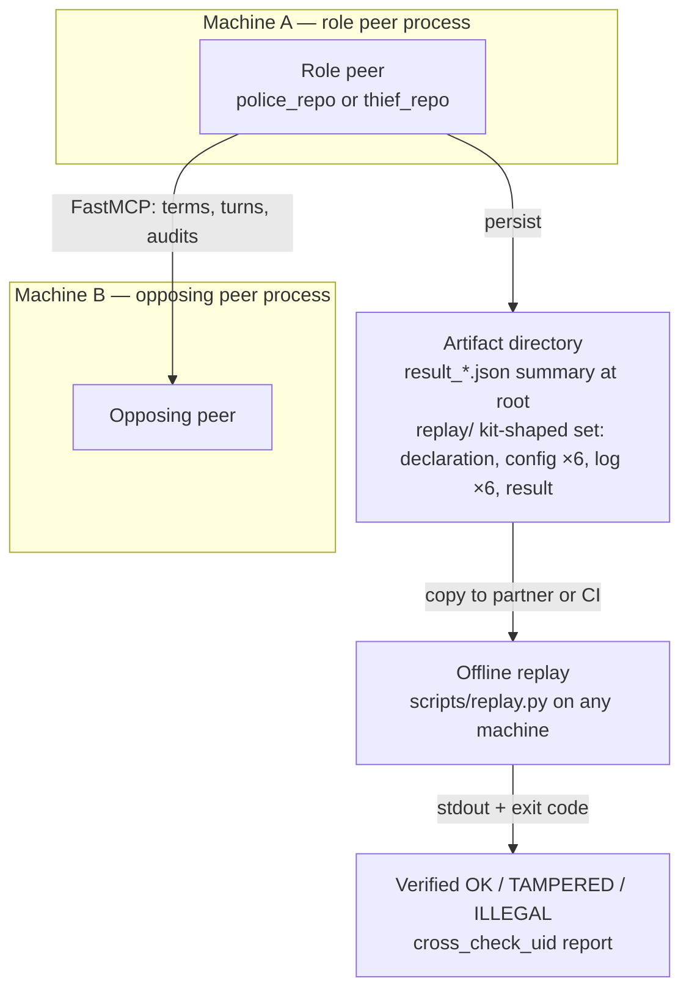
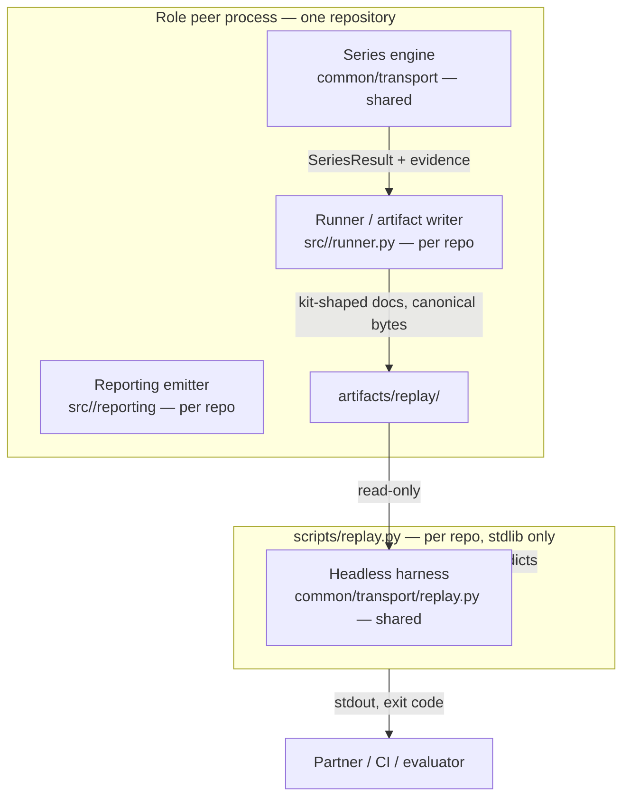
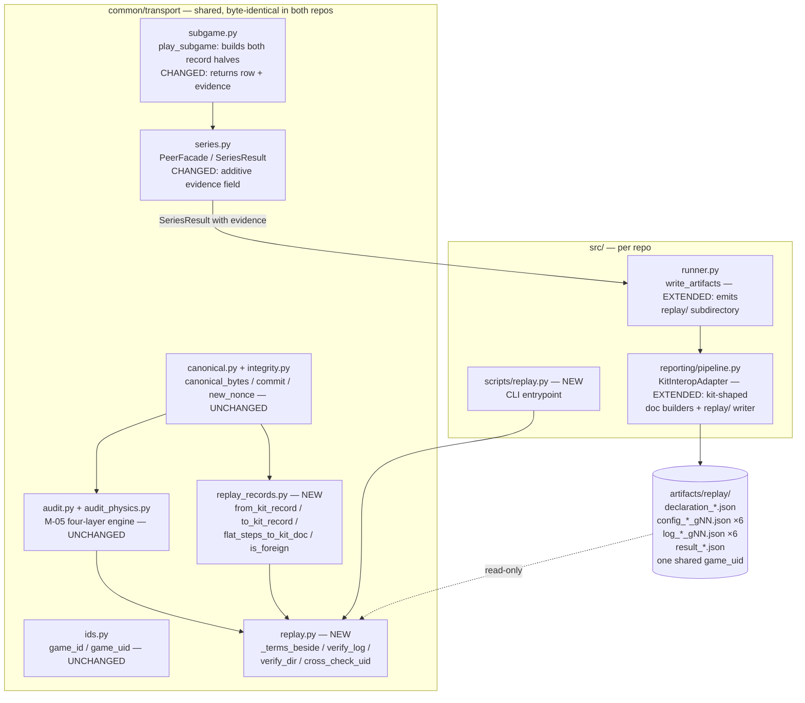

# PLAN — Replay Port: Headless Replay Verification & Replayable Artifacts

| Field | Value |
|---|---|
| **Artifact** | stage-plan |
| **ID** | PLAN-REPLAY-PORT@0.1 |
| **Status** | draft — pending orchestrator approval (workflow step 5, guidelines p. 9 §2.5) |
| **Derived from** | [PRD_replay_port.md](PRD_replay_port.md) (draft) and the primary sources it cites: Book Ch. 7, the reference kit (`references/copthief-league-protocol/` — `verify_vectors.py`, `sparring/{replay,audit,kitref,artifacts,cli}.py`, `sparring/tests/test_audit_closure.py`), and the two repos' code and task files (inventory verified 2026-08-22) |
| **Applies to** | `police_repo` + `thief_repo` — one shared `common/transport` slice, role-parameterized per-repo slices under `src/<peer>/` (`thief_peer` / `police_peer`) |
| **Owner** | orchestrator |
| **Updated** | 2026-08-22 |

---

## 1. Approach summary

Replay is **evidence, not a second rules engine**. The port has three moving parts, in dependency order:

1. **Shared slice (C03 territory, `common/transport/`, written once, synced to both repos):**
   - a pure, deterministic **shape adapter** (`replay_records.py`) translating the kit's nested sealed record `{payload, nonce, commit}` to the repository's flat record and back — round-trip identity under canonicalization, re-hash-exact by construction (the flat re-hash payload *is* the kit payload);
   - a **headless harness** (`replay.py`) mirroring the reference's `verify_log` / `verify_dir` / `cross_check_uid`, importing only `common.transport.*`, calling the existing four-layer `audit_records` with `played={}` (binding layer inert offline, exactly as the reference), physics armed from a kit-shaped `config_*.json` beside the log, and preserving the honest TAMPERED-vs-ILLEGAL split.
2. **Evidence plumbing (C03 territory, shared):** `play_subgame` already computes both record halves and the outcome; it currently returns only a `SeriesRow`. The seam (D-08): `play_subgame` returns the row **plus** a per-subgame evidence bundle, and `SeriesResult` carries it as an **additive optional field** — every existing consumer stays source-compatible.
3. **Per-repo emission (C06 territory, `src/<peer>/reporting/` + `src/<peer>/runner.py`):** after the bundle is settled, the runner writes the replayable set — declaration, 6 × config, 6 × log, result — into a dedicated `replay/` subdirectory (D-05), all sharing one `game_uid`, behind `KitInteropAdapter` (D-02, FR-RP-12 labeling), as canonical bytes. A per-repo `scripts/replay.py` CLI exposes the harness.

The GUI half of the book's viewer (navigation, display, screenshots) is **not** in this plan — it remains T015 on its existing gates, and it will *display* this harness's per-step results.

**Why the task graph changes (G6/G7):** T015 (GUI) is blocked behind T010/T014 (PLANQ-007) and its declared write set cannot own `common/transport`, `reporting/`, `runner.py`, or `scripts/`. The headless slice is re-sequenced as four new tasks (D-07) whose only hard dependency is T008 (already `done` per its task file, 2026-08-18 evidence), so the rule-20 gate becomes exercisable without waiting for the GUI toolkit decision or the official templates.

## 2. C4 — Level 1: Context



## 3. C4 — Level 2: Container (one peer process + offline verifier)



## 4. C4 — Level 3: Component



## 5. C4 — Level 4: Code (module APIs)

New files stay ≤ 150 nonblank/noncomment lines (AGENTS.md). Where a module risks the cap, split by function (precedent: `audit.py` + `audit_physics.py`).

### 5.1 `common/transport/replay_records.py` — NEW, shared (≈ 60 lines)

Pure, deterministic shape adapter. No I/O, no imports outside `__future__` (and `common.transport.canonical` for the round-trip test helpers only if needed — prefer zero runtime imports).

```python
def from_kit_record(record: dict) -> dict:
    """Nested kit record -> flat repo record.

    {**payload, "nonce": nonce, "commit": commit}. Re-hashing the result
    reproduces record["commit"] byte-for-byte (the flat re-hash payload is
    exactly the kit payload).
    """

def to_kit_record(flat: dict) -> dict:
    """Inverse: {"payload": flat minus commit/nonce, "nonce": ..., "commit": ...}."""

def flat_steps_to_kit_doc(steps: list[dict], opponent_steps: list[dict] | None) -> dict:
    """Record lists -> {"records": [...], "opponent_records": ...} fragment."""

def is_foreign_record(payload: dict) -> bool:
    """True when the payload carries no parseable sealed state string
    (foreign kit shape: position lists) — drives the degraded path (D-03)."""
```

Round-trip identity `to_kit_record(from_kit_record(r)) == r` is the golden-pinned property (TC-RP-06).

### 5.2 `common/transport/replay.py` — NEW, shared (≈ 120 lines; split into `replay_foreign.py` if needed)

The repo-local equivalent of the reference verifier, **without** any import from the reference kit:

```python
def _terms_beside(path: Path) -> dict:
    """Signed terms from a config_*.json artifact in the same directory, if one is there.

    Globs config_*.json, reads doc["terms"] (D-04). Arms the audit's physics
    layer offline: board bound, barrier quota, step ceiling. The BINDING layer
    is in-play knowledge and stays inert — replay is integrity + physics.
    """

def _verify_half(records: list[dict], terms: dict) -> AuditResult:
    """Map via replay_records, call audit_records(flat, played={}, terms)."""

def verify_log(path: Path) -> tuple[bool, str]:
    """(ok, human-readable report) for one log artifact.

    Own-shaped halves: full four-layer audit (binding/outcome inert offline).
    Foreign halves: integrity-only re-hash via the same canonical_bytes +
    commit, with an explicit degraded-coverage note (D-03, FR-RP-10) — never
    a placeholder field, never a false TAMPERED for missing intent/state.
    Verdict split (FR-RP-08): tampered_steps -> TAMPERED (void, named steps,
    both hashes); else failed_steps -> ILLEGAL.
    """

def verify_dir(root: Path) -> tuple[int, int, list[str]]:
    """Recurse log_*.json under root (D-05 keeps this set clean); aggregate ok/bad."""

def cross_check_uid(root: Path) -> str | None:
    """All *.json in the tree must carry one game_uid (the join key);
    return a conflict report naming the distinct uids, else None."""
```

### 5.3 `common/transport/subgame.py` — CHANGED (shared)

`play_subgame` keeps its behavior and gains an evidence return:

```python
@dataclass
class SubGameEvidence:
    """Per-subgame evidence for the replayable artifact set (D-08)."""
    row: SeriesRow
    our_records: list[dict]          # step-0 first, flat sealed records
    opponent_records: list[dict]     # revealed by the opponent, flat
    result_claim: str
    terms: dict                      # the signed 14-key set for this subgame
```

`play_subgame(...) -> SubGameEvidence` (the row is `evidence.row`); `PeerFacade._play_sub_game` appends `evidence.row` to the ledger exactly as today and keeps the evidence in `self._evidence: dict[int, SubGameEvidence]`.

### 5.4 `common/transport/series.py` — CHANGED (shared)

```python
@dataclass
class SeriesResult:
    game_id: str
    game_uid: str
    ledger: list[SeriesRow] = field(default_factory=list)
    settled: bool = False
    settled_outcome: Outcome = Outcome.TAMPER_FORFEIT
    evidence: dict[int, SubGameEvidence] | None = None   # ADDITIVE, default None
```

`PeerFacade.run()` sets `evidence` from `self._evidence`. Every existing consumer (runner, tests) is source-compatible: the field is optional and defaults to `None`.

### 5.5 `src/<peer>/reporting/pipeline.py` — EXTENDED (per repo)

`KitInteropAdapter` gains the kit-shaped document builders (D-02 boundary; FR-RP-12 labeling). New module `src/<peer>/reporting/kit_artifacts.py` if the adapter outgrows its line budget:

```python
class KitInteropAdapter:
    # ... existing to_kit_filename unchanged ...

    @staticmethod
    def interop_label() -> dict:
        """{"label": "INTERNAL/INTEROP — NOT OFFICIAL",
            "boundary": "KitInteropAdapter",
            "authority": "book App. F table 20 (target shape); official
            templates pending (T016 / INPUT-001)"}"""

    @staticmethod
    def kit_config_doc(game_id, game_uid, sub_game_number, terms, links) -> dict
    @staticmethod
    def kit_log_doc(game_id, game_uid, sub_game_number, summary,
                    our_records, opponent_records, mutual_agreement, links) -> dict
    @staticmethod
    def kit_declaration_doc(game_id, game_uid, groups, num_sub_games, links) -> dict
    @staticmethod
    def kit_result_doc(game_id, game_uid, ledger, settled, settled_outcome, links) -> dict

def write_replayable_bundle(out_dir: Path, game_id: str, game_uid: str,
                            groups: list[dict], evidence: dict[int, SubGameEvidence],
                            result: SeriesResult) -> list[Path]:
    """Emit declaration + 6 config + 6 log + result into out_dir (D-05:
    artifacts/replay/), canonical bytes + trailing newline (what we emit is
    what we hashed). Returns the written paths."""
```

### 5.6 `src/<peer>/runner.py` — EXTENDED (per repo)

`write_artifacts` keeps writing the existing root-level `result_{game_id}.json` summary unchanged and **additionally** calls `write_replayable_bundle(path / "replay", …)` when `result.evidence` is present. `run_one_peer` needs no signature change (the evidence rides the result; groups/terms ride the evidence bundle).

### 5.7 `scripts/replay.py` — NEW, per repo (≈ 40 lines, stdlib only)

```
usage: replay.py <replay_dir>
```

Prints per-log verdicts from `verify_dir`, the `cross_check_uid` outcome, and an `ok/bad` summary. Exit-code discipline mirrors the reference `replay` command (`sparring/cli.py::cmd_replay`): 2 = no such path, 6 = uid mismatch or any bad log, 0 = all verified. This is the "handed to a partner to settle an audit dispute offline" entrypoint (reference docstring) and the CI gate.

## 6. UML — Sequence: offline replay verification

```mermaid
sequenceDiagram
    participant U as User / CI / partner
    participant CLI as scripts/replay.py
    participant H as common.transport.replay
    participant A as audit_records (M-05, unchanged)
    U->>CLI: replay <replay_dir>
    CLI->>H: verify_dir(root)
    loop per log_*.json (sorted)
        H->>H: load doc; read records + opponent_records
        H->>H: _terms_beside(path) -> config_*.json -> terms
        loop per sealed half (own, opponent)
            alt own shape (sealed state present)
                H->>H: from_kit_record per record
                H->>A: audit_records(flat, played={}, terms)
            else foreign shape (no parseable state)
                H->>H: integrity-only re-hash via canonical_bytes + commit
                Note over H: note degraded coverage; intent not enforced
            end
            A-->>H: AuditResult(passed, tampered_steps, failed_steps, detail)
        end
        H->>H: verdict split: TAMPERED / ILLEGAL / Verified OK (count stated)
    end
    H-->>CLI: (ok, bad, lines)
    CLI->>H: cross_check_uid(root)
    H-->>CLI: None | conflict report (distinct uids named)
    CLI-->>U: printed verdicts + exit code
```

## 7. UML — Flow: per-half verdict decision

```mermaid
flowchart TD
    S[Sealed half of one log] --> F{Foreign shape?<br/>no parseable state string}
    F -- yes --> DEG[Re-hash every record:<br/>canonical_bytes(payload) + pipe + nonce<br/>vs stored commit — same primitives as live audit]
    F -- no --> AD[from_kit_record per record]
    AD --> AU[audit_records flat, played={}, terms<br/>layers: integrity + physics armed;<br/>binding & outcome inert offline]
    DEG --> V{Any record failed<br/>its re-hash?}
    AU --> V
    V -- yes --> T[TAMPERED — steps do not reproduce<br/>their commitments — game void, no appeal]
    V -- no --> P{Physics failures?<br/>off-board / jump / quota / ceiling}
    P -- yes --> I[ILLEGAL — every record re-hashes,<br/>signed physics broken — NOT a forgery]
    P -- no --> OK[Verified OK — N records certified<br/>side stated: own / opponent / both]
```

## 8. UML — Sequence: evidence emission at settlement

```mermaid
sequenceDiagram
    participant S as play_subgame (shared)
    participant F as PeerFacade.run (shared)
    participant R as write_artifacts (per repo)
    participant K as write_replayable_bundle (per repo, behind KitInteropAdapter)
    participant D as artifacts/replay/ (canonical bytes)
    S->>S: build our_records (step-0 + moves),<br/>receive opponent revealed records
    S->>S: live audit (unchanged) -> row
    S-->>F: SubGameEvidence(row, our_records, opponent_records, result_claim, terms)
    F->>F: ledger.append(row); evidence[sub_game] = evidence
    F-->>R: SeriesResult(..., evidence)
    R->>R: write root result_{game_id}.json (unchanged)
    R->>K: write_replayable_bundle(replay/, game_id, game_uid, groups, evidence, result)
    K->>D: declaration_{game_id}.json
    K->>D: config_{game_id}_g{NN}.json ×6 (top-level terms)
    K->>D: log_{game_id}_g{NN}.json ×6 (records + opponent_records)
    K->>D: result_{game_id}.json
    Note over D: all four kinds share one game_uid (join key)
```

## 9. Deployment

Two role processes play the series exactly as today (FastMCP over HTTP, or loopback in CI). After settlement each process persists:

```text
artifacts_dir/
  result_{game_id}.json            # existing summary (unchanged)
  replay/                          # NEW (D-05) — the replayable, self-contained set
    declaration_{game_id}.json
    config_{game_id}_g01.json      # ... g06
    log_{game_id}_g01.json         # ... g06
    result_{game_id}.json
```

Offline replay needs no process, no network, no dependencies: copy the directory to any machine and run `uv run python scripts/replay.py <dir>` (or the same logic in CI). A partner receiving the directory verifies the *same bytes* the mover hashed — what we emit is what we hashed (canonical bytes, no pretty-printed re-serialization). Internal bundle attachments (the `log_{game_uid}_{game_id}.json` files of the internal contract) stay at the artifacts root or in the mail bundle — never inside `replay/` — which is what keeps `verify_dir`'s glob clean (G8).

## 10. Data contracts (schemas & shapes)

### 10.1 The sealed record — two shapes, one hash

| Shape | Fields | Producer |
|---|---|---|
| **Flat (repo, live + offline audit input)** | `{step, sender, intent, state, move, hint?, barrier_placed?, capture_claim?, claim_response?, win_claim?, nonce, commit}` — built in `subgame.py::_our_move`; step-0: `{step: 0, sender, intent: "declare", nonce, commit}` | `play_subgame` (unchanged) |
| **Nested (kit-shaped, persisted)** | `{"payload": {…flat minus nonce/commit…}, "nonce": str, "commit": str}` | `replay_records.to_kit_record` (the writer) |

Re-hash (both shapes, one construction): `payload = flat record minus {commit, nonce}`; `commit == SHA256(canonical_bytes(payload) + b"|" + nonce)`. The adapter is re-hash-exact because `from_kit_record(r)["payload" flattened]` **is** the kit payload.

The sealed `state` string (repo physics input, own shape only): `grid={size}x{size};self=[r, c];barriers=[[r, c], …]` — own position and locally known barriers, never the opponent's (local truth).

### 10.2 The log document (`log_{game_id}_g{NN}.json`)

```json
{
  "schema_version": "1.1",
  "game_id": "<group-pair id, e.g. a-vs-b>",
  "game_uid": "<16-byte UUID hex — the join key>",
  "links": {
    "declaration": "declaration_<game_id>.json",
    "config": "config_<game_id>_g<NN>.json",
    "log": "log_<game_id>_g<NN>.json",
    "result": "result_<game_id>.json"
  },
  "interop": {
    "label": "INTERNAL/INTEROP — NOT OFFICIAL",
    "boundary": "KitInteropAdapter",
    "authority": "book App. F table 20 (target shape); official templates pending (T016 / INPUT-001)"
  },
  "summary": {"sub_game_number": 1, "outcome": "<outcome>", "steps": 12, "audit_ok": true},
  "records": [
    {"payload": {"step": 0, "sender": "thief", "intent": "declare"}, "nonce": "<32-hex>", "commit": "<sha256>"},
    {"payload": {"step": 1, "sender": "thief", "intent": "evade", "state": "grid=7x7;self=[0, 0];barriers=[]", "move": "<move>", "hint": "<hint>"}, "nonce": "<32-hex>", "commit": "<sha256>"}
  ],
  "opponent_records": [
    {"payload": {"step": 0, "sender": "police", "intent": "declare"}, "nonce": "<32-hex>", "commit": "<sha256>"}
  ],
  "mutual_agreement": {"our_result_claim": "<outcome>", "opponent_result_claim": "<outcome>", "audits_passed": true}
}
```

Written as canonical bytes + trailing newline. `opponent_records` is present by default (D-06); the harness re-hashes whichever halves are sealed and says how many (FR-RP-03).

### 10.3 The config document (`config_{game_id}_g{NN}.json`)

```json
{
  "schema_version": "1.1",
  "game_id": "<group-pair id>",
  "game_uid": "<join key>",
  "links": { "...": "as above" },
  "interop": { "...": "as above" },
  "sub_game_number": 1,
  "config_name": "config_<game_id>_g01.json",
  "terms": { "<the signed 14-key set, flat and closed>" },
  "config_sha256": "<canonical hash of terms>"
}
```

`_terms_beside` reads `doc["terms"]` from any `config_*.json` in the log's directory (D-04) — physics armed: `board_size`, `barriers_max`, `max_steps`.

### 10.4 Declaration & result (completing the four)

- `declaration_{game_id}.json` — `schema_version`, ids, `links`, `interop`, `num_sub_games`, `groups` (both group ids — derivable: `game_id` is the sorted pair), mode/role context.
- `result_{game_id}.json` (inside `replay/`) — `schema_version`, ids, `links`, `interop`, the per-subgame ledger (outcome, steps, scores, `audit_ok`), `settled`, `settled_outcome`.

The root-level `result_{game_id}.json` summary written by `write_artifacts` today is **unchanged** (existing consumers depend on it); the `replay/` copy is the kit-shaped one.

### 10.5 Internal ↔ kit-shaped mapping

| Internal (T032 contract, untouched) | Kit-shaped (interop, new) |
|---|---|
| `SubGameLog.steps: list[dict]` (flat), filename `log_{game_uid}_{game_id}.json` | `records`/`opponent_records` (nested), filename `log_{game_id}_g{NN}.json` — **different directory** (D-05) |
| `SubGameConfig.agreed_terms`, filename `sub_game_config_{uid}_{id}.json` | `terms` (top-level), filename `config_{game_id}_g{NN}.json` |
| `SeriesResult` (ledger) | `result_{game_id}.json` (kit-shaped) |
| `game_uid` (one scheme, `ids.py` — kit-matching) | same `game_uid`, same derivation |

## 11. Configuration

No new configuration keys. The emission reuses the existing `artifacts_dir` parameter of `write_artifacts` / `run_one_peer`; the replayable set lands under it at `replay/`. The verifier takes a directory argument — no configuration at all.

## 12. Integration spine — the evidence seam (D-08)

The seam was the one place two plausible designs competed:

| Option | Mechanics | Verdict |
|---|---|---|
| **A (chosen)** | `play_subgame` returns `SubGameEvidence` (row + records + claims + terms); `PeerFacade` accumulates; `SeriesResult.evidence: dict[int, SubGameEvidence] \| None = None` | Data rides the canonical result object the runner already reads. Additive optional field ⇒ facade, runner, `run_series`, and every existing test stay source-compatible. The played map is **not** carried (in-play knowledge, deliberately never persisted). |
| B | Callback sink (`evidence_sink: Callable`) injected through `PeerConfig` | Hides the evidence flow in configuration; `PeerConfig` is shared negotiation config, not a results carrier; harder to test deterministically |
| C | Driver writes a side-channel journal file | Second persistence path, bypasses the result contract, complicates the determinism guarantee |

Change surface (all inside the declared write sets of T034/T046): `subgame.py` (return type + evidence construction — ~15 lines), `series.py` (dataclass field + facade accumulation — ~10 lines), per-repo `runner.py` + `reporting/pipeline.py` (writer). The live audit call in `play_subgame` is byte-for-byte untouched.

## 13. Stage decisions (promote D-01/D-02 to ADRs at approval)

- **SD/D-01 — Artifact shape.** Adopt the App. F table 20 names with nested `{payload, nonce, commit}` records and one shared `game_uid`, canonical bytes. *Rationale:* the book (App. F table 20), the reference verifier, and the real league logs (anrbj666) all use this shape — the kit's artifact writer states in its own docstring that its names and the shared `game_uid` "follow the book's App. F table 20 exactly"; adopting it makes our logs verifiable by the partner's tooling and keeps the harness reference-identical. *Trade-off:* it is not the official schema (open) — hence D-02's labeling.
- **SD/D-02 — Official-template stance.** The kit-shaped log is a parallel **interop artifact behind `KitInteropAdapter`**, explicitly labeled `INTERNAL/INTEROP — NOT OFFICIAL`; it is not written into the internal `SubGameLog` and is never presented as official. *Rationale:* T016 is `blocks: start` on INPUT-001 and AGENTS.md prohibits relabeling auxiliary artifacts as official; LEAGUE_COMPATIBILITY's adapter boundary is the sanctioned place for exactly this, and OPEN-007's recorded convention already requires the same posture for the canonical bytes — "implement the convention below and keep it behind the adapter boundary". *Trade-off:* two artifact families coexist until the official templates arrive; the official templates then replace the adapter, not the verifier.
- **SD/D-03 — Foreign-log degradation.** Foreign-shaped records (no parseable `state`) verify integrity-only through the same primitives, with an explicit degraded-coverage note; a missing `intent` in a foreign record is a degradation note, never TAMPERED; no placeholder field is ever invented (it would change the payload and break the re-hash). *Rationale:* T015's acceptance criterion "unknown optional fields degrade to visible unsupported evidence rather than false tamper accusations"; the reference audit states the same contract in its own docstring — a reveal that carries less evidence "gets the checks the evidence supports and a note for the one it cannot, never an accusation". The asymmetry is structural: SEC-003/M-05 bind at least State/Move/Intent/Nonce in our commitments, so our records always carry `intent`, while the kit's audit never required it. *Trade-off:* foreign physics (position-list trails) is not verified — extending `check_physics` is C03 scope creep, deferred.
- **SD/D-04 — Terms lookup.** Emit kit-shaped `config_*.json` with top-level `terms` rather than teaching `_terms_beside` to read the internal `sub_game_config_*` + `agreed_terms`. *Rationale:* keeps the harness reference-identical and the replayable directory self-contained for a partner. *Trade-off:* terms bytes appear in two files (internal + interop) — acceptable, both derive from the same signed set.
- **SD/D-05 — Replayable-directory layout.** Dedicated `replay/` subdirectory under the artifacts root. *Rationale:* fixes G8 (the internal `log_{uid}_{id}.json` matches the `log_*.json` glob and would false-fail); keeps one artifacts root. *Trade-off:* partners must point the CLI at `replay/` — documented in the CLI help and the evidence task.
- **SD/D-06 — Two-sided logs.** Our kit-shaped logs seal `opponent_records` by default. *Rationale:* the counted league logs do (anrbj666); a two-sided file is stronger evidence and exercises FR-RP-03 in production, not only in tests. *Trade-off:* slightly larger artifacts; the opponent's records are already locally held (revealed in play), so no new information is exposed.
- **SD/D-07 — Task-graph re-sequencing.** New tasks (per repo, mirrored): **T033** shared adapter+harness (C03), **T034** evidence plumbing (C03), **T046** per-repo emission (C06), **T047** CLI + integration/tamper evidence (C05). T015 stays the GUI viewer; proposal: add T033 to its `depends_on` and move `tests/integration/test_replay_tamper.py` from T015's write set to T047's. Board reconciliation: T008's board row (both repos) is stale — the task file is `done` with 2026-08-18 evidence while the board says `blocked`. *Rationale:* G6/G7 — T015 as declared cannot own this work and is blocked behind PLANQ-007; the headless slice's only hard dependency is T008. *Trade-off:* four new task files + board rows in both repos (orchestrator action, TODO Phase 0).
- **SD/D-08 — Record-capture seam.** Option A of §12. *Rationale:* additive, source-compatible, rides the canonical result object; the played map stays in-play. *Trade-off:* `SubGameEvidence` is a new shared type — one dataclass, no behavior change.

## 14. Requirement → module → test traceability

| Requirement | Module(s) | Test(s) |
|---|---|---|
| FR-RP-01 | `common/transport/replay.py::verify_log` | TC-RP-01, TC-RP-02, TC-RP-03 |
| FR-RP-02 | `replay.py`, `replay_records.py` (imports of `common.transport.*` only) | TC-RP-06 + import lint by review |
| FR-RP-03 | `replay.py::verify_log` (two halves) | TC-RP-04 |
| FR-RP-04 | `subgame.py`, `series.py`, `reporting/pipeline.py`, `runner.py` | TC-RP-01 (honest bundle from real driver records) |
| FR-RP-05 | `reporting/pipeline.py::kit_config_doc`, `_terms_beside` | TC-RP-01 (physics armed: a planted off-board step fails ILLEGAL) |
| FR-RP-06 | `pipeline.py::write_replayable_bundle`, `replay.py::cross_check_uid` | TC-RP-01, TC-RP-05 |
| FR-RP-07 | `scripts/replay.py` | M4 evidence (CLI run output + exit code) |
| FR-RP-08 | `replay.py::verify_log` (verdict split over `AuditResult`) | TC-RP-02 vs TC-RP-03 |
| FR-RP-09 | `replay_records.py` | TC-RP-06 |
| FR-RP-10 | `replay.py` (foreign path), `replay_records.py::is_foreign_record` | TC-RP-08 |
| FR-RP-11 | `runner.py` (`replay/` subdirectory) | TC-RP-07 |
| FR-RP-12 | `pipeline.py::interop_label` (on every doc) | TC-RP-01 (assert label present) |
| FR-RP-13 | all (golden pins) | TC-RP-10 |
| NFR-RP-06 | `common/` sync discipline | `diff -rq` evidence per shared-slice task |

## 15. Verification commands (both repos, per AGENTS.md)

```sh
uv sync --locked --all-groups
uv run ruff check .
uv run pytest
uv run python scripts/run_quality_gates.py
```

Per-task spot checks (mirroring T015's style):

```sh
uv run pytest tests/unit/transport/test_replay_records.py tests/unit/transport/test_replay_verify.py tests/unit/transport/test_series_evidence.py
uv run pytest tests/integration/test_replay_tamper.py
uv run python scripts/replay.py <artifacts>/replay/        # real warmup run
uv run python scripts/check_line_cap.py common src scripts tests   # via run_quality_gates
diff -rq ../thief_repo/common ../police_repo/common       # shared-slice identity
```

## 16. Relationship to the repository documents

- **System [PRD](PRD.md) / [PLAN](PLAN.md):** no change — this plan consumes C03/C05/C06 contracts as registered; the C05 component [PRD](components/C05-observability-replay/PRD.md) and [PLAN](components/C05-observability-replay/PLAN.md) stay the fixed contract for the *viewer*; this stage plan is the shared headless slice + emission underneath it.
- **[T015](tasks/T015-implement-replay-and-audit-view.md):** remains the GUI viewer (OBS-005/006 display half). Proposal (D-07, orchestrator action O-04): add T033 to `depends_on`; move `tests/integration/test_replay_tamper.py` to T047's write set.
- **[T016](tasks/T016-adopt-official-report-artifact-schemas.md):** unchanged; when INPUT-001 resolves, the official templates replace the `KitInteropAdapter` builders (D-02) — the harness and the verifier are unaffected by construction.
- **[T023](tasks/T023-complete-documentation-and-real-evidence.md):** consumes the M4 evidence directories (`docs/evidence/replay-port/`) for its real-evidence requirements (QR-017, OBS-007).
- **Gates:** none of T010/T014 (PLANQ-007) or T016 (INPUT-001) gates this workstream; OPEN-007 stays open exactly as for the live audit (NFR-RP-02).
- **Precedent:** the stage-document set [PRD_mcp_infrastructure.md](PRD_mcp_infrastructure.md) / [PLAN_mcp_infrastructure.md](PLAN_mcp_infrastructure.md) / [TODO_mcp_infrastructure.md](TODO_mcp_infrastructure.md) is the structural model for this three-file set.
