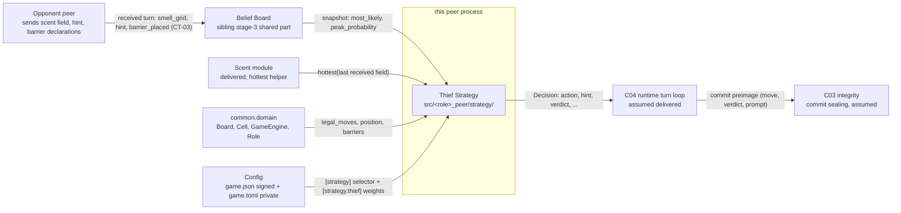
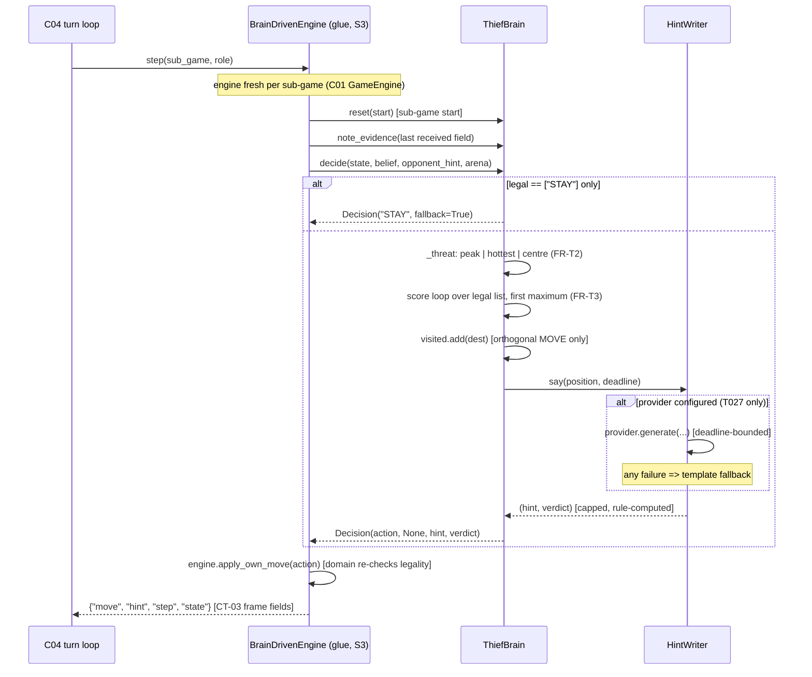
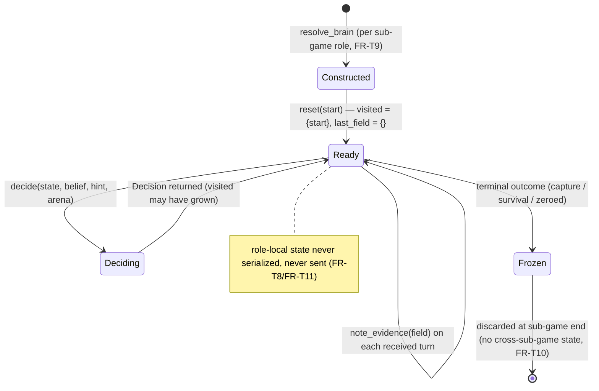

# PLAN — Thief Strategy (Stage 3, role-specific part)

## 1. Approach summary

Build one module per repository — `src/thief_peer/strategy/` — holding the Thief's decision
policy over the CT-01 legal set, plus the **shared core** of the strategy module that both
role repositories carry identically (modulo package import path and the role constant, the
shared-scent/belief precedent):

| File | Kind | Responsibility |
|---|---|---|
| `strategy/decision.py` | shared core | the frozen `Decision` contract (PRD §5.3) |
| `strategy/base.py` | shared core | `BrainBase` — pinned two-phase `decide()`, role-local `visited` + `last_field` |
| `strategy/hints.py` | shared core | `HintWriter` (template default) + `TextProvider` seam; landmark names from `belief.hints` |
| `strategy/inject.py` | shared core | `resolve_brain_cls` / `resolve_brain` — config-selected brain, fail-fast |
| `strategy/thief.py` | **role-specific** | `ThiefBrain` — the scored multi-criterion evasion policy (M-04 derived design) |
| `strategy/__init__.py` | shared core | public re-exports only |

The policy reads only what the stage entry criteria guarantee: the C01 `GameEngine`
(legal set, own position, public barriers), the belief snapshot (PRD-BELIEF-BOARD FR-B6
queries), the last received scent field (via a `note_evidence` hook, SD-T4), and private
config. It writes one thing: a `Decision`. No transport, no clock, no network in
`strategy/`.

Integration continues the stage-2 top-down spine (PLAN-MCP-INFRA §12/SD-03 and
`PLAN_belief_board.md` §12): the role glue's stand-in engine
(`src/thief_peer/wire/`: `legal_moves[0]` + canned hint) is replaced **behind the existing
`TurnEngine` seam** by a brain-driven engine, and the spine test
(`tests/integration/test_series_loopback.py`) must stay green after every swap. The belief
half is already wired by the belief stage (S1/S2); this stage replaces only the *decision*
half, on top of the real belief.

Binding integration strategy:

1. Build the shared core + `ThiefBrain` against plain data (no transport), unit-first.
2. Hardening tests for the verbal layer (isolation, verdict rule, cap, lie rate).
3. Swap the stand-in decision on the role-glue decision path (S3a/S3b/S3c); spine green.
4. Property/KPI/determinism/perf suites + coverage close the stage; the shared-core sync
   check runs once the police counterparts exist.

## 2. C4 — Level 1: Context



External actors: the opponent peer (evidence source — never a source of *truth*), the signed
constitution, the private tuning file. The strategy has no other external dependency: no
network, no disk, no clock.

## 3. C4 — Level 2: Container (one peer process)

```mermaid
flowchart TB
    subgraph peer process
        subgraph C04 runtime reliability (assumed delivered)
            TH[TurnHandler — update path]
            TS[TurnSender — decision path]
            SM[Orchestrator FSM]
        end
        subgraph C02 perception strategy
            subgraph belief [belief/ — sibling shared part]
                BGRID[grid.py — BeliefGrid]
                BHINTS[hints.py — LANDMARK_CELLS]
            end
            subgraph strategy [strategy/ — THIS PLAN]
                DEC[decision.py]
                BASE[base.py — BrainBase]
                HINTW[hints.py — HintWriter]
                INJ[inject.py — seam]
                THIEF[thief.py — ThiefBrain]
            end
            SCENTBOX[scent/ — delivered]
        end
        GLUE[role glue wire/<br/>BrainDrivenEngine — S3 swap]
        C01[common.domain — Board, Cell, GameEngine]
        TH --> BGRID
        TH -- "note_evidence(field)" --> GLUE
        TS --> GLUE
        GLUE --> INJ
        INJ --> THIEF
        THIEF --> BASE
        BASE --> HINTW
        HINTW -. "imports LANDMARK_CELLS (SD-B3)" .- BHINTS
        THIEF --> BGRID
        THIEF --> SCENTBOX
        C01 --> THIEF
        C01 --> BASE
    end
```

Dependency direction is strictly inward: `strategy/` never imports `wire/`, `transport/`,
or `ui/`. The dashed line is *content* sharing — one landmark table imported from
`belief.hints`, never copied (SD-B3 of the belief PLAN). The glue imports `strategy/`;
`strategy/` does not know the glue exists.

## 4. C4 — Level 3: Component

| Module | Responsibility | Owns state? |
|---|---|---|
| `strategy/decision.py` | `Decision` frozen dataclass + field invariants (PRD §5.3) | no |
| `strategy/base.py` | `BrainBase`: pinned `decide()` (move phase → hint phase), forced-STAY handling, `visited` update, `note_evidence` | yes — `visited: set[Cell]`, `last_field: dict[str, float]` (role-local, per sub-game) |
| `strategy/hints.py` | `HintWriter` (role-parameterized template banks, lie roll, verdict rule, `_cap`), `TextProvider` Protocol seam (T027) | no (RNG injected) |
| `strategy/inject.py` | `resolve_brain_cls` (fail-fast selector), `resolve_brain` (seeded construction) | no |
| `strategy/thief.py` | `ThiefBrain`: threat selection (FR-T2), scored ranking (FR-T3), barrier guard (FR-T4) | no (weights as constructor args) |
| `strategy/__init__.py` | public re-exports: `BrainBase`, `Decision`, `HintWriter`, `TextProvider`, `ThiefBrain`, `resolve_brain`, `resolve_brain_cls` | no |

State ownership rule (AGENTS.md): the only mutable strategy state is `BrainBase.visited`
and `BrainBase.last_field`, both role-local, both reset per sub-game, neither serialized nor
sent (FR-T8/FR-T11). The engine owns position/barriers (C01); the belief owns the
distribution (belief stage); the config manager owns config (C01).

## 5. C4 — Level 4: Code (module APIs)

Signatures as they will exist; bodies are the task-level detail
(`TODO_thief_strategy.md`).

### 5.1 `strategy/decision.py` (shared core)

```python
@dataclass(frozen=True)
class Decision:
    """The CT-02 response: one legal action + the verbal phase + audit metadata.

    Invariants: `action` is a member of this turn's CT-01 legal set;
    `barrier_cell` is None for THIEF (role guard, M-04) and, for POLICE,
    requires action == "STAY" and membership in barrier_targets() under quota;
    `hint` is at most hint_max_words words; `verdict` is sealed for audit.
    The serializable projection (action, barrier_cell as [r,c] | None, hint,
    verdict) feeds the canonical-JSON commit preimage (SPEC section 2) via C03.
    """
    action: str
    barrier_cell: Cell | None = None
    hint: str = ""
    verdict: str = "truth"          # "truth" | "lie"
    fallback: bool = False          # True when forced STAY (no legal orthogonal move)
    reasoning: str = ""             # "" for template mode
    prompt_text: str = ""           # sealed (prompt_discussion) for audit; "" for template
    response_seconds: float = 0.0   # hint-phase timing metadata; never a decision input
```

### 5.2 `strategy/base.py` (shared core)

```python
class BrainBase:
    """Shared strategy core. Phase order is PINNED (M-04 {#hint_isolation}):
    the move is selected first by pure Python — the LLM is NEVER consulted here
    (NG-003) — and the hint is produced afterwards; a hint can never influence
    an already-selected move."""

    role: Role

    def __init__(self, rng: random.Random, arena: str, max_words: int,
                 hint_writer: HintWriter) -> None: ...

    def reset(self, start: Cell) -> None:
        """Fresh sub-game: visited = {start}; last_field = {} (role-local only)."""

    def note_evidence(self, field: dict[str, float]) -> None:
        """Remember the last received scent field (FR-T2 diffuse-fallback input).
        Called by the C04 turn handler on each received turn, BEFORE decide()
        (SD-T4). The field is evidence, never opponent truth."""

    def decide(self, state: GameEngine, belief: BeliefGrid, opponent_hint: str,
               arena: str, deadline: float | None = None) -> Decision:
        """THE pinned two-phase decision (PRD FR-T1…FR-T7).

        1. legal = state.legal_moves(); if legal == ["STAY"]:
           return Decision("STAY", fallback=True)   # capture is domain-decided
        2. action, barrier = self._decide_move(state, belief)   # pure Python
        3. on an orthogonal MOVE: visited.add(dest)
        4. hint, verdict = hint_writer.say(state.position, deadline=deadline)
        5. return Decision(action, barrier, hint, verdict, fallback=False)
        """

    def _decide_move(self, state: GameEngine, belief: BeliefGrid) -> tuple[str, Cell | None]:
        """(action, barrier_cell). PURE PYTHON. The LLM is NEVER consulted here (NG-003)."""
```

### 5.3 `strategy/hints.py` (shared core, role-parameterized)

```python
class TextProvider(Protocol):
    """Provider-neutral seam for the optional LLM adapter (T027, P2, gated by
    PLANQ-003/004). NEVER on the movement path (STRAT-008, NG-003)."""
    def generate(self, role: Role, position: Cell, arena: str, max_words: int,
                 deadline: float | None) -> dict[str, str] | None:
        """Strict JSON {"message", "verdict", "reasoning"}, or None on any
        failure/timeout/unparseable reply (template fallback then applies)."""

class HintWriter:
    """Template-default verbal layer (STRAT-008). Landmark names imported from
    belief.hints.LANDMARK_CELLS (SD-B3 — one table, both directions)."""

    def __init__(self, role: Role, rng: random.Random, arena: str, max_words: int,
                 provider: TextProvider | None = None) -> None: ...

    def say(self, position: Cell, *, deadline: float | None = None) -> tuple[str, str]:
        """(hint, verdict). Template mode (default, zero tokens):

        - lie roll: rng.random() < 0.4 (reference behaviour, seeded);
        - truth: assert a landmark region containing (or Chebyshev-adjacent to)
          `position`; none applicable ⇒ generic non-landmark line (no claim);
        - lie: assert a landmark region NOT containing (or adjacent to) it;
        - verdict RULE-COMPUTED: "truth" iff the asserted region contains or is
          Chebyshev-adjacent to `position` — the role knows its own position,
          so the verdict is always well-defined and audit-consistent;
        - _cap truncates to max_words (for LLM providers the arena + cap also
          enter the system prompt, reference behaviour).
        Provider mode (T027): call with deadline; any failure ⇒ template.
        """
```

### 5.4 `strategy/inject.py` (shared core)

```python
_SELECTORS = {Role.THIEF: "thief_class", Role.POLICE: "police_class"}

def resolve_brain_cls(config: Mapping[str, object] | None, role: Role) -> type[BrainBase]:
    """The config selector ([strategy] thief_class / police_class, dotted
    "package.module:ClassName") if set, else the shipped default for `role`
    (thief_repo: ThiefBrain; the opposite-role default is PLAN SD-T7).
    Fail-fast: ValueError on malformed selector / missing attribute; TypeError
    if the target is not a BrainBase subclass."""

def resolve_brain(config: Mapping[str, object] | None, role: Role,
                  llm: object | None = None,
                  rng: random.Random | None = None) -> BrainBase:
    """Instantiate the resolved class with: rng (default: seeded from the
    resolved config's seed), arena + hint_max_words from the resolved config,
    and the template HintWriter (provider only via T027). The C04 runtime never
    hard-codes a brain (book section 6.2, reference runtime.py L73 pattern)."""
```

### 5.5 `strategy/thief.py` (role-specific — `thief_repo` only)

```python
class ThiefBrain(BrainBase):
    """The M-04 evasion policy: scored multi-criterion ranking over the CT-01
    legal list (derived design — PLANQ-008 records the approved priorities)."""

    def __init__(self, *, w_dist: float = 1.0, w_mob: float = 0.25,
                 w_fresh: float = 0.15, w_trap: float = 5.0,
                 min_confidence: float = 0.15, **base) -> None: ...

    def _threat(self, state: GameEngine, belief: BeliefGrid) -> Cell:
        """FR-T2, fixed order: belief.most_likely() when
        belief.peak_probability() >= min_confidence; else
        scent.hottest(self.last_field); else the board centre."""

    def _decide_move(self, state: GameEngine, belief: BeliefGrid) -> tuple[str, None]:
        """Score each legal action in CT-01 order (N, S, W, E, STAY):

        dest     = state.board.step(state.position, action)     # STAY -> position
        d        = manhattan(dest, threat)                      # MAXIMIZE
        mobility = len(state.board.legal_moves(dest, barriers)) - 1
        fresh    = 1 if (action != "STAY" and dest not in self.visited) else 0
        trap     = 1 if state.board.boxed_in(dest, barriers) else 0
        score    = w_dist * d / size + w_mob * mobility / 4
                   + w_fresh * fresh - w_trap * trap

        Winner: FIRST maximum (strict > while scanning) — deterministic tie-break.
        Returns (action, None): the Thief NEVER places a barrier (FR-T4).
        """
```

All inputs to `_decide_move` are verified repo APIs: `Board.legal_moves(cell, barriers)`
(orthogonal in fixed order + `STAY` last), `Board.step`, `Board.boxed_in`,
`manhattan(a, b)` (`common/domain/board.py`); `GameEngine.legal_moves()`, `.position`,
`.barriers`, `.board`, `.step` (`common/domain/rules.py`); `hottest(field)` (
`thief_peer/scent/model.py`, lexicographic tie-break); belief queries per FR-B6.

## 6. UML — Sequence: one own turn at the decision path



## 7. UML — Flow: threat selection, scoring and edge handling

```mermaid
flowchart TD
    A[own turn] --> B{legal == STAY only?}
    B -- yes --> C["forced STAY, fallback=True (rule-47 capture domain-decided)"]
    B -- no --> D{peak_probability >= min_confidence?}
    D -- yes --> E[threat = belief.most_likely]
    D -- no --> F{last_field non-empty?}
    F -- yes --> G[threat = scent.hottest(last_field)]
    F -- no --> H[threat = board centre]
    E --> S
    G --> S
    H --> S
    S["scan legal actions in N,S,W,E,STAY order"] --> T[score per destination]
    T --> U{score strictly greater than best?}
    U -- yes --> V[best = action]
    U -- no --> W[keep first maximum]
    V --> X
    W --> X["(action, barrier=None); visited updated on MOVE"]
    X --> Y["hint phase: template say(position), capped; verdict rule-computed"]
```

Edge cases pinned by tests: empty field (H), all-visited board (freshness term saturates,
distance/mobility still decide), a single non-trap alternative surrounded by traps (chosen
deterministically), corner destination (mobility 1–2, no crash), `min_confidence` exactly at
the boundary (`>=`, deterministic side pinned by TC-T03).

## 8. UML — State: brain lifecycle per sub-game



## 9. Deployment

In-process; nothing to deploy. The module adds no ports, no files, no environment
variables. Both role repositories ship their copy independently (environment separation,
ARCH-001/002); the shared-core files stay mutually consistent through the ORC sync check
(TODO TS-07, the cross-repo rule).

## 10. Data Contracts

The strategy **sends nothing on the wire directly** — it sits behind the already-delivered
CT-03 envelope and the C03 commit path:

| Direction | Contract | Fields touched |
|---|---|---|
| in | CT-01 local state (`GameEngine`) | `legal_moves()`, `position`, `barriers`, `board` (geometry, size), `step` |
| in | CT-02 request — belief snapshot | `most_likely()`, `peak_probability()` (PRD-BELIEF-BOARD FR-B6) |
| in | last received field | CT-03 `smell_grid` (`{"r,c": float}`) via the C04 `note_evidence` hook (SD-T4) |
| out | CT-02 response (`Decision`) | `action` (CT-01 legal set), `barrier_cell` (`None` for Thief), `hint` (≤ 15 words), `verdict`, `fallback`, `reasoning`, `prompt_text`, `response_seconds` |
| out | CT-03 `TurnMessage` projection (via C03/C04) | `hint` → `hint`; `action` + `verdict` + `prompt_text` → commit preimage (canonical JSON, SPEC §2); `barrier_placed` absent for Thief; `capture_claim` / `claim_response` / `win_claim` — domain/C03-owned, not strategy fields (FR-T5) |

Additive-only rule (CT-02): the `Decision` fields above are the whole surface; this PLAN
does not invent new belief queries, new engine fields, or new wire keys. The serializable
projection is plain `str`/`int`/`None` so C03 can canonicalize it without strategy-aware
code (PRD §10).

## 11. Configuration

Per PRD §9: private `[strategy]` (selector) + `[strategy.thief]` (weights: `w_dist`,
`w_mob`, `w_fresh`, `w_trap`, `min_confidence`), consumed through the C01 config manager's
resolved mapping (no file I/O in `strategy/` — `resolve_brain` takes the mapping). Shared
signed values consumed: `board_and_agents.grid_size`, `movement_and_barriers.move_set`,
`world.map_area`, `world.hint_max_words`, `network_and_league.diversity_reward` (motivation
only). Precedence: shared JSON overlays private TOML on conflict (CFG rules); the
`[strategy]` keys have no shared counterparts.

## 12. Integration Spine — Stub Replacement Map

Continues the stage-2 discipline (PLAN-MCP-INFRA §12/SD-03) and the belief stage's S1/S2
(real belief already wired into the turn handler):

| Step | Replace | With | Spine invariant |
|---|---|---|---|
| S3a | stand-in move selection in the role glue (`legal_moves[0]`) on THIEF sub-games | `BrainDrivenEngine` behind the `TurnEngine` seam: `resolve_brain(config, role)` per sub-game + `brain.decide(...)` + `engine.apply_own_move(action)` | `tests/integration/test_series_loopback.py` green |
| S3b | stand-in canned hint (`"I am here"`) | `HintWriter` template output on the outgoing frame (same `Decision.hint`) | same spine green |
| S3c | (wiring, not a replacement) | `brain.note_evidence(field)` on each received turn, before the decision (SD-T4) | same spine green |

The opposite-role (POLICE) sub-game **keeps the stand-in selection** on this repository
(SD-T7) until the police stage's brain is ported — the series still settles end-to-end
(S3a keeps the glue's existing opposite-role path). No big-bang: each swap is its own task
with its own green run (TODO TS-04).

Write-set note (workflow §4 — no silent scope expansion): the glue file
`src/thief_peer/wire/__init__.py` and the KPI harness (`tests/integration/`) are outside
T007's declared write set; the ORC records the extensions (or assigns a small follow-on
task) in `docs/tasks/` **before** TS-04/TS-06 are claimed, the same pattern as the belief
stage's FR-B9 seam recording.

## 13. Stage Decisions (promote to ADRs only if the orchestrator wants durable records)

### SD-T1 — Scored multi-criterion heuristic over the reference distance-max

**Decision:** ship the four-term scored ranking (distance, mobility, freshness, trap) as
the final Thief policy; keep the reference distance-max as the A/B baseline in the KPI
harness. **Rationale:** the reference baseline's failure mode is structural — maximal
Manhattan distance is attained in corners, which are exactly where mobility is zero and the
rule-47 trap seals with one barrier; the PRD's Alternatives table (PRD §7) records the
trade-offs. The weights are **project convention** (M-04 derived-design split), pinned in
PRD §9 as the PLANQ-008 approval baseline. **Trade-off:** tuned weights may be suboptimal
against an unknown Police; the KPI harness (200 seeded games) is the measurable check, and
re-tuning is a config edit, not a code change. **Alternatives:** reference distance-max
(rejected as final, kept as baseline), lookahead (P2), RL (P2), LLM (forbidden by default).

### SD-T2 — Threat fallback chain: peak → hottest → centre

**Decision:** the threat is `belief.most_likely()` above `min_confidence` (default 0.15),
else `scent.hottest(last_field)`, else the board centre (FR-T2). **Rationale:** a diffuse
peak is a noisy point estimate (a 1/49 uniform belief has a peak of ~0.02); chasing it
would make the policy pretend to certainty it does not have. The raw scent is the
uncalibrated-but-honest channel; the centre keeps `decide()` total when even the field has
fully decayed. **Trade-off:** the fallback can sit on a stale hotspot under the default
one-sided `trust_v1` likelihood (PRD-BELIEF-BOARD §6.2); the belief stage's `kernel_bayes_v1`
addresses that upstream. **Alternatives:** always-peak (rejected: noise-chasing),
always-scent (rejected: ignores hint evidence already folded into the belief).

### SD-T3 — Role-local `visited` in `BrainBase`, not in the engine

**Decision:** `visited: set[Cell]` lives in `BrainBase` (init `{start}`; add on orthogonal
MOVE only; never serialized, never sent; reset per sub-game). **Rationale:** this repo's
`GameEngine` has no visited set, and the engine is C01-owned shared code — adding a
policy-specific field there would push strategy concerns into the domain (ARCH-007
boundary). The freshness term (FR-T3) and the signed `diversity_reward` motivation both
need it; it is role-local evidence, so STRAT-001/OBS-002 are respected. **Trade-off:** a
second per-sub-game state object in the strategy; negligible, and reset is one line.
**Alternatives:** engine field (rejected: C01 write-set + boundary), recompute from the
sealed log (rejected: the log is C03 territory and needs the opponent's audit context).

### SD-T4 — Last received field remembered via a `note_evidence` hook

**Decision:** `BrainBase.note_evidence(field)` is called by the C04 turn handler on each
received turn, before `decide()`; the diffuse fallback (SD-T2) reads `self.last_field`.
**Rationale:** the shared-core `decide()` signature is binding for both role docs and
cannot grow a field parameter without a CT-02 contract change for a role-local
convenience; the field is legitimate evidence (the opponent's transmitted scent,
STRAT-001), not opponent truth. **Trade-off:** one hook call in the glue per received
turn (S3c); the hook is a no-op store. **Alternatives:** extend the CT-02 request
(rejected: additive-only contract change for a local convenience), read it from the engine
(rejected: the engine is C01-owned and scent-free by design).

### SD-T5 — Template mode is the only provider this stage; the seam is defined, the adapter deferred

**Decision:** `TextProvider` (Protocol) is defined in the shared core `hints.py`; this
stage ships template mode only; the provider-neutral adapter is T027 (P2, `optional:
true`, gated by PLANQ-003/PLANQ-004 `blocks: start` on that task only). **Rationale:**
STRAT-008 recommends zero-token template as the default; PLANQ-003 (whether to enable a
provider at all) is `TBD_TEAM_DECISION` — building the adapter now would work against an
unmade team decision. The seam costs one small Protocol and keeps T027 a drop-in.
**Trade-off:** none at this stage (the fallback path is the template anyway).
**Alternatives:** build the adapter now (rejected: gated decision), no seam (rejected:
T027 would then patch the shared core).

### SD-T6 — Strict first-maximum tie-break in CT-01 order

**Decision:** the winner scan uses strict `>` so the FIRST maximum in the CT-01 order
(N, S, W, E, STAY) wins ties. **Rationale:** determinism without a second tie-break key —
`Board.legal_moves` already returns a fixed order, and the reference implementation relies
on the same `min`/`max`-first-extremum convention (report §5.2). Any additional tie-break
key would be an unapproved extra heuristic. **Trade-off:** ties resolve by direction
priority, not by any quality signal; acceptable at this board size. **Alternatives:**
random tie-break (rejected: breaks NFR-2 without a seeded justification), secondary
`-belief.prob(dest)` key (rejected: that is the POLICE pursuit secondary key — importing
it into the Thief policy would blur the role docs' shared-core split).

### SD-T7 — Opposite-role sub-games keep the stand-in until the police stage ports

**Decision:** the brain is resolved per sub-game role (FR-T9). In `thief_repo`, THIEF
sub-games run `ThiefBrain`; POLICE sub-games keep the stage-2 stand-in selection on the
glue's existing path, labeled as such. **Rationale:** the Police policy is role-owned by
`police_repo` (M-03; its designed behaviour — pursuit + `where_place_barrier` — must not
be designed or duplicated here, M-04's separation argument in reverse). The spine stays
green either way, and the KPI harness is role-pinned (TC-T17), so no measurement depends
on the opposite-role default. **Trade-off:** a Thief peer's even sub-games play a
dumb policy until the port; acceptable mid-stage, and the port is a recorded follow-on.
**Alternatives:** implement the reference PoliceBrain here (rejected: role-ownership
violation), a designed police policy here (rejected: same, plus it would pre-empt the
police PRD), refuse to run series (rejected: the spine requires a full six-sub-game
series).

## 14. Requirement → Module → Test Traceability

| Req | Module (file.function) | Tests |
|---|---|---|
| ARCH-007 (strategy is a separate module) | the `strategy/` package boundary; `inject.py` (seam) | TC-T10, TC-T12, TC-T18 |
| STRAT-001 (own position + belief only) | `base.py:decide` inputs; `thief.py` (no opponent-truth parameter) | TC-T02, TC-T14 |
| STRAT-006 (belief materially influences selection) | `thief.py:_threat`, `_decide_move` | TC-T03, TC-T04, TC-T05, TC-T08 |
| STRAT-007 (heuristic route, none required) | `thief.py` (route 2, book §6.3.1); KPI vs baseline | TC-T17 |
| STRAT-008 (template default; LLM text-only) | `hints.py:HintWriter` (+ `TextProvider` seam) | TC-T09, TC-T10 |
| STRAT-009 (truth or deception; arena + cap) | `hints.py:say` (banks, lie roll, `_cap`) | TC-T09, TC-T11 |
| GAME-012 (barriers open + truthful) | `thief.py` consumes declared barriers as exact truth; FR-T4 never declares | TC-T02 (barrier guard), TC-T06 |
| SEC-007 (truthful capture answer) | **no strategy module** — domain `answer_capture_claim` + C03 sealing; `Decision` has no claim field | TC-T02 (shape property), FR-T5 |
| M-04 `{#evasion_legality}` | `base.py:decide` (legal-list iteration), `thief.py:_decide_move` | TC-T01, TC-T02, TC-T07 |
| M-04 `{#capture_response_honesty}` | no policy path (hard constraint, FR-T5) | TC-T02 (shape property) |
| M-04 `{#hint_isolation}` | `base.py:decide` pinned phase order | TC-T10 |
| NG-003 (no LLM bypass of legality) | `base.py:_decide_move` (pure Python) | TC-T10 |
| NFR-1 (≤ 10 ms p99) | all | TC-T16 |
| NFR-2 (determinism) | all (seeded RNG; pinned orders) | TC-T08, TC-T15 |
| CFG-006 (consume signed values) | `inject.py:resolve_brain` (config mapping reads) | TC-T01, TC-T12 |

## 15. Verification Commands

```sh
uv sync --locked --all-groups
uv run pytest tests/unit/strategy -q              # TC-T01, T03…T13, T14(partial)
uv run pytest tests/property/strategy -q          # TC-T02 full (10k fuzz) — T021 write set
uv run pytest tests/integration/test_strategy_selfplay_kpi.py -q   # TC-T17 (KPI harness)
uv run pytest tests/integration/test_series_loopback.py -q         # TC-T18 (spine after S3)
uv run ruff check src/thief_peer/strategy tests/unit/strategy tests/property/strategy
uv run python -m tests.tooling.line_cap src/thief_peer/strategy    # ≤ 150 nonblank/noncomment
uv run python scripts/run_quality_gates.py        # link + secret + docs gates
# cross-repo (once the police counterparts exist): shared-core sync check —
# strategy/{decision,base,hints,inject,__init__}.py identical modulo package import path
# and the role constant (TODO TS-07, the cross-repo rule).
```

## 16. Relationship to the Repository Documents

- **Upstream:** `PRD-THIEF-STRATEGY` (this stage's PRD); M-04 (binding mechanism contract);
  C02 component PRD/PLAN (shared scope); CT-01/02/03 (boundaries); ADR-004 +
  `LEAGUE_COMPATIBILITY.md` (the profile the policy must not conflict with, PRD §10).
- **Sibling (same stage, separate files):** `PRD/PLAN/TODO_belief_board.md` (shared belief
  part — this PLAN consumes its FR-B6 query surface and imports its `LANDMARK_CELLS`
  table, SD-B3) and the planned `PRD/PLAN/TODO_police_strategy.md` (police role doc —
  mirror of the shared-core wording, its own pursuit policy + barrier placement).
- **Execution:** `TODO_thief_strategy.md` (this stage's ledger) maps to repo task
  **T007** (write set `src/thief_peer/strategy/` + `tests/unit/strategy/`; PLANQ-008
  `blocks: criterion` on `{#heuristics}`), with ORC-recorded write-set extensions for the
  glue swap (S3) and the KPI harness, plus **T021** for the property-suite close-out;
  T027 (optional provider) stays deferred and gated. The global `docs/TODO.md` ledger is
  reconciled by the orchestrator after each wave; this stage does not edit it.
- **Assumed delivered (prerequisites, per stage entry criteria):** C01 domain + config
  (T003/T004), scent model + lock (T005), orchestrator FSM + turn loop (T010), MCP
  transport + turn frames (T009), integrity core (T008); the belief board (T006) is the
  sibling stage-3 work and an entry criterion for the spine swap (TS-04).
