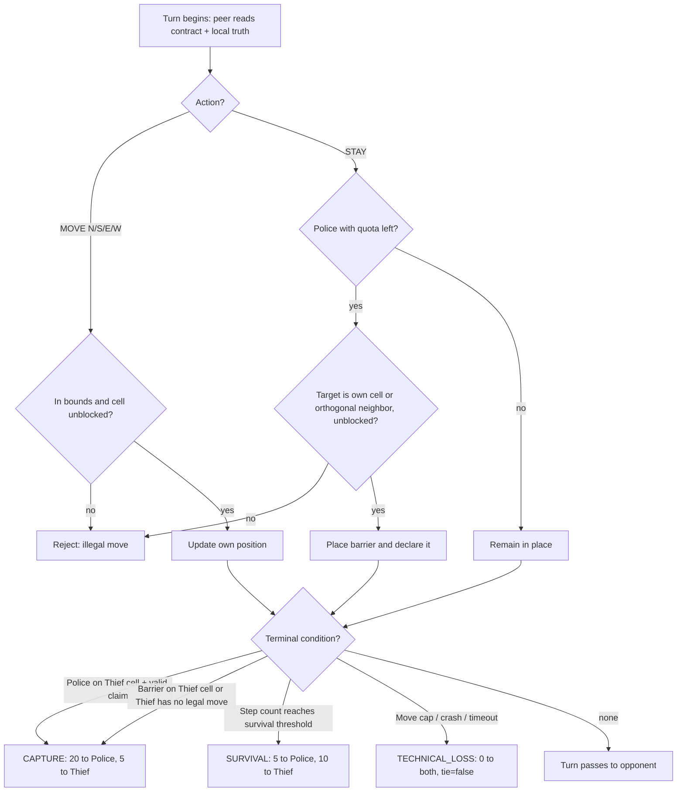

# Product Requirements: Stage 1 — Base Logic (Board, Movement, Barriers, Capture, Scoring)

## Summary

Build the deterministic core of the game: a discrete square board, the movement and barrier rules, capture and terminal conditions, the fixed scoring table, and the shared configuration contract that parameterizes them all — with **no communication, no strategy, no scent, no cryptography, and no I/O** (book ch. 10 build order, stage 1). This is the foundation every later stage rests on: stage 2 (FastMCP infrastructure) starts only after stage 1 behavior is observed working end-to-end. Target audience: the two peer agents (which consume the contract and enforce the physics), the project team, and the evaluator (who audits the stage evidence).

This PRD decomposes the approved product contract `PRD-FINAL-P2P@0.1` into stage 1 scope. It adds no new product scope: every requirement maps to a canonical ID in `docs/spec/CANONICAL_REQUIREMENTS.md`. Where the book body uses parameter placeholders (`[גודל הלוח]`, `[מכסת המחסומים]`, `[סף ההישרדות]`), the binding values and their fixed/minimum/negotiated statuses come from Appendix F as registered in that canonical set; the shared contract's file structure and field names come from Appendix B, and the binding rule list from Appendix E. Correctness for this stage is established by the committed domain vectors in `tests/unit/domain/`, which encode the Appendix E rules and the Appendix F table directly.

## Context and theoretical background (book ch. 3)

- **Discrete space, no external judge (§3.2).** The game lives on a finite grid where every position, move, and block is exactly countable. There is no referee: physics is enforced by the agents themselves, each on its own turn, from a pre-agreed shared contract — `config/game.json` — byte-identical at both peers. Because both sides compute the same transition function and the same terminal conditions, there is no dispute about "what is legal" before play starts.
- **Negotiated contract, floor not ceiling (§3.2).** The contract is settled per pairing, not imposed from above; it may vary between pairs but may not weaken the book's rules. Teams may legally upgrade rules and exploit any loophole not forbidden, as long as everything is agreed and legal.
- **State-space explosion (§3.3).** The Dec-POMDP state space grows as the product of both agents' positions and all barrier layouts. The default board is 7×7 (up from 5×5): quadrupling the cells inflates the state space by orders of magnitude, making exhaustive brute-force search computationally infeasible — an intrinsic Dec-POMDP difficulty — which is why heuristics and learning (stage 3+) are required instead of enumeration.
- **Pursuit on graphs (§3.4).** One orthogonal step or stay per turn, no diagonals, ties the game to the cops-and-robbers pursuit family studied in graph theory.
- **Spatial engineering (§3.4).** The barrier quota makes Police the architect of the arena under a resource-management constraint: squeeze Thief into a corner without walling off Police's own access.
- **Asymmetric scoring (§3.5).** Not a binary win: each terminal scenario pays both sides differently, and technical loss zeros both sides — making protocol correctness worth more than winning on time.
- **Canonical contract file (App. B).** `config/game.json` is the signed constitution of the game, organized in the sections `board_and_agents`, `world`, `movement_and_barriers`, `scoring`, `pheromones`, `network_and_league`, `rate_limiter_gatekeeper`. JSON was chosen for canonical serialization (sorted keys), which enables consistent hashing (`config_sha256`) and byte-for-byte identity at both peers. Field names are fixed and mandatory — only values are negotiable. Each peer's private `config/game.toml` holds local-only settings, is never signed, never crosses the network, and can never weaken a signed condition: on any key conflict the JSON value overlays the TOML.
- **Binding rule list (App. E).** The stage 1-relevant binding rules: rule 11 (contract byte-identical at both peers), rule 12 (minimums may be raised by agreement only, never lowered), rules 13–14 (orthogonal movement only; diagonals rejected by the opponent), rules 15–16 (open exact barrier declaration; no lying about placement), rules 21–22 (truthful capture answers; false claims are disqualifying), rules 46–48 (blocking placement and entrapment count as capture; every ending scored by the fixed table).

## Scope

### In scope (stage 1)

1. **Shared config contract** — load and validate `config/game.json` with the Appendix B section structure and fixed field names: Appendix F statuses (fixed / minimum / negotiated), defaults, per-game uniquely named committed files, private-local config precedence rules.
2. **Board** — square N×N grid, N ≥ 7 (default 7); axis system (origin corner, start index) from the contract; in-bounds geometry; start positions from the contract.
3. **Movement** — one action per turn: N, S, E, W, or STAY; diagonal and off-board/barrier moves rejected; deterministic fixed-order legal-move enumeration.
4. **Barriers** — Police only, on a forgo-movement turn, own cell or one orthogonally adjacent cell; irreversible and impassable to both; quota ≥ 14 (default 14), enforced on own placements and on the opponent's declared barriers; open exact declaration.
5. **Capture and terminal conditions** — capture by claim (Police lands on Thief's cell + valid claim + honest answer, logic level), capture by blocking placement, capture by entrapment, survival at the threshold, move cap, technical loss.
6. **Scoring** — the fixed table: capture (20, 5), survival (5, 10), technical loss (0, 0), cumulative tie (2, 2).
7. **Purity and determinism** — the domain core has no network, GUI, LLM, clock, or filesystem dependency, and is byte-reproducible for identical inputs.

### Out of scope (later stages)

| Stage | Excluded here |
|---|---|
| 2 | FastMCP servers, tools, localhost transport (stage 2 wraps this core without changing its logic) |
| 3 | Strategy / decision-making modules |
| 4 | Natural language hints, scent/pheromone fields and decay, LLM inference/lies |
| 5 | Public addresses, ngrok/Localtonet tunneling, remote peers |
| 6 | Commit–Reveal, Nonce, Step-0, cryptographic audit of the honesty obligations (this stage defines the claim/answer flow at **logic** level only; tamper detection is stage 6) |
| 7 | Gmail API, GUI, Replay app |

## Goals and success metrics (KPIs)

Stage goals (measurable; acceptance is defined by the SC list in "Success criteria and stage gate"):

- G-BL-01: The domain core enforces every binding rule of book ch. 3 and App. E rules 11–16, 21–22, 46–48 — no rule violation passes undetected.
- G-BL-02: Both peers compute identical legality and terminal decisions from the identical contract (symmetry, App. E rule 11).
- G-BL-03: The core is pure and deterministic, so stages 2+ can attach transport and strategy without redesign.

| KPI | Target | Measured by |
|---|---|---|
| Requirement-to-test coverage of BL-01…BL-22 | 100% | traceability table in the task handoff |
| Contract-test pass rate at the stage gate | 100% | `uv run pytest` evidence |
| Determinism divergences across repeated runs | 0 | SC-4 double-run comparison |
| Full 35-step two-agent simulation wall time | < 1 s (design target < 10 ms) | benchmark at CP-5 |
| I/O imports in the domain module (network/GUI/LLM/clock/filesystem) | 0 | import audit / ruff |

## Requirements

Normative key words (MUST, MUST NOT, SHOULD) are RFC-2119. Each BL row maps to the canonical requirement it implements; canonical IDs are the traceability anchor (workflow §2).

### A. Board, axes, and config contract (book §3.2–3.3)

| ID | Canonical | Requirement | Input → Output |
|---|---|---|---|
| BL-01 | GAME-001 | The board MUST be square and at least 7×7; 7×7 is the default when no other value is agreed. | contract `board_size` → validated square grid |
| BL-02 | GAME-002 | The number of agents MUST be exactly 2. | contract `num_agents` → validation verdict |
| BL-03 | GAME-003 | Axis origin, starting index, and start positions MUST come from the contract; defaults: top-left origin, index 0, Thief at the center, Police at a corner. Both peers MUST interpret coordinates identically. | contract → start cells as `(row, col)` pairs |
| BL-04 | CFG-005 | Statuses MUST be enforced: Fixed is immutable; Minimum cannot fall below its threshold and may be made harder only by agreement; Negotiated uses the default when no agreement exists. | contract values → accept / reject with the offending key named |
| BL-05 | CFG-001, CFG-004; App. E rule 11 | `config/game.json` MUST be the shared contract with the Appendix B section structure and fixed field names, byte-identical at both peers, and MUST define all Appendix F game values (cryptographic locking of the file itself is stage 6). Renamed, missing, or unknown keys MUST be rejected. | file → validated parameter set |
| BL-06 | CFG-009, CFG-010 | Configuration MAY change only under agreement; each game MUST have a uniquely named configuration file committed to the repository. | — |
| BL-07 | CFG-002, CFG-003; App. B §1–2 | The private local configuration (`config/game.toml`) MUST stay local, MUST NOT cross the network, and MUST NOT weaken a signed condition; when a key appears in both files the shared JSON value overlays the TOML. | — |

### B. Movement (book §3.4)

| ID | Canonical | Requirement | Input → Output |
|---|---|---|---|
| BL-08 | GAME-004 | On each turn an agent MUST perform exactly one action: north, south, east, west, or stay. | `(cell, action, barriers)` → new cell |
| BL-09 | GAME-005 | Diagonal movement MUST NOT be accepted and MUST be rejected. | diagonal action → rejection |
| BL-10 | GAME-005, App. E 13–14 | A move that leaves the board or lands on a barrier cell MUST be rejected by the peer enforcing the physics — there is no external judge. | illegal action → rejection |
| BL-11 | — (determinism) | The legal action set MUST be enumerable in a fixed, documented order so any seeded policy is reproducible. | `(cell, barriers)` → ordered action list |

### C. Barriers (book §3.4)

| ID | Canonical | Requirement | Input → Output |
|---|---|---|---|
| BL-12 | GAME-006 | Only Police places barriers; placing MUST forfeit movement on that turn (STAY is the turn's action); the target MUST be Police's own cell or one orthogonally adjacent cell. | `(cop_cell, target, role, quota_left)` → placement or rejection |
| BL-13 | GAME-007 | A placed barrier MUST remain irreversible and impassable to both agents until the game ends. | barrier set is append-only; blocked cells excluded from legality |
| BL-14 | GAME-008 | The barrier quota MUST be at least 14; 14 is the default. Placement beyond the quota MUST be rejected — including the opponent's declared barriers (the signed quota binds both sides' counts). | 15th placement/declaration against quota 14 → rejection |
| BL-15 | GAME-012; App. E rules 15–16 | Every barrier placement MUST be declared openly and exactly, and a peer MUST NOT lie about a barrier's location; each peer absorbs the opponent's declared barrier into its own board. Hidden placement or a false declaration is prohibited and sanctionable (sanction detection belongs to stage 6). | declared cell → appended to local barrier set (validated: in bounds, not already blocked) |

### D. Capture and terminal conditions (book §3.5)

| ID | Canonical | Requirement | Input → Output |
|---|---|---|---|
| BL-16 | GAME-009; App. E rules 21–22 | Police landing on the Thief's cell followed by a valid Capture Claim MUST count as capture. The claim MUST name Police's current post-move cell; the Thief MUST answer truthfully at the logic level — a false claim or denial is a disqualification-level fault (detection and the cryptographic obligation are stage 6). | `(claim_cell, police_cell, thief_cell)` → capture / claim rejected |
| BL-17 | GAME-010 | Placing a barrier on the cell occupied by the Thief at that moment MUST count as capture (noticed by the Thief). | barrier target == thief cell → capture |
| BL-18 | GAME-011 | A Thief with no legal move because all adjacent cells are blocked or outside the board MUST count as captured. STaying still does not rescue it — the rule is about movement. | `(thief_cell, barriers, board)` → capture verdict |
| BL-19 | GAME-014 | The move cap and survival threshold MUST each be at least 35; 35 is the default for both. Survival is reached at the threshold of valid steps without capture; the move cap ends the game. | step counter vs. thresholds → terminal outcome |
| BL-20 | — | The terminal outcome set at this stage is exactly: `CAPTURE`, `SURVIVAL`, `TECHNICAL_LOSS` (crash / time overrun / forgery — their detection is later stages; the domain defines the outcome and its score now). | — |

### E. Scoring (book §3.5, table 2)

| ID | Canonical | Requirement | Input → Output |
|---|---|---|---|
| BL-21 | GAME-013 | Scoring MUST be fixed: capture gives Police 20 and Thief 5; survival gives Police 5 and Thief 10; technical loss is 0 for both; a cumulative series tie gives 2 to each side. | `(outcome, role)` → int |
| BL-22 | — | A zeroed outcome (technical loss / timeout / tamper) MUST NOT be reported as a tie: the 0–0 is a sanction, not a draw. | `(outcome, scores)` → `tie` flag |

### F. Hidden-position design constraint (reference `engine.py`)

The domain core MUST operate on **local truth only**, so stage 2 can attach a transport without redesign:

- F-01: A peer MUST know its own position only; it MUST NOT hold or compute the rival's true position.
- F-02: Barriers are public (declared) and MUST be held by both sides.
- F-03: Terminal conditions that depend on the rival's position are decided by the side entitled to know them — the Thief notices barrier-on-cell (BL-17) and entrapment (BL-18); the Police issues the claim and the Thief answers (BL-16).

### G. User stories

- **US-BL-001 — Legal move (both roles).** Given a peer holds its turn under a valid contract, when it issues one of N/S/E/W/STAY, then a move that stays in bounds and unblocked is applied and the turn passes; any other action is rejected as illegal with no state change.
- **US-BL-002 — Barrier placement (Police).** Given Police has quota remaining and forgoes movement, when it declares a target on its own cell or an orthogonally adjacent cell, then the barrier becomes permanently impassable to both and the quota decreases by one; a placement beyond the quota (e.g., the 15th against 14) is rejected.
- **US-BL-003 — Capture (Police claim, Thief answer).** Given Police lands on the Thief's cell, when it issues a Capture Claim naming its own post-move cell, then the Thief answers truthfully and the outcome is CAPTURE with scores (20, 5); a claim naming any other cell is rejected.
- **US-BL-004 — Survival (Thief).** Given no capture has occurred, when the Thief's valid steps reach the survival threshold (default 35), then the outcome is SURVIVAL with scores (5, 10).
- **US-BL-005 — Contract validation (both roles).** Given a `config/game.json`, when a peer loads it, then a changed fixed value, a lowered minimum, or a renamed/missing field is rejected with the offending key named; a valid contract loads identical parameters at both peers.

## Shared config contract — file structure and binding values

Sources: Appendix B (file structure, field names), Appendix F tables 13–19 (values and statuses), `docs/spec/CANONICAL_REQUIREMENTS.md` (CFG-001…CFG-010). Field names are **fixed and mandatory** (App. B §3); only values are negotiable, and a Minimum may move only in the harder direction (App. F status definitions; App. E rule 12).

### Stage 1 contract skeleton (App. B, book defaults)

```json
{
  "schema_version": "1.2",
  "agreed_between": ["<group-a>", "<group-b>"],
  "board_and_agents": {
    "grid_size": 7,
    "num_agents": 2,
    "thief_start": [3, 3],
    "cop_start": [0, 0],
    "axis_origin_corner": "top-left",
    "axis_start_index": 0
  },
  "movement_and_barriers": {
    "move_set": ["N", "S", "E", "W", "STAY"],
    "max_barriers": 14,
    "max_moves": 35,
    "survival_threshold": 35
  },
  "scoring": {
    "capture_cop": 20, "capture_thief": 5,
    "survival_cop": 5, "survival_thief": 10,
    "tie_score": 2, "technical_loss": 0
  },
  "world": { "map_area": "New York", "hint_max_words": 15 },
  "pheromones": {
    "pheromone_center_intensity": 0.9,
    "pheromone_decay": 0.10,
    "pheromone_grid_size": 5
  },
  "network_and_league": {
    "response_timeout_sec": 30, "watchdog_timeout_sec": 60,
    "num_games": 1, "diversity_reward": 10,
    "min_games_to_pass": 2, "max_games_per_team": 10,
    "token_budget_per_series": 200000
  },
  "rate_limiter_gatekeeper": {
    "requests_per_minute": 30, "concurrent_requests": 2,
    "retry_backoff_sec": 5, "max_retries": 3, "queue_depth": 100
  }
}
```

All sections MUST be present (CFG-004). The sections consumed by later stages (`world`, `pheromones`, `network_and_league`, `rate_limiter_gatekeeper`) are out of scope for stage 1 logic except that the config loader MUST parse and define them.

Note on `num_games`: the book's example JSON ships `num_games: 1` (a single sample sub-game), while the league series is fixed at six sub-games (App. F table 18). Stage 1 only requires the field to be present and validated; series semantics belong to a later stage.

### Binding values (App. F tables 13, 15, 17)

| Official key (App. B/F) | Reference name | Status | Default | Stage 1 validation |
|---|---|---|---|---|
| `grid_size` | `board_size` | minimum | 7 | ≥ 7 |
| `num_agents` | — | fixed | 2 | == 2 |
| `axis_origin_corner` | — | negotiated | top-left | one of the four corners; identical at both peers |
| `axis_start_index` | — | negotiated | 0 | 0 or 1; identical at both peers |
| `thief_start` | — | negotiated | `[3, 3]` (center) | in bounds, not on a barrier, distinct from `cop_start` |
| `cop_start` | — | negotiated | `[0, 0]` (corner) | in bounds, not on a barrier |
| `max_barriers` | `barriers_max` | minimum | 14 | ≥ 14 |
| `max_moves` | `max_steps` | minimum | 35 | ≥ 35 |
| `survival_threshold` | — | minimum | 35 | ≥ 35 |
| `move_set` | — | fixed | N, S, E, W, STAY | immutable |
| `scoring.capture_cop` / `scoring.capture_thief` | — | fixed | 20 / 5 | immutable (GAME-013) |
| `scoring.survival_cop` / `scoring.survival_thief` | — | fixed | 5 / 10 | immutable (GAME-013) |
| `scoring.tie_score` | — | fixed | 2 | immutable (GAME-013) |
| `scoring.technical_loss` | — | fixed | 0 | immutable (App. E rule 48) |

The private `config/game.toml` (App. B §4) holds local-only settings — group identity, network port/opponent, strategy selection, LLM/trash-talk mode, mail target — is never signed, never crosses the network, and never weakens a signed condition (BL-07).

## Non-functional requirements and performance metrics

| ID | Requirement |
|---|---|
| NF-01 | **Purity:** no network, GUI, LLM, clock, or filesystem dependency enters the domain logic (PLAN TD-01; T004 acceptance criteria). |
| NF-02 | **Determinism:** identical (contract, action sequence) → byte-identical legal-action ordering, terminal outcome, and scores; reproducible across processes. |
| NF-03 | **Complexity:** every operation is O(1)–O(N²) in N (N ≥ 7). A full 35-step two-agent game simulation MUST complete in well under one second with a large margin. |
| NF-04 | **No hidden global state:** state transitions act on the explicit sub-game object only; no mutable singletons. |
| NF-05 | **Testability:** every requirement above is verifiable from its stated input → output signature by a contract test. |
| NF-06 | **No wire serialization in the domain:** byte-level serialization belongs to the transport boundary (stage 2, PLAN TD-03); the canonical internal cell is the `(row, col)` tuple. |

## Constraints and limitations

- The contract is a **floor, not a ceiling** (book §3.2): it may not weaken Appendix F; upgrades by agreement are permitted and SHOULD be validated by the same status rules (BL-04).
- Start positions, board size, and quota MUST never be hardcoded as constants in game logic — always read from the validated config, so the balance can change per pairing without touching agent code (book §3.3).
- The canonical cell representation is `(row, col)` with the contract's origin and indexing; if one peer indexed from 0 and the other from 1, `[3,3]` would diverge and the game would collapse — validation MUST reject mismatched interpretations (book §3.3).
- The domain MUST NOT hash or sign anything in stage 1 (that is the stage 6 integrity layer); internal representations are free but outcomes and scores are pinned by the tables above.
- This repository's package layout and module boundaries follow `docs/PLAN.md` (TD-01, TD-04).
- **Fixed field names (App. B §3).** Only values are negotiable; the section structure and field names are mandatory. This repository MUST use the official Appendix B/F names — `grid_size`, `max_barriers`, `max_moves`, `survival_threshold` — throughout configuration, domain code, and tests. A synonym such as `board_size`, `barriers_max`, or `max_steps` is a defect, including in internal field names, because it silently detaches the code from the signed contract.
- **Stage 1 demo driver.** The two-agent scripted run (SC-3) is a test-only harness and MAY run in a single process; the App. E rule 1 binding — two fully separate processes with no shared memory — applies to the shipped peers from stage 2 onward.

## Alternatives considered and rationale

| Alternative | Verdict | Rationale |
|---|---|---|
| Central referee / judge process | Rejected | The project's essential design decision is *no external judge*; physics is self-enforced from the shared contract (book §3.2). A judge would reintroduce a shared live state (NG-001). |
| 5×5 default board | Rejected | State space too small: the pursuit is decided almost immediately and brute-force remains feasible; 7×7 is the binding minimum with strategic room (book §3.3). |
| Hardcoded constants for game values | Rejected | The contract is negotiated per pairing; values must flow from `config/game.json` (book §3.2–3.3; CFG-004). |
| 1-based coordinate indexing | Allowed by negotiation, not default | The default is 0-based indexing from a top-left origin; both peers may agree otherwise but MUST agree identically (GAME-003). |
| Single shared board object (omniscient state) | Rejected | The hidden-position model requires local truth per peer; even the live GUI must not show the objective board (OBS-002). Each peer's engine holds only its own position. |
| Reusing an external rules engine wholesale | Rejected | The domain must follow this repository's own package structure and contract boundaries (PLAN TD-01/TD-04), and its behavior must be traceable to the Appendix E rules and the Appendix F table rather than to another implementation's choices. |

## Success criteria and stage gate (book ch. 10 discipline)

A milestone is **"the behavior observed end-to-end"**, not "the code was written":

- **SC-1 (book ch. 10, stage 1 checklist):** two agents move legally on the grid; a move beyond the barrier quota is rejected; coordinate overlap triggers capture.
- **SC-2 (repo PRD SC-002):** contract tests prove all fixed/default parameter semantics and every movement, barrier, capture, survival, and scoring rule.
- **SC-3:** a local two-agent scripted run (no network) completes a full legal game to a terminal outcome and produces the expected scores.
- **SC-4:** determinism — two runs with identical inputs produce byte-identical legal-action ordering, outcome, and scores.
- **SC-5:** config validation tests prove fixed values are immutable, minimums cannot be lowered, and negotiated defaults apply.

**Gate:** SC-1…SC-5 all pass with recorded test evidence before stage 2 (FastMCP infrastructure) begins.

### Checkpoints and deliverables (stage 1 timeline)

Calendar dates are fixed at approval; the sequence and exit criteria are binding (ch. 10: the next stage starts only after the previous behavior is observed end-to-end).

| Checkpoint | Deliverable | Exit criteria |
|---|---|---|
| CP-1 | Config loader; sample `config/game.json` committed and uniquely named per game (CFG-009/010) | BL-04…BL-07 tests green; SC-5 passes |
| CP-2 | Board + movement module with contract tests | BL-01…BL-03, BL-08…BL-11 tests green |
| CP-3 | Barrier module with quota enforcement (own placements + opponent declarations) | BL-12…BL-15 tests green |
| CP-4 | Capture/terminal conditions + fixed scoring table | BL-16…BL-22 tests green |
| CP-5 — stage gate | Local two-agent scripted end-to-end run; determinism evidence recorded in the task handoff | SC-1…SC-5 pass; evidence attached; stage 2 may start |

## Test plan — specific test vectors

| Requirement | Test | Input | Expected |
|---|---|---|---|
| BL-01 | board geometry | 7×7: cells `[3,3]`, `[0,0]`, `[6,6]` in bounds; `[7,0]`, `[-1,3]` out | correct verdicts |
| BL-03 | defaults | default contract, 7×7 | Thief start `[3,3]` (center), Police start `[0,0]` (corner) |
| BL-04 | status enforcement | `board_size = 6` / `board_size = 8` | reject / accept |
| BL-04 | status enforcement | `barriers_max = 10`, `survival_threshold = 30` | reject (below minimum) |
| BL-04 | status enforcement | `move_set` changed | reject (fixed) |
| BL-08 | corner move set | from `[0,0]` | legal set exactly `{S, E, STAY}` in fixed order |
| BL-08 | center move set | from `[3,3]` on empty 7×7 | `{N, S, E, W, STAY}` in fixed order |
| BL-09 | diagonal rejection | diagonal action from any cell | rejected |
| BL-10 | off-board rejection | `N` from `[0,0]` | rejected |
| BL-10 | barrier rejection | move into a barrier cell | rejected |
| BL-11 | reproducibility | `legal_moves` from same `(cell, barriers)` in two fresh instances | identical lists, same order |
| BL-12 | placement rules | Police STAYs, places at orthogonal neighbor | accepted; Police moves that turn → rejected |
| BL-12 | placement rules | Police at `[3,3]` targets `[3,5]` (two steps) | rejected |
| BL-12 | placement rules | Thief attempts any placement | rejected |
| BL-13 | permanence | move into a previously placed barrier cell | rejected until game end (no removal API exists) |
| BL-14 | quota | 14th placement vs. 15th placement (quota 14) | accepted / rejected |
| BL-14 | opponent quota | 15th *declared* opponent barrier absorbed | rejected |
| BL-15 | declaration | declared barrier in bounds, new | appended to local barrier set |
| BL-15 | declaration | declared barrier out of bounds | rejected |
| BL-16 | capture by claim | Police moves onto Thief cell, claims its post-move cell | capture; scores (20, 5) |
| BL-16 | invalid claim | claim names a cell that is not Police's post-move cell | claim rejected |
| BL-17 | blocking placement | barrier dropped on Thief's occupied cell | capture (noticed by Thief) |
| BL-18 | entrapment | Thief in corner with both adjacent cells barred | capture |
| BL-18 | not trapped | Thief in corner with one adjacent cell free | not captured |
| BL-19 | survival | 35th valid step without capture | SURVIVAL; scores (5, 10) |
| BL-21 | score table | every (outcome, role) pair | matches GAME-013 exactly |
| BL-22 | sanction vs. tie | technical loss, scores 0–0 | `tie` flag false |
| BL-05 | fixed field names | JSON with `board_size` instead of `grid_size` | rejected (renamed key) |
| BL-07 | overlay | TOML `grid_size = 9` vs. JSON `grid_size = 7` | JSON wins (7) |
| BL-07 | no weakening | TOML `max_barriers = 10` (below minimum) | invalid at both peers |

### Turn adjudication flow



## Dependencies

- **Upstream:** `PRD-FINAL-P2P` approval; official inputs (T001) confirming Appendix F values; dependency baseline (T002).
- **Sibling:** T003 (package and configuration boundary) precedes the domain module work (T004), which implements GAME-001…014 against this PRD.
- **Downstream:** stage 2 (FastMCP tools wrap this core with no logic change); stages 3–7 build on the pinned outcome and score types.

## Open items

No stage 1 value is open: all are registered in Appendix F. Where a value the specification fixes appears to conflict with anything else, the specification wins and an `OPEN-*` entry is raised per workflow §4. The move-cap-versus-survival-threshold relationship is already registered as OPEN-011 and is not settled by this PRD.

## Approval and change history

| Version | Date | Status | Change | Approval |
|---|---|---|---|---|
| 0.1 | 2026-08-15 | draft | Initial stage 1 PRD: decomposes PRD-FINAL-P2P@0.1 (GAME-001…014, CFG-001…010) per book ch. 3, guideline §2.3 | Pending project-team review |
| 0.2 | 2026-08-15 | draft | Aligned with book appendices B/E/F (official config field names and section structure, binding rule citations) and with guideline §20.1 (user stories, KPIs, timeline/checkpoints) | Pending project-team review |

After approval, per the repository workflow: only the orchestrator edits this PRD; material changes require a Change Request naming affected requirement IDs, source/authority, impact, approval, and resulting version, followed by PLAN/task reconciliation.
