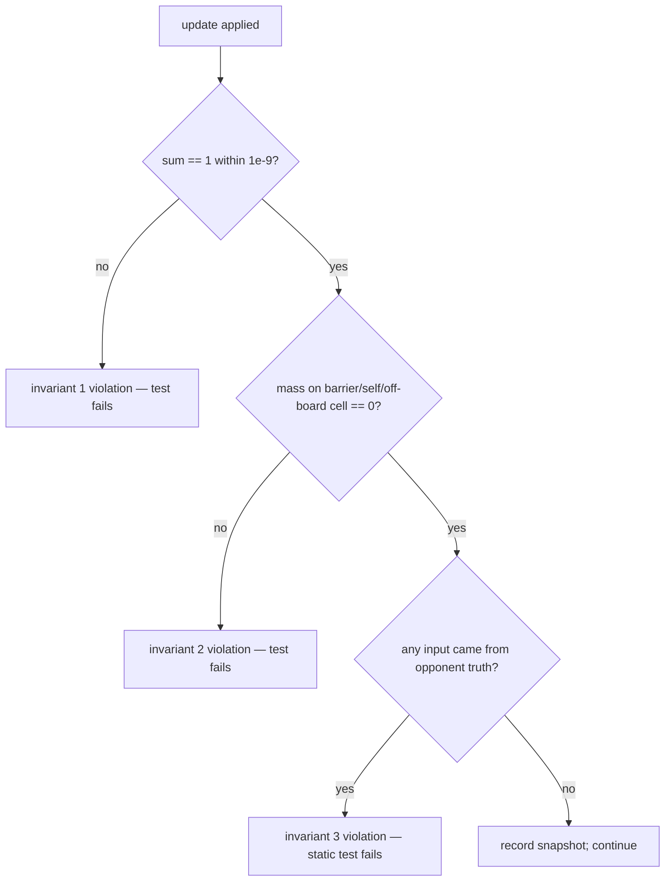

# PRD: Belief Board — Opponent-Location Inference Under Partial Observation

## 1. Overview & Context

### 1.1 Purpose

The belief board is the opponent-location inference engine of one peer: a normalized probability
distribution `b(s) = P(opponent = s | evidence)` over the board, maintained from the opponent's
transmitted scent field and verbal hints, and consumed by the role strategy for legal-move
selection (STRAT-001, STRAT-006) and projected verbatim into the Live GUI heatmap (OBS-003).

This is the **shared part** of the Stage-3 Perception & Strategy work: the algorithm, the
invariants, the update order, and the landmark registry are identical in both role repositories
(the role never enters the update — both roles infer about the opponent in exactly the same way).
The role-specific decision policy that consumes the board is specified separately, in
`PRD_thief_strategy.md` / `PRD_police_strategy.md`.

This PRD decomposes the approved product contract for the belief board and implements the
mechanism PRD `docs/mechanisms/M-02-belief-state.md` (invariants, binding) and the shared C02
component PRD. It makes the board compatible with the **locked scent profile** of the adopted
operational interoperability profile (ADR-004: `subtractive_chebyshev_v1` default,
`multiplicative_book_v1` additionally supported): the likelihood the board uses must be
calibrated to the emission model that actually produced the transmitted field, or the board
systematically misreads its own evidence.

### 1.2 Problem Statement

The project removes the referee and the shared board (book ch. 1, ch. 5). Each peer knows only
its own position. The opponent's position **never crosses the wire**; what arrives each
half-turn is:

- a scent grid `{"r,c": intensity}` — a decaying radial emission that cannot lie, but is
  indirect: it is the field the opponent's *trail* produces, not a position reading;
- a free-form hint (≤ 15 words, arena-bounded, **may be deceptive** by rule, STRAT-009);
- public barrier declarations (exact, truthful, GAME-012).

The peer must therefore maintain a probabilistic belief and act on it. Concretely, the board
must:

- Start from a uniform prior over legal cells on every sub-game (no prior evidence yet).
- Incorporate every scent observation and every hint deterministically; never silently
  discard received evidence (M-02 invariant 4).
- Keep zero mass on impossible cells — declared barriers, off-board, and (after a confirmed
  non-capture) this role's own cell (M-02 invariant 2).
- Stay normalized after every update (M-02 invariant 1).
- Never read the opponent's true position, directly or indirectly (M-02 invariant 3,
  derived from ARCH-003 / OBS-002) — the API surface must make that impossible.
- Answer, every turn, "where is the opponent most likely to be" (`most_likely`) fast enough
  that move selection is instant, and expose enough structure (`top_k`, `peak_probability`,
  `as_matrix`) that the strategy can fall back sensibly when the belief is diffuse and the GUI
  can render it verbatim (OBS-003).

### 1.3 Theoretical Background

The setting is a decentralized partially observable stochastic game (Dec-POMDP): each peer's
policy is a function of its own belief state, not of the global state. The belief board is a
**grid-based Bayesian filter** over the finite cell set (book ch. 6 §6.4, "belief map + Bayes
rule"; belief-map background [17] in the book's bibliography):

- **Prior.** Uniform over the `N×N` board at sub-game start: `b₀(s) = 1/N²` (N = 7 shipped).
- **Transition (predictive) step.** The opponent made at most one move since the last
  observation, from the signed move set (orthogonal step or stay). The prior is propagated by
  spreading each cell's mass uniformly over its allowed neighbourhood — the 5-cell von Neumann
  neighbourhood (self + 4 orthogonal neighbours) for the shipped move set. This is the standard
  motion model of a grid-based tracker, with the neighbourhood pinned to the *negotiated* move
  set so the transition model matches how the opponent can actually move.
- **Likelihood (measurement) step.** Bayes' rule `posterior ∝ prior × likelihood`, where the
  likelihood is the probability of the received scent field under the hypothesis "the opponent
  is (or was recently at) cell s". Two registered likelihood forms are supported (FR-B2):
  1. `trust_v1` (default) — the reference-compatible engineered likelihood
     `L(s) = 1 + trust · intensity(s)`, `trust = 4.0` shipped. It is one-sided: scent
     concentrates mass, absence of scent carries no negative evidence. It is provably
     reproducible against the reference implementation's board given identical inputs.
  2. `kernel_bayes_v1` (optional, selected by private config) — the full filter: for each
     hypothesis cell s, score the received field against the **locked scent model's emission
     kernel** centred at s (obtained through the scent module's emission-probe seam, §5.2), so
     that off-field cells receive genuine negative evidence. The kernel is never re-derived
     inside the belief module — it is read through the shared scent interface, so a profile
     change (ADR-004 revisit conditions) requires no belief edit.
- **Exclusion.** Hard constraints (barriers, self-cell after confirmed non-capture) zero the
  cell and renormalize — mass is redistributed, never lost (M-02 invariant 2).
- **Hint evidence.** The book (ch. 6 §6.4) requires the belief to be updated from scent
  *and hints*, with a reliability coefficient because text may lie (STRAT-006 is a MUST that
  covers both channels). The update is deterministic: hints are matched against the
  arena's landmark registry (FR-B5); a hint naming a landmark concentrates mass on that
  landmark's board region with factor `(1 + reliability · w)`, same one-sided shape as the
  trust form. Deception is not detectable in-band by design — the invariants govern internal
  consistency, not deception detection (M-02 edge case).
- **Distance metric.** With the shipped orthogonal move set, Manhattan distance is the
  admissible step estimate the chapter's pursuit/evasion heuristics build on (book ch. 6
  §6.4: `D = |xc−xt| + |yc−yt|`); under king moves it would be Chebyshev. The board exposes
  the metric through C01's `Board`, not a private copy.

### 1.4 Target Audience

The peer runtime (turn handler — updates the board on every incoming message), the role
strategy (consumes a per-turn snapshot), the Live GUI (renders the distribution verbatim,
OBS-003), and the test suite (property-tests the invariants independently of any strategy).
The project team uses this PRD as the approval baseline for the belief work; the evaluator
audits it against M-02 and STRAT-001/006.

## 2. Goals & Success Metrics

### 2.1 Goals

1. One pure, deterministic belief module shared byte-for-byte (modulo package import paths)
   by both role repositories.
2. All three M-02 invariants hold at all times and are property-tested without reference to
   any specific strategy.
3. The board materially changes legal-move selection (STRAT-006) — demonstrated by an
   A/B test where the same strategy produces different moves with belief on/off.
4. The scent likelihood is calibrated to the **locked** scent profile through the scent
   interface; switching the locked profile requires no edit inside `belief/`.
5. Hints update the board deterministically (STRAT-006's second channel) with a bounded,
   config-owned reliability.
6. Fast enough that inference is never a turn-timing bottleneck: full per-half-turn update
   well inside the strategy budget (NFR-1).

### 2.2 Success Criteria (Milestones)

| ID | Milestone | Evidence |
|---|---|---|
| MB-1 | Belief core + invariants | unit + property suite green: normalization after every update; zero mass on excluded cells; no API accepts opponent truth (code review + static assertion test) |
| MB-2 | Scent observation calibrated | differential test: under identical input fields, `trust_v1` reproduces the reference board's probabilities; `kernel_bayes_v1` concentrates on the kernel centre and shows negative evidence off-field; both via the emission probe for the **locked** profile |
| MB-3 | Diffusion + exclusion wired in the turn loop | the stage-2 spine test stays green with the real board in the turn handler; after a barrier declaration, that cell is zero within the same half-turn |
| MB-4 | Hint channel | seeded test: a landmark hint shifts the peak toward the landmark region by the configured reliability; a neutral hint leaves the board unchanged |
| MB-5 | Belief materially influences selection | A/B: same strategy, belief on/off, fixed fixtures ⇒ different selected actions in ≥ 50% of the fixture set; belief on ⇒ peak-follower behaviour in the pursuit fixtures |

### 2.3 KPIs

Project-set (not official) targets, measured by the stage test harness:

| KPI | Target |
|---|---|
| Full per-half-turn update (diffuse + observe + hint + exclude), 7×7, CPython 3.12 | ≤ 5 ms p99 |
| Invariant violations under 10k random update sequences (property test) | 0 |
| Determinism: same seed + same wire inputs ⇒ byte-identical belief snapshots across two runs | exact |
| `trust_v1` reproduction of the reference board on the shipped worked example | exact (same doubles, same order) |
| Module line coverage under the repo gate | ≥ 85% |
| Files over the 150 nonblank/noncomment line cap | 0 |

## 3. Functional Requirements

### FR-B1 — Uniform prior over legal cells (STRAT-001)

The board initializes uniformly over all `N×N` cells at the start of each sub-game
(`b(s) = 1/N²`), fresh per sub-game — no state persists across sub-games. Initialization must
satisfy invariant 1 immediately.

### FR-B2 — Scent observation update, calibrated to the locked profile (STRAT-006)

On every received scent grid, the board applies a likelihood update and renormalizes:

- `trust_v1` (default): for each received cell `(r,c)` with intensity `i`,
  `b(r,c) ← b(r,c) · (1 + trust · i)`; unmentioned cells keep factor 1. `trust` is the private
  `belief.smell_trust_weight` (shipped default 4.0).
- `kernel_bayes_v1` (optional): for each hypothesis cell s with prior mass above a negligible
  floor, score the received field against `emission_field(s)` from the scent emission probe
  (FR-B9): `score(s) = Σ over received cells of (1 + trust · |observed(v) − kernel_s(v)|)`
  normalized to a per-cell factor in `[1 − trust, 1 + trust]`; the exact scored form is fixed
  by the PLAN (it must reduce to monotone concentration on the kernel centre and to
  negative evidence for field-absent cells). The update form is selected once by private
  config (`belief.update_form`) at board construction; no runtime switching mid-sub-game.
- Out-of-bounds cells in a malformed grid are ignored, never an error (defensive; the wire
  layer validates first).

### FR-B3 — Predictive diffusion matching the negotiated move set (STRAT-006)

Before each observation, the board propagates the prior by the opponent's transition model:
each cell's mass is spread uniformly over its self + in-bounds orthogonal neighbours (the
shipped move set includes STAY). The neighbourhood is derived from the signed move set via
C01 `Board`, never hardcoded, so a future move-set change (king moves) changes the
neighbourhood without an edit here.

### FR-B4 — Impossible-cell exclusion (M-02 invariant 2)

- A cell declared as a barrier this turn (either side's declaration — barriers are public and
  impassable to both) is excluded in the same half-turn, before the next selection.
- This role's own cell is excluded after a turn in which no capture claim landed on it
  (mutual exclusivity: the opponent cannot share this cell un-captured).
- Exclusion zeroes the cell and renormalizes; mass is redistributed, never lost.

### FR-B5 — Deterministic hint update (STRAT-006, STRAT-009)

- The board owns the **landmark registry** for the agreed arena (`world.map_area`, shipped
  "New York"): a deterministic table mapping each landmark name to a small board region
  (≤ 3 cells). The table is shared code, identical in both repositories, and is the same
  table the strategy's hint generator uses to *produce* hints (one source of truth, both
  directions).
- On each incoming hint, the board performs case-insensitive landmark matching. For each
  matched landmark region cell with Chebyshev distance `d` from the region,
  `b(cell) ← b(cell) · (1 + reliability · w(d))` with `w(0) = 1`, `w(1) = 0.5`, `w(≥2) = 0`;
  `reliability` is private config `belief.hint_reliability` (default 0.25).
- Hints naming no registered landmark (or the generic-fallback arena with no compass-word
  match) leave the board unchanged — a neutral hint is not an error and not evidence.
- The parser is rule-based and pure; no LLM is on the hint-update path (NFR-2, STRAT-008).

### FR-B6 — Query interface (consumed by strategy and GUI)

- `most_likely() -> Cell` — argmax with deterministic tie-break (lexicographic (row, col),
  the same convention as the scent module's `hottest`).
- `peak_probability() -> float` — the mass at the peak; the strategy's diffuse-fallback
  trigger.
- `top_k(k) -> list[(Cell, float)]` — for strategy alternatives and GUI annotations.
- `prob(cell) -> float` — single-cell query (barrier scoring reads candidate masses).
- `as_matrix() -> list[list[float]]` — a deep copy for the GUI (OBS-003 renders it verbatim).
- `exclude(cell)` — the FR-B4 entry point.

### FR-B7 — No hidden-truth leakage (M-02 invariant 3, OBS-002)

No constructor, method, or parameter of any belief module accepts the opponent's actual
position, the opponent's role-internal state, or any value only derivable from them. The
board's entire evidence surface is: received scent grids, received hint text, barrier
declarations, this role's own cell, the signed board size/move set. A static test asserts no
import of opponent-truth symbols into `belief/`.

### FR-B8 — Purity

No I/O, no network, no clock, no global state, no LLM call in `belief/`. All randomness is
absent (the board is a pure function of its inputs); any stochasticity the project needs
lives in the strategy, which owns the seeded RNG.

### FR-B9 — Emission-probe seam (STRAT-005, ADR-004)

The belief module obtains the locked scent model's emission kernel exclusively through a
narrow seam supplied by the scent module: `emission_field(center: Cell) -> dict[str, float]`
(pure radial emission at a hypothetical centre, per the locked profile, no state mutation).
The belief code never imports a scent profile and never branches on the profile name —
consistent with ADR-004's consequence that belief and strategy consume the selected profile
through the boundary only. The seam is additive to the already-delivered scent module; the
orchestrator records it as an in-scope extension of T005 or a small follow-on task before BB-03
starts (workflow §4: no silent scope expansion).

### FR-B10 — Determinism and seeding discipline

Every update is a pure function of (board state, inputs, config). The board itself holds no
RNG. Given an identical sub-game wire transcript and config, two runs produce
byte-identical belief snapshots at every half-turn.

### FR-B11 — Fresh per sub-game

The board is constructed per sub-game with the signed board size and the private belief
config; it is discarded at sub-game end. Series-level aggregation (T019) never reads a
live board.

### 3.1 User stories

- **As the strategy**, I ask "where is the opponent most likely, and how sure am I?" each
  turn, and I get an answer in microseconds so my move stays instant.
- **As the turn handler**, I feed you one scent grid, one hint, and one optional barrier
  declaration per half-turn and never think about the arithmetic.
- **As the Live GUI**, I read `as_matrix()` and render the heatmap verbatim — what I show is
  exactly what the agent believes.
- **As the evaluator**, I can point at three invariants (normalization, exclusion, no-leak)
  and at the property tests that prove them, without reading strategy code.

## 4. Non-Functional Requirements

### NFR-1 — Performance

Full per-half-turn update (FR-B3 + FR-B2 + FR-B5 + FR-B4) ≤ 5 ms p99 on a 7×7 board, CPython
3.12, laptop-class CPU. `kernel_bayes_v1`'s extra cost (49 hypotheses × ≤ 25 field cells)
must stay inside the same budget; if a future board size breaks it, the fallback is the
`trust_v1` form, not a slower code path.

### NFR-2 — Determinism

Identical inputs ⇒ identical outputs, every run (FR-B10). No wall-clock, no dict-order
dependence beyond sorted iteration where order matters, no hash-seed dependence (integer-keyed
structures or sorted keys only).

### NFR-3 — Testability

The module is testable with plain data (no transport, no config file on disk): all config
arrives as constructor arguments. Property tests drive it with random-but-seeded update
sequences; differential tests pin it against the reference implementation's worked example.

### NFR-4 — Configurability

Adjustable values live in private config only: `belief.smell_trust_weight`,
`belief.update_form`, `belief.hint_reliability` (§9). Shared signed values (scent physics,
board size, move set) are consumed, never overridden. Private config can never weaken a
signed value (CFG-006 precedence rule).

### NFR-5 — Security and separation

No secrets, no credentials, no environment reads in `belief/`. No import path may reach the
opponent's local truth (enforced by FR-B7's static test) or the network layer (NFR-8).

### NFR-6 — Modularity and dependency discipline

`belief/` depends only on `common.domain` (board geometry, Cell) and the scent emission
seam (Protocol). It depends on nothing else — not the strategy, not the wire, not the GUI.
Files stay under the 150-line cap; no speculative abstractions (one grid class, pure update
functions, one hint parser).

## 5. Expected Input / Output

### 5.1 Input (per sub-game construction)

| Input | Source | Notes |
|---|---|---|
| `board_size` (signed, shipped 7) | CT-01 / shared game.json | the grid is `N×N` |
| move set (signed, shipped orthogonal + STAY) | CT-01 / shared game.json | fixes the diffusion neighbourhood |
| locked scent profile identity | ADR-004 lock record | only via the emission probe (FR-B9); never as a branch |
| private belief config (`smell_trust_weight`, `update_form`, `hint_reliability`) | private game.toml | §9 |

### 5.2 Input (per half-turn, from the turn handler)

| Input | Source | Notes |
|---|---|---|
| received scent grid `{"r,c": float}` | TurnMessage (CT-03) | may be empty (the opponent's trail fully decayed) |
| received hint (≤ 15 words) | TurnMessage (CT-03) | free text, may lie |
| declared barrier cell (or none) | TurnMessage (CT-03) | public, exact |
| this role's current cell | CT-01 local state | for self-exclusion |
| "no capture landed this turn" flag | C04 turn loop | gates self-exclusion |

### 5.3 Output

| Output | Consumer | Notes |
|---|---|---|
| `most_likely()`, `peak_probability()`, `top_k(k)`, `prob(cell)` | role strategy (CT-02 request) | per-turn snapshot semantics: read after the turn's update |
| `as_matrix()` | Live GUI (CT-05 projection) | verbatim rendering, OBS-003 |
| internal distribution | next half-turn | the only persisted state |

## 6. Constraints & Limitations

### 6.1 Constraints

- Signed scent physics is fixed (Appendix F: centre 0.9, decay 0.10, 5×5 field); the board
  never re-derives emission — it reads it through the seam (FR-B9).
- The update form is fixed for a sub-game (FR-B2); mid-game switching is forbidden because it
  would make the transcript non-reproducible under audit replay.
- One belief per sub-game per peer; no cross-sub-game learning is in scope (that would be a
  new product scope, not a board feature).
- The landmark registry covers the agreed arena; for arenas without a registered table the
  generic compass fallback applies (FR-B5) — coverage of a specific arena is a config-table
  concern, not a correctness one.
- Line cap 150, no new third-party dependency (pure stdlib + the existing repo packages).

### 6.2 Limitations (accepted)

- `trust_v1` is one-sided: an empty received field (trail fully decayed) carries no negative
  evidence, so the belief can sit on a stale hotspot. `kernel_bayes_v1` addresses this; the
  default stays `trust_v1` because it is the proven, reference-reproducible form (ADR-004
  discipline: the reference-compatible behaviour is the safe default).
- Diffusion spreads mass uniformly over the neighbourhood; it is an approximation of the
  true transition kernel (the opponent's policy is not uniform — a fleeing thief avoids the
  cop). Meta-modelling the opponent's policy is out of scope (explicit P2).
- Hint reliability is a constant, not learned: deceptive hints are tolerated by design; the
  board may be misled, and the invariants do not promise deception detection.
- The belief is a single hypothesis distribution; there is no explicit multi-modal tracking
  beyond what the distribution itself represents.

## 7. Alternatives Considered

| Alternative | Trade-off | Verdict |
|---|---|---|
| **`trust_v1` reference-compatible likelihood** (selected default) | One-sided (no negative evidence); hand-tuned trust; but byte-reproducible against the reference and trivially fast | **Selected** as default — proven behaviour, ADR-004 discipline, zero risk to the spine |
| **`kernel_bayes_v1` full emission-model likelihood** (selected optional) | Genuinely Bayesian against the locked profile; handles empty fields; costs 49×25 ops and a new scent seam (FR-B9) | **Selected** as the registered optional form — the legitimate upgrade the reference report identifies, kept behind config so the default stays safe |
| Particle filter / MCMC sampling | Handles arbitrary emission models; but stochastic (breaks NFR-2 determinism unless seeded), slower, and overkill for 49 cells | Rejected for this stage |
| Viterbi / MLLT sequence tracking (keep the best trajectory, not just the cell) | Better for a *moving* target under noise; but needs a stored trajectory per hypothesis, couples the board to the scent *history*, and complicates the GUI contract (OBS-003 renders a distribution) | Rejected; revisitable P2 if self-play shows tracking lag |
| LLM-based hint interpretation (classify truth/lie, extract landmarks with a model) | Richer parsing; but puts an external call on the belief path (violates FR-B8, NFR-2, STRAT-008 default) and makes the board non-deterministic | Rejected; the deterministic parser is sufficient for the landmark-anchored hint style this project generates |
| Sharing one belief implementation across `common/` vs role packages | `common/` guarantees identity; but the System PLAN places `belief/` in the role package (target layout) and T006's write set is `src/<role>_peer/belief/` | Follow the System PLAN; identity enforced by the sync check (TODO spine invariant), same pattern as the shared scent module |

## 8. Success Criteria & Test Plan

### 8.1 Half-turn update (sequence)

```mermaid
sequenceDiagram
    participant TH as TurnHandler (C04, assumed)
    participant BG as BeliefGrid
    participant SC as Scent seam (emission probe)
    TH->>BG: exclude(declared barrier)   [if barrier_placed]
    TH->>BG: diffuse()                   [opponent moved one step-or-stay]
    TH->>BG: observe_smell(grid)         [likelihood update, renormalize]
    TH->>BG: apply_hint(hint, arena)     [landmark match, reliability-weighted]
    TH->>BG: exclude(own cell)           [if no capture landed]
    Note over BG: normalized after each step; invariants hold at all times
```

### 8.2 Invariant checks (flow)



### 8.3 Specific test cases

| ID | Test | Criterion |
|---|---|---|
| TC-B01 | init: `BeliefGrid(7)` ⇒ every cell 1/49, sum 1 | FR-B1 |
| TC-B02 | property: 10k random sequences of (diffuse, observe, hint, exclude) ⇒ sum 1 after every step | FR-B1…B4, MB-1 |
| TC-B03 | `exclude(barrier cell)` ⇒ mass 0 there, sum 1 elsewhere | FR-B4 |
| TC-B04 | self-exclusion gated: excluded only when "no capture landed" is true | FR-B4 |
| TC-B05 | `observe_smell({"3,3": 0.7})` from uniform ⇒ `prob(3,3) > prob(9,9)` (out-of-bounds ignored on 7×7) and sum 1 | FR-B2 trust_v1 |
| TC-B06 | differential: shipped worked-example transcript (reference E1: centre 0.9 / ring 0.6 / ring 0.3, trust 4.0) ⇒ peak (4,3), centre mass ≈ 0.0505 under `trust_v1` | FR-B2, MB-2 |
| TC-B07 | `kernel_bayes_v1`: field centred at (4,3) ⇒ peak (4,3); then an **empty** field after diffusion ⇒ peak mass strictly below pre-observation peak mass (negative evidence works) | FR-B2, MB-2 |
| TC-B08 | `kernel_bayes_v1` reads the kernel through the seam: monkeypatched probe ⇒ different probabilities; no import of profile modules in `belief/` (static) | FR-B9 |
| TC-B09 | diffusion from a point mass spreads to self + 4 in-bounds orthogonal neighbours only (no diagonals); corner point mass spreads to 3 cells | FR-B3 |
| TC-B10 | hint "…near Times Square…" (arena New York) ⇒ peak moves toward the Times Square region; shift magnitude scales with `hint_reliability`; neutral hint ⇒ no change | FR-B5, MB-4 |
| TC-B11 | landmark table identity: the table in `belief/hints.py` is byte-identical in both repos (sync check) and matches the hint generator's table | FR-B5 |
| TC-B12 | no-leak: no parameter of any belief API accepts opponent position; static import scan of `belief/` finds no opponent-truth symbol | FR-B7, MB-1 |
| TC-B13 | determinism: same seed + same transcript, two processes ⇒ identical `as_matrix()` at every half-turn | FR-B10 |
| TC-B14 | perf: full update ≤ 5 ms p99 over 10k iterations (both forms) | NFR-1 |
| TC-B15 | A/B: same strategy, belief on/off over fixed fixtures ⇒ ≥ 50% of fixtures change action; belief on ⇒ pursuit fixtures follow the peak | MB-5 |
| TC-B16 | GUI verbatim: `as_matrix()` is a deep copy (mutating it does not touch the board) | FR-B6, OBS-003 |

### 8.4 Milestones and deliverables (stage timeline)

| Phase | Deliverable | Exit |
|---|---|---|
| 1 (BB-02…BB-04) | `belief/` core: grid, trust+kernel updates, diffusion, exclusion; unit suite green | TC-B01…B09 |
| 2 (BB-05) | Hint channel + landmark registry; shared table synced to the role repos | TC-B10, TC-B11 |
| 3 (BB-06) | Property + differential + perf + determinism suites; spine test green with the real board in the turn loop; docs synced | TC-B12…B16, MB-1…MB-5 |

## 9. Configuration Schema

Private `config/game.toml` (local only, never signed, never sent; must contain nothing
relevant to the opponent — the reliability of *my* belief about the opponent is my secret):

```toml
[belief]
# likelihood gain for scent evidence (trust_v1 factor 1 + trust*intensity;
# kernel_bayes_v1 scale). Shipped default 4.0.
smell_trust_weight = 4.0
# "trust_v1" (default, reference-compatible) | "kernel_bayes_v1" (full emission-model filter)
update_form = "trust_v1"
# reliability coefficient for hint evidence, 0.0..1.0. 0 disables the hint channel.
hint_reliability = 0.25
```

Shared values consumed (signed `config/game.json`, **never** redefined here):
`board_and_agents.grid_size` (board size), `movement_and_barriers.move_set` (diffusion
neighbourhood), `world.map_area` (landmark arena), `pheromones.*` (only via the emission
seam). Precedence: on any key conflict the shared JSON overlays the private TOML
(CFG rules); the `[belief]` keys have no shared counterparts.

## 10. Out of Scope

- Any movement/pursuit/evasion policy — that is the role strategy PRDs' scope.
- Opponent policy modelling (meta-belief), trajectory tracking (Viterbi/MLLT), learned
  reliability — P2 candidates, each a new task if approved.
- LLM-assisted hint analysis (any model on the belief path) — forbidden by FR-B8/NFR-2 in
  this stage; a future optional adapter would need its own PRD, PLANQ-003/004-style gate, and
  legality validation.
- Cross-sub-game memory or series-level belief (T019 territory).
- Scent emission/absorption/decay itself (M-01, already delivered) and the wire transport of
  `smell_grid` (CT-03, already delivered).
- GUI rendering (C05, T014) — this PRD only fixes the verbatim snapshot contract.

**Open items.** OPEN-009 (official scent saturation/merge reading) does not block this stage:
the board consumes whichever profile the lock records (ADR-004). PLANQ-008 (approved
heuristics) gates the *strategy* criteria only, not the board.

## 11. References

- `docs/mechanisms/M-02-belief-state.md` — the binding invariants (this PRD's mechanism contract).
- `docs/components/C02-perception-strategy/PRD.md` / `PLAN.md` — the shared C02 component scope.
- `docs/contracts/CT-01-game-state.md`, `CT-02-strategy-decision.md`, `CT-03-peer-wire.md`,
  `CT-05-event-projection.md` — the boundaries this PRD consumes/produces.
- `docs/decisions/ADR-004-operational-interoperability-profile.md` — locked scent profile;
  profile-agnostic consumption is an ADR consequence.
- `docs/interop/LEAGUE_COMPATIBILITY.md` — strategy/belief are project-native; the league kit
  pins the scent math (§5) the board must be calibrated to.
- `references/copthief-league-protocol/SPEC.md` §5 (pheromone field), §7.5 (wire surface).
- Project book ch. 6 §6.4 (belief map + Bayes + Manhattan), ch. 4 (pheromone model),
  ch. 10 §10.3.3/10.3.4 (stage order).
- `docs/report-game-p2p-cop-chase-strategy.md` §3.5, §10 — non-authoritative reference
  implementation of the `trust_v1` form and its identified upgrade headroom
  (registered evidence only, per LEAGUE_COMPATIBILITY).
- Role strategy PRDs: `PRD_thief_strategy.md` (thief_repo), `PRD_police_strategy.md`
  (police_repo) — the consumers of this board.
