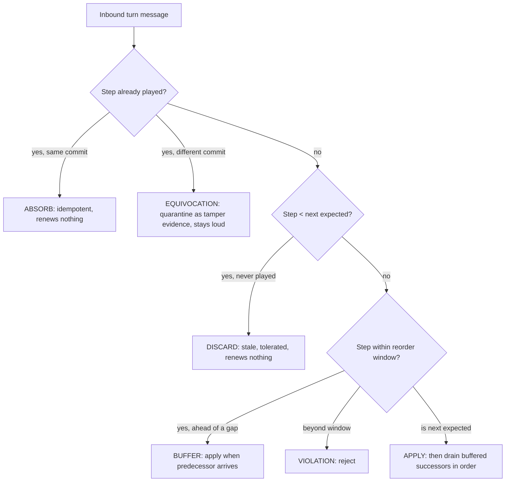
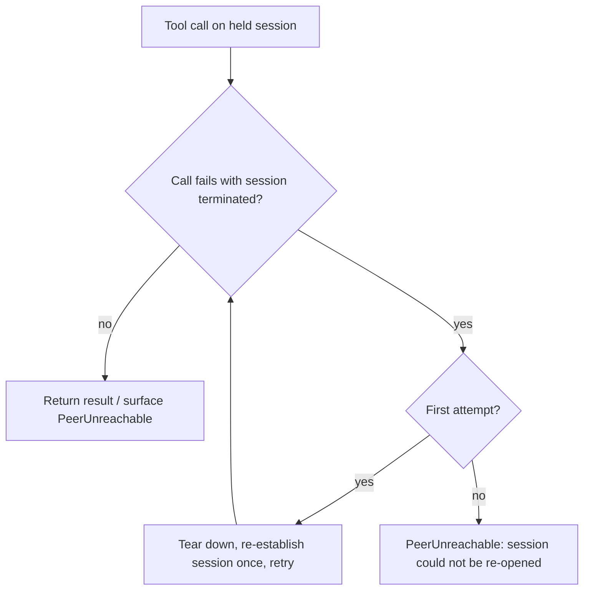
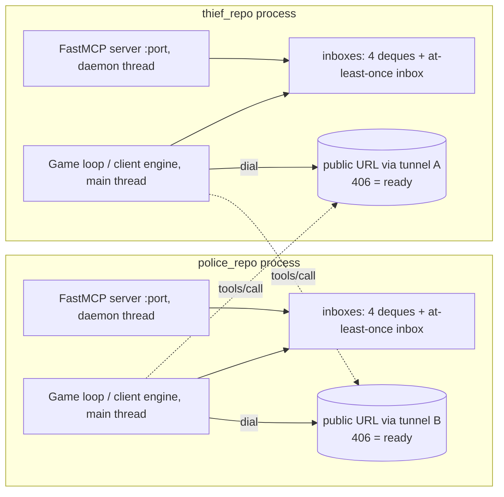

# PRD: MCP Infrastructure — P2P Peer Protocol & FastMCP Transport

| Field | Value |
|---|---|
| **Component** | MCP Transport & Peer Protocol (the interoperability boundary) |
| **Build Stage** | Stage 2 — FastMCP Infrastructure |
| **Source Chapters** | Project Book Ch. 2 (Distributed P2P Architecture & FastMCP Infrastructure) |
| **Source Appendices** | Appendix B (Configuration), Appendix E (rules 1–2, 6, 10, 11, 17–19, 21–22, 24, 25, 26–27, 53), Appendix F (Required Parameters) |
| **Compatibility Target** | `references/copthief-league-protocol/sparring/transport/` — wire profile `reference-v3` (NON-AUTHORITATIVE compatibility evidence, not an official schema) |
| **Applies To** | `police_repo` and `thief_repo` — one shared, role-parameterized protocol layer |
| **Status** | Approved (2026-08-17, orchestrator) |

---

## 1. Overview & Context

### 1.1 Purpose

The MCP Infrastructure is the layer through which two independently written peers — Police and Thief — actually talk: a symmetric FastMCP server/client surface, the pre-game handshake, the per-turn wire messages, the end-of-game audit exchange, and the operational discipline (tunneling, reachability, environment separation) that makes a match possible over the public internet.

This is the **interoperability boundary** of the project: it is the one layer whose output must be byte-identical between two independently written implementations for a match to be legal at all. A one-character difference in a tool name, an argument name, a canonical-JSON separator, or a Unicode escape silently voids the match for **both** sides. Everything above it (strategy, scent, reporting) is built for one side only; this PRD is the only one written for *both*.

This PRD decomposes the approved product contract for Stage 2 and makes the implementation **compatible with the runnable reference transport** in `references/copthief-league-protocol/sparring/transport/` (`server.py`, `client.py`, `loopback.py`, `faults.py`) under the `reference-v3` interoperability profile. That compatibility is a *target*, not an authority: the profile is non-authoritative evidence, the official schema stays open (OPEN-001/OPEN-007), and a non-kit officially compliant peer remains a valid opponent behind the same adapter boundary.

### 1.2 Problem Statement

The project removes the referee. There is no game server holding ground truth, no arbiter to consult, no channel that can be trusted. Both peers run on different machines behind NAT, each sees only its own position, and each must independently prove that the other did not cheat. Concretely, the layer must:

- Let two processes that have never met agree on the rules (signed terms), detect each other's identity (pairing), and derive shared identifiers (`game_id`, `game_uid`) **without a round-trip** and without a third party.
- Exchange one message per half-turn in which the true position **never crosses the wire** — only a cryptographic commit, a free-form (possibly lying) verbal hint, and a scent grid that cannot lie.
- Survive an adversarial *and* flaky network: a lost acknowledgement makes a correct client retry, so the same message arrives twice **by design**; a dropped tunnel must not fork state or forfeit a game.
- Prove at game end that every step was played as committed: a mutual audit where any single hash mismatch is tampering by definition, with a total sanction.
- Do all of the above while **neither side may deadlock on the other**, no shared live state may exist between the two, and the language model may write the lies but must never decide the legal moves.

The failure modes are not theoretical. The reference kit's own field history contains: a client that sent `message` to `submit_audit` and schema-failed at the one moment both sides agreed a result; two peers that each waited for the other to move first and timed out after a fully successful handshake; a serializer that escaped Hebrew to `\uXXXX` and voided an otherwise honest match for both teams; a session torn down at a sub-game boundary that aborted a whole series. Every functional requirement in §3 exists because one of these failures is real.

### 1.3 Theoretical Background

- **MCP (Model Context Protocol).** An open standard connecting LLMs to external tools and data. A server exposes *tools* — functions described by structured schemas so a remote caller (and an LLM) can invoke them safely. The transport used here is **streamable HTTP**, which is *session-oriented*: a `tools/call` without an established session is answered `400 Missing session ID` — a state that reads like "peer unreachable" and is not one. A browser-shaped GET (no `Accept: text/event-stream`) is answered `406` by a healthy peer; **406 is the ready state, not 200**.
- **FastMCP.** The Python library implementing the server and client. It is the *only* third-party dependency of the whole HTTP tier (`fastmcp>=2.0,<3.0`) and is imported lazily so the zero-dependency test tier (loopback, vectors, guards) stays honest.
- **Full decentralization (book §2.2).** No central server, no single point of failure, no single point of trust. Each peer holds its *local truth* only; every move is verified against the rival via cryptographic negotiation. The distributed-systems literature warns that removing the central control point shifts the center of gravity from local computation to **coordination between components** — which is precisely the burden of this layer.
- **Symmetry (book §2.3).** Each agent is simultaneously *server* (exposing tools via `@mcp.tool`) and *client* (calling the rival's tools over the network). There is no strong side and no weak side. A corollary the reference kit states bluntly: **MCP pushes one way per session, so serving alone answers tools but plays nothing** — each peer must also *dial* the other.
- **The deadlock hazard.** Two peers each awaiting the other *inside a tool handler* is an instant deadlock — the highest-severity failure available in this design. The book's minimal example (verify the signature inside `receive_move`) is deliberately *not* followed: **tool = queue push, verification = game loop**.
- **Commit–Reveal on the wire (book §5.3; mechanism M-05).** Each step is sealed: `commit = SHA256(canonical_json(payload) | nonce)`, with the nonce pipe-appended to the canonical string (not inside the hashed object) and withheld until the end-of-game audit. The commit crosses the wire on every turn; the reveal crosses only in `submit_audit`. Canonicalization details (compact separators, `ensure_ascii=False`, UTF-8) are the load-bearing bytes of cross-team hashing — a serializer that escapes non-ASCII "reads as tampering and voids the match for BOTH sides".
- **At-least-once delivery (SPEC §7.1 of the kit).** HTTP is at-least-once, so a receiver must map every arrival to exactly one of: *absorb* (exact duplicate), *equivocation* (different commit for a played step — tamper evidence, stays loud), *buffer* (within the reorder window), *apply*, *discard* (stale, never playable), or *violation* (past the window). A receiver with window 0 turns an ordinary retry race into a self-inflicted technical loss.
- **NAT traversal (book §2.4–2.4.1).** Most machines sit behind firewalls and NAT and are not directly reachable. A tunnel (ngrok, Localtonet, Cloudflare tunnel, …) creates a public URL and performs NAT traversal. The operational consequence: FastMCP's DNS-rebinding guard answers **421** to every request whose `Host` header is not rewritten — a tunnel-side fix, never a code fix.
- **Absolute environment separation (book §2.4.2, mandatory rule).** Cop code and thief code run in two completely separate processes under separate configuration areas; no shared memory, no shared live-state module, no shared variables. Sharing is a backdoor: it lets one agent see the other's local truth and voids the zero-trust model even when the game "works".
- **Responsibility split (book §2.3.1, table 1).** Three components with distinct duties: the local FastMCP server (resources, exposing actions, async responses), the client engine (game logic, turn scheduling, calling the strategy model), and the language model (the rhetorical/psychological layer). **The LLM never decides legal moves** — a verbal hint is never trusted in itself; legality is enforced by code and by the mutual audit.

### 1.4 Target Audience

- **Primary**: the two peer agents (Police and Thief), each running in its own process — they consume the wire contract, enforce the physics, and audit each other.
- **Secondary**: the implementers of `police_repo` and `thief_repo` (the protocol layer is shared and must be byte-identical in both), and the evaluator, who audits stage evidence (contract tests, two-process smoke runs, golden-vector reproduction, fault-injection ledgers).
- **Operational**: the league operators who schedule matches — they need the readiness discipline (§3.8) to name a start time that will not be lost to a half-started window.

---

## 2. Goals & Success Metrics

### 2.1 Goals

| # | Goal |
|---|---|
| G1 | Two independently written peers can negotiate, play, and settle a full six-sub-game series over FastMCP with **zero shared state** and no central judge |
| G2 | The wire surface is compatible with the reference transport (`reference-v3` profile) at the schema level, so the sparring peer is a working opponent out of the box |
| G3 | Deadlock-free by construction: handlers never block, both sides dial, verification happens in the game loop |
| G4 | Network hazards (duplicates, reordering, drops, flaps, session deaths) never fork state and never cost a game |
| G5 | Zero trust: every step is cryptographically verifiable by the opponent; a single mismatch is TAMPERED with a total sanction and no repair |
| G6 | Fully testable without a network: a complete series runs in CI with zero dependencies installed |
| G7 | League-ready: public reachability through a tunnel with a documented, tool-supported readiness discipline (406 polling, host-header rewrite, loopback nonce proof, await-peer handshake budget) |

### 2.2 Success Criteria (Milestones)

Binary criteria, observable end-to-end, before the stage gate:

- [ ] **SC-1** Two independent local processes on `localhost` complete the full tool surface (handshake, turns, mutual audit) **without a public endpoint and without an opponent URL** (`local_mcp_smoke`)
- [ ] **SC-2** The `reference-v3` compatibility surface matches the kit on every schema-level item — exact tool names, the `message`/`payload` argument asymmetry, turn-message keys and shapes, locked-model declaration/refusal rules, thief-first turn order, no step-0 tool/turn (`reference_v3_contract`)
- [ ] **SC-3** A full six-sub-game series with mutual audits settles over two processes; re-running the same seeded series with duplicates, reordering, and drop-then-retry injected produces a **byte-identical outcome ledger**
- [ ] **SC-4** The canonical-byte primitives (canonical JSON, per-step commit, terms signature, uid derivation) reproduce the kit's published golden vectors (draft bytes match a known peer — recorded as interop evidence, *not* as official status)
- [ ] **SC-5** The tunnel readiness checklist is implemented and executable: 406-ready probe, 421 classification with tunnel-side fix, 502 classification, loopback nonce proof of the *own* receiving path, `--await-peer` handshake-budget polling. The public-endpoint criterion itself is exercised only once `G-LIVE` is satisfied (`public_endpoint`)
- [ ] **SC-6** Separation is verified by construction: two separate processes, separate config areas, byte-identical shared layer across `police_repo`/`thief_repo`, no network import outside the transport modules, no module-level mutable state in the shared layer
- [ ] **SC-7** The LLM/hint provider never decides a legal move; a provider failure does not block a legal game action; no code path carries a numeric position as a substitute for the language channel

### 2.3 KPIs

| Metric | Target | Measured by |
|---|---|---|
| Wire-surface conformance with the kit (15-item matrix) | 15/15 | contract suite against `reference-v3` |
| Golden-vector reproduction (terms signature, commit, uid, delivery decision) | 100% | vector fixtures at the stage gate |
| Determinism: clean vs. fault-injected seeded series | byte-identical ledger (0 diverging bytes) | fault-injection replay |
| Blocking or crypto calls inside MCP handlers | 0 | static scan + handler-latency test |
| Network imports outside the transport modules | 0 | source-scan gate (NM-5 pattern) |
| Shared-layer drift between `police_repo` and `thief_repo` | 0 differing files | `common/` sync check |
| Handler enqueue-and-return latency (localhost, p99) | < 5 ms | benchmark (design target: microseconds) |
| Requirement-to-test coverage of FR-1…FR-42 | 100% | traceability table in the task handoff |
| Full two-process series without a public endpoint | passes | `local_mcp_smoke` |

---

## 3. Functional Requirements

Normative keywords (MUST, MUST NOT, SHOULD) are RFC-2119. Each FR cites the book section, the kit evidence (module), and the canonical requirement ID where one exists. "The kit" means `references/copthief-league-protocol/sparring/`.

### 3.1 Decentralized topology

- **FR-1** The system MUST be fully peer-to-peer: exactly two independent processes, no central server, no referee. Each peer MUST hold only its own local truth; the only cross-process data flows MUST be the four tool messages and the end-of-game audit. (book §2.2; ARCH-001; kit `docker-compose.yml` topology)
- **FR-2** The peers MUST communicate exclusively through MCP tool calls over HTTP. No out-of-band channel (file, mail, shared memory, environment variable, sidecar process) MAY carry game data between the two sides. (book §2.2; kit guard NM-5 pattern)

### 3.2 Symmetric server/client (NET-001)

- **FR-3** Each peer MUST act simultaneously as an MCP **server** (exposing the tool surface of §3.3) and an MCP **client** (calling the opponent's tools). Both sides MUST actively dial the other; a peer that only listens MUST NOT be considered operational — "a peer that only listens never plays". (NET-001; book §2.3; kit `server.py` TOOLS-ONLY banner)
- **FR-4** The HTTP server MUST run on a daemon thread (or equivalent) while the client engine/game loop runs on the main thread (or a dedicated worker), so serving never blocks the game and the game never blocks serving. (kit `server.py:121-129`)
- **FR-5** The protocol layer — message shapes, negotiation, inbox, canonicalization, commit/reveal, and the server/client adapters — MUST be **role-agnostic**: one implementation, deployed byte-identically in `police_repo` and `thief_repo`, parameterized only by `role`. The shared layer MUST live in `common/` (where byte-identity is verifiable, as with the shared domain core); role-specific glue (natural role, CLI entry, private config, strategy wiring) MUST live in `src/<role>_peer/`. (book §2.3 symmetry; `common/` sync invariant)

### 3.3 Tool surface

- **FR-6** Each peer's server MUST expose all four tools, under exactly these names: `negotiate`, `receive_turn`, `submit_audit`, `receive_control`. All four are required; `receive_control` is not optional — it is the only path a refusal can travel, since every tool returns `{"ok": True}`. (kit `server.py:32-54`; the kit's own `doctor` names all four as required)
- **FR-7** The argument-name asymmetry MUST be preserved exactly: `negotiate`, `receive_turn`, and `receive_control` take a single dict argument named **`message`**; `submit_audit` takes a single dict argument named **`payload`**. A peer that sends `message` to `submit_audit` gets a schema error at the exact moment both sides are trying to agree on a result. A contract test MUST assert the asymmetry rather than assume it. (kit `server.py:38-54`, `client.py:99`)
- **FR-8** Every tool handler MUST validate the frame shape, enqueue it into the local inbox, and return `{"ok": True}`. A handler MUST NOT await game progress, MUST NOT perform cryptographic verification, and MUST NOT mutate game state. **Tool = queue push; verification = game loop.** Rationale: two peers each awaiting the other inside a handler is an instant deadlock, the highest-severity failure available in this design; the book's §2.3.2 skeleton (verify-inside-handler) is a teaching skeleton, not the production shape. (kit `server.py:1-13`)
- **FR-9** The tools MUST be mounted at `/mcp` over streamable HTTP. A browser-shaped GET (no `Accept: text/event-stream`) MUST be answered `406` — the healthy, ready state that operators poll for; a real MCP `initialize` POST MUST receive a real `protocolVersion` answer. (kit `client.py:133-195`)

### 3.4 Handshake — `negotiate`

- **FR-10** `negotiate.message` MUST carry: `terms` (the flat signed set, FR-11), `nonce`, `signature`, `group_id`, plus the pairing fields `role` and `sub_game_number`, `identity` (the hardware/model declaration), the locked-model declarations (FR-16), `info_mode`, and `game_uid` (FR-15). The pairing fields and the locked-model hashes ride **beside** `terms`, never inside it: adding a key to `terms` breaks the signature, which is the entire reason the separate declaration mechanism exists. (kit `messages.py:79-110`, `config.py:45-50`)
- **FR-11** Under the `reference-v3` profile the signed terms are a **flat, closed, 14-key** set, exactly: `board_size`, `smell_grid_size`, `decay_per_step`, `emit_intensity`, `min_center_intensity`, `max_steps`, `barriers_max`, `setting`, `hint_max_words`, `axis_origin_corner`, `axis_start_index`, `thief_start`, `cop_start`, `num_games`. Renamed, missing, or extra keys MUST be rejected. The §9.2 projection table defines how these keys are sourced from `config/game.json`; `min_center_intensity` has no Appendix F counterpart and MUST be sourced from the private `config/game.toml` or a fixed default, explicitly labeled non-official. (kit `config.py:48-50`; profile is non-authoritative pending OPEN-001/OPEN-007)
- **FR-12** `signature` MUST be `SHA256(canonical_json(terms) + "|" + nonce)` over the exact 14 keys. The receiver MUST re-verify with **its own** serializer and MUST value-compare the terms; failure is a refusal with a diagnostic that prints both canonical strings ("a float that differs only in repr is invisible in a value diff and fatal to the signature"). (kit `negotiate.py:90-115`, vector `terms_signature.json`)
- **FR-13** The receiver's handshake verification MUST run in this order: terms present → all 14 keys → value-equality → signature re-verify → locked-model comparison → pairing (same `sub_game_number`, **complementary** `role`) → declared `game_uid`. A stranger MAY be refused with a diagnosis; a refusal MUST travel as a `receive_control` message, because no tool return value can carry one. (kit `negotiate.py:74-176`; refusal codes SPAR-N03/N04/N06/N07/N10)
- **FR-14** Pairing declaration rule: a missing `role` or `sub_game_number` is **silence, not a refusal** — omission never refuses. A peer that fails-fast on an omitted pairing field forfeits a legitimate opponent (the kit's own warning). The classic self-inflicted collision is two peers both defaulting to `police` (SPAR-N07). (kit `verify_vectors.py:202-226`)
- **FR-15** `game_uid` is **derived, not exchanged**: a UUID from `SHA256(canonical_json(terms) + "|" + "|".join(sorted(group_ids)))[:16]`; `game_id = "-vs-".join(sorted([a, b]))` — sorted pair, never self-first. `game_uid` is omitted in sub-game 1 (omission ≠ empty string) and declared from sub-game 2 onward, so a wrong-input uid is refused **at the handshake** (SPAR-N10) instead of surfacing as two reports naming one match by two uids. (kit `verify_vectors.py:84-104`; the exact uid/id relationship to the official schema remains OPEN-007/OPEN-008)
- **FR-16** Locked-model declarations: the profile choices for the four families `scent_model`, `wire_shape`, `info_mode`, `smell_binding` are declared at negotiate time as `<family>_sha256` — a hash over a pinned parameter document. The document itself never crosses the wire; only the hash. Declarations sit **outside** the closed signed-terms set. **Refusal rule:** refuse only when *both* peers declare a family and the hashes disagree; omission on either side is never refusal. (kit `verify_vectors.py:156-191`)
- **FR-17** `info_mode: belief` MUST be declared and structurally honored: the rival's true position is outside the observation space and MUST never cross the wire. (STRAT-001; kit `config.py:78`)
- **FR-18** Turn order: **the thief takes the first game turn** (the `reference-v3` convention). The `wire_shape` lock does *not* cover turn order, so a matching lock can confirm agreement while hiding this exact disagreement — two peers that each expect the other to move first both wait forever after a fully successful handshake. The peer MUST therefore implement a turn-order diagnostic that *names* the disagreement rather than reporting a bare timeout. Consequence for the Police-role peer: it waits for the opponent's opening turn. (kit `netplay.py:263-276`; the 2026-08-04 dogfood lesson)
- **FR-19** There is **no step-0 tool and no step-0 turn**. The hardware/model declaration rides in `negotiate.identity`; the sealed step-0 record is disclosed inside `submit_audit`. There is no `hello` tool — liveness is a tool listing, not a tool call. A peer that waits for a `declare_step0` call waits forever. (kit SPEC §7.5, PROMOTED; `Inbox.next_step = 1`)
- **FR-20** Wire omission conventions: the negotiation encoder MUST **omit** `None` fields (omission ≠ empty string; a sub-game-1 greeting carries no `game_uid` key at all, and a peer declaring no locks carries no `*_sha256` keys). The turn message MUST emit its four optional keys as **explicit `null`s** (matching the reference wire). A receiver MUST tolerate both omission and explicit null for optional keys, and MUST tolerate and ignore **unknown keys** — that is the extension seam. (kit `messages.py:1-7, 104-105`)

### 3.5 Turn message — `receive_turn`

- **FR-21** `receive_turn.message` MUST carry the required keys `step`, `sender`, `hint`, `smell_grid`, `commit`, `timestamp`, and the optional keys `barrier_placed`, `capture_claim`, `claim_response`, `win_claim`. (kit `verify_vectors.py:331-332`; `messages.py:14-27`)
- **FR-22** `smell_grid` MUST be present and MUST have the shape `{"r,c": number}` (stringified cell key → numeric intensity). A stringified intensity MUST be refused. (kit `verify_vectors.py:356-361`)
- **FR-23** `commit` MUST be a 64-character **lowercase** hexadecimal string; uppercase is a divergence because the value is compared as a string. (kit `verify_vectors.py:362-365`)
- **FR-24** `timestamp` MUST be non-empty; its content is decorative. (kit `verify_vectors.py:350-353`)
- **FR-25** A missing required key MUST be refused, never defaulted. Every validation decision MUST be made **before any state change** — the message is adversarial input and a partially-applied bad turn is unrecoverable. (kit `verify_vectors.py:338-344`)
- **FR-26** The turn message MUST NOT contain the sender's true position: only the commit, the hint, and the scent grid cross. `barrier_placed` is public by rule (Police must declare it truthfully); `capture_claim` is Police-only ("I claim you are at [r,c]"); `claim_response` is the Thief's **obligatory honest answer**; `win_claim` is the Thief's `{"type": "survival"}`. (kit `messages.py:24-27`, `turnloop.py:171-184`)
- **FR-27** (NET-003, NET-004) `hint` MUST be free-form natural language (Hebrew, English, or mixed — the reference wire deliberately carries both, plus astral-plane emoji). No field, flag, or side channel MAY substitute a direct numeric-position protocol for the language channel, even as an internal shortcut.

### 3.6 Audit — `submit_audit`

- **FR-28** `submit_audit.payload` MUST carry `sender`, `records` (every record of the sub-game, each `{payload, nonce, commit}` — the nonces finally revealed), and `result_claim`. (kit `messages.py:62-76`, report §2.3-3)
- **FR-29** (SEC-005, SEC-006) The receiver MUST re-hash each record with its **own** serializer: `SHA256(canonical_json(payload) + "|" + nonce)`. The verdict shape is `{passed, verified_steps, failed_steps, skipped}`. Any single mismatch MUST be marked **TAMPERED**, cause technical loss with a total sanction (both sides score zero) regardless of what happened on the board, with **no retrospective repair**. (kit `audit.py:5-6, 117-133`)

### 3.7 Session handling and inbound delivery

- **FR-30** The client MUST hold **one MCP session open across the whole series** rather than re-establishing per call — MCP over streamable HTTP is session-oriented, and a bare `tools/call` without a session is answered `400 Missing session ID`, which reads like an unreachable peer and is not one. The async client MUST run on a **private event loop in a daemon thread**, bridged into the synchronous game loop (with the call timeout), so the game loop, the state machine, and the tests stay free of async. (kit `client.py:46-110`)
- **FR-31** A dead session MUST be re-established **exactly once** before the call gives up: a legitimate session death is the *rolling-window topology* — an opponent that runs each sub-game in its own process tears the session down at every sub-game boundary, and that is an ordinary boundary event, not an unreachable peer. Re-establishment MUST occur within the original deadline. (kit `client.py:92-110`; the unpatched one-shot abort found in the 2026-08-04 dogfood run)
- **FR-32** Inbound delivery MUST implement the bounded at-least-once contract per expected message: an **exact duplicate** (same step, same commit) is *absorbed* — idempotent, applied once, prior result stands; a **different commit for an already-played step** is *equivocation* — quarantined as tamper evidence and kept loud (two commitments for one step is exactly what commit–reveal exists to catch); an arrival **within the configured reorder window** (default 4) is *buffered* until its predecessor arrives and applied in sequence; an arrival **beyond the window** is a protocol violation (rejected); a stale arrival below the next expected step that was never played is *discarded* (counted as tolerated traffic). The window MUST be configurable and MUST NOT default to 0 — window 0 converts an ordinary retry race into a self-inflicted technical loss. Duplicates are keyed on the **commit**, not on (kind, step), so a redelivery collapses while a different commitment stays loud. (kit `inbox.py:38-91`, `verify_vectors.py:383-424`)
- **FR-33** Deadline semantics: there is one clock per *expected* message; a duplicate or early push "proves the opponent is alive but does not discharge what it owes" and **renews nothing**; the deadline is judged on **every lap, not only empty polls** — a flood must burn the *sender's* budget, not the receiver's. (kit `verify_vectors.py:427-439`, `netplay.py:285-291`)
- **FR-34** (NET-005) Every MCP request MUST carry a timestamp and expiry deadline; after expiry the system performs a controlled retry or declares technical loss — it never waits indefinitely. The envelope carries the fields; the retry/timeout decision is owned by the runtime component (C04).

### 3.8 Tunneling and public reachability (NET-002)

- **FR-35** For league play, each peer's server MUST be reachable through a **public address** via tunneling (ngrok, Localtonet, Cloudflare tunnel, or an equivalent mechanism). Localhost-only operation is permitted only during early development and MUST NOT be used for a counted match. (NET-002; book §2.4; App. E rule 10)
- **FR-36** The readiness discipline is part of the deliverable (an executable check, not a prose note):
  1. **Classify the edge, don't guess** — probe the peer and interpret: `406` to a browser-shaped GET = **the ready state** (MCP peer up, refusing browser-shaped GETs); `502` = edge up, nothing behind it (peer not started *or* tunnel has no ingress — indistinguishable from outside, which is why each side proves its *own* path); `421` = the DNS-rebinding guard rejected the `Host` header (every request through a tunnel) — fixed **at the tunnel**, never in code (ngrok `--host-header=rewrite`; Cloudflare `originRequest.httpHostHeader: 127.0.0.1:<port>`); `404` = serving at a different path (peers mount at `/mcp`); a redirect (30x) = a forwarder, not the peer (a redirected POST becomes a GET and tool calls fail).
  2. **Prove your own receiving path** before naming a start time (the check teams skip): bind a throwaway listener on the series port, fetch your **own** public hostname through the tunnel, and demand back a **nonce you generated** — one shot exercises tunnel + ingress + host-header rewrite, and refuses to run if the port is already held (an orphaned peer answering would starve the real one behind it).
  3. **`--await-peer` handshake budget**: poll the opponent's edge (any HTTP answer, 406 included) for one handshake budget before the first greeting, so a cold start is not read as "opponent never arrived"; the budget is the same value the arrived peer gets to greet, so "how long will it wait for me" has one answer on both sides.
  (kit `client.py:5-16, 133-195`, `server.py:108-112, 140-155`, `tools/netcheck.py`)
- **FR-37** Startup safety: preflight MUST precede binding — the server never binds a port if preflight refuses. The port-occupancy check MUST be a **connect probe, never a trial bind** (binding to test would race the real server for the address, and on Windows two binds can both succeed, which makes the check quietly useless on the platform most likely to run a peer). (kit `server.py:59-71, 76-84`)

### 3.9 Absolute environment separation (ARCH-001/002/003)

- **FR-38** The Police and Thief code MUST run in two completely separate processes, under separate configuration areas (`police_repo/config/` vs `thief_repo/config/`), with **no shared memory, no shared module that holds live state, and no shared variables** between the two sides. Any attempt to share live memory is not a technical bug but a violation of the decentralization rules: it creates a backdoor through which one agent sees the other's local truth and voids the zero-trust model even if the game "works" technically. (book §2.4.2 mandatory rule; App. E rules 1–2)
- **FR-39** The shared `common/` layer stays legal **only while it stays stateless**: no module-level mutable state, and no direct network primitives (`socket`, `urllib`, `httpx`, …) outside the transport server/client modules. This MUST be enforced by a **source-scan gate that refuses to start on violation** (the kit's NM-5 pattern), not merely promised by convention. (kit `guards/no_mail.py:59-66`)
- **FR-40** Configuration ownership: `config/game.json` is the shared contract, byte-identical at both peers (CFG-001); the private `config/game.toml` is local-only, never crosses the network, and never weakens a signed condition — on any key conflict the JSON value overlays the TOML (CFG-002/CFG-003). Endpoint, port, timeouts, retry limits, and the reorder window MUST come from configuration; no value in the local test suite may require a real opponent's.

### 3.10 LLM role (book §2.3.1 table 1, "the important distinction")

- **FR-41** The language model (or any hint provider) MUST produce only the rhetorical layer — the free-form hint. It MUST NOT decide legal moves; legality is enforced by the domain rules, the commit–reveal, and the mutual audit. A verbal hint is never trusted in itself. The default mode MUST be the zero-token template (no tokens, no external call); an optional provider (Ollama/cloud/CLI) MAY be added, and **a provider failure MUST NOT block a legal game action**. (STRAT-008; kit `policies/hints.py` — `lie_rate`, `hint_lang {en, he, mixed}`)
- **FR-42** A hint MAY be truthful or deceptive; the sealed record's `intent` field (`"truth" | "lie"`) declares which, and the audit can corroborate false answers structurally. (STRAT-009; kit `turnloop.py:156-164`)

### 3.11 User stories

- **US-MCP-001 — First contact (both roles).** Given two peers have never met, when each pushes its signed greeting into the other's `negotiate`, then both verify terms, signature, pairing, and locked models, derive the *same* `game_id` and `game_uid` with no round-trip, and the Thief moves first.
- **US-MCP-002 — A legal turn (both roles).** Given the local peer owns the turn, when it seals the step record and pushes the turn message (commit + hint + scent grid, no position), then the opponent's handler returns `{"ok": True}` in microseconds, the opponent's game loop verifies and applies it in order, and the local nonce remains secret until the audit.
- **US-MCP-003 — A network flap.** Given the tunnel drops an acknowledgement, when the sender retries within the turn budget, then the receiver absorbs the duplicate and the outcome ledger is unchanged — the retry does not cost the game.
- **US-MCP-004 — A tamper attempt.** Given the opponent reveals a mutated record at the audit, when the local peer re-hashes with its own serializer, then the verdict is TAMPERED, both sides score zero, and no repair path exists.
- **US-MCP-005 — Scheduling a match.** Given an agreed start time T, when the peer launches with the await-peer budget, then it polls the opponent's edge for the handshake budget, a late cold start is not a forfeit, and the loopback nonce proof already ran against the local public hostname.
- **US-MCP-006 — Refusing a stranger.** Given a `negotiate` from a peer with mismatched terms, a broken signature, or a duplicate role, when verification fails, then the local peer refuses with a named diagnosis on the control channel and creates no game state.

---

## 4. Non-Functional Requirements

### 4.1 Performance

| Requirement | Specification |
|---|---|
| Handler enqueue-and-return | < 5 ms p99 on localhost (design target: microseconds); a handler MUST NEVER await game progress |
| Request timeout / retry limits | Configuration-driven (`response_timeout_sec`, `watchdog_timeout_sec`, backoff, max retries from `config/game.json`); the transport give-up MUST outlast the turn deadline, and the turn deadline MUST beat the stall timeout — "a silent opponent is classified by rule (a technical loss) and never by suicide" |
| Series budget | Six sub-games × ≤ 35 steps complete within the configured budgets without unbounded waits |

### 4.2 Determinism

**NFR-1:** Given the same seed and the same message sequence, the canonical bytes, the commits, and the outcome ledger MUST be byte-identical across runs and across the two repositories. Re-running the same seeded series over a fault-injecting transport (duplicates, reordering, drops-then-retries) MUST yield a byte-identical outcome ledger — "not 'we handled a duplicate' but 'the duplicates changed nothing about who won'".

### 4.3 Testability (zero-dependency tier)

**NFR-2:** A loopback transport — the same message dicts, the same tool names, the same `{"ok": True}` returns, "only the hop is a function call" — MUST let a complete series (handshake, six sub-games, mutual audits) run in CI with **no fastmcp, no sockets, and no sleeping**. This is not a mock: any drift between the loopback surface and the real surface is itself a defect. **NFR-3:** Fault injection MUST be deterministic (every nth message duplicated / held / dropped-then-retried) so the at-least-once contract is proven against the conditions it exists for, not against a calm network.

### 4.4 Configurability

**NFR-4:** Endpoint URL, host, port, reorder window, every deadline/retry budget, and the tunnel identity MUST be readable from configuration; the local test suite MUST pass with no real opponent URL, no tunnel, and no public endpoint.

### 4.5 Modularity and dependency discipline

**NFR-5:** `fastmcp` (>=2.0, <3.0) is the **only** third-party dependency of the HTTP tier, imported lazily inside the server/client construction so the zero-dependency tier stays honest. No network import outside the transport modules; no module-level mutable state in the shared layer; Python 3.12 baseline; public boundaries typed; no code file over 150 nonblank, noncomment lines; clocks, randomness, and file access injected, never global.

### 4.6 Security and separation

**NFR-6:** No secrets, keys, credentials, or tokens in source, logs, or wire frames (SEC-010). A Nonce is never logged or transmitted before the audit. A refusal or diagnostic MUST NOT leak the opponent's local truth. FastMCP's DNS-rebinding guard (the 421) remains enabled — it is worked around at the tunnel, never disabled.

---

## 5. Expected Input / Output

All four tools take a single dict argument (`message` for three, `payload` for `submit_audit`) and return `{"ok": True}`. The frames below are the shapes the reference transport actually generates (full, CI-regenerated frames with reproducible hashes live in the kit's `docs/EVIDENCE.md` and `examples/sample_exchange.md`); every hash quoted is real and verifiable with the kit's `verify_vectors.py`.

### 5.1 Input (inbound frames)

| Frame | Arrives via | Shape (abridged) |
|---|---|---|
| Greeting | `negotiate(message)` | `{terms: {14 flat keys}, nonce, signature, group_id, role, sub_game_number, identity: {…hardware/model/repos…}, scent_model_sha256, wire_shape_sha256, info_mode_sha256, smell_binding_sha256, info_mode: "belief", game_uid?}` |
| Turn | `receive_turn(message)` | `{step, sender, commit: 64-hex-lower, hint: free-form text, smell_grid: {"r,c": number}, timestamp: non-empty, barrier_placed: null|[r,c], capture_claim: null|[r,c], claim_response: null|{…}, win_claim: null|{"type":"survival"}}` |
| Audit | `submit_audit(payload)` | `{sender, result_claim: "capture"|"survival"|"timeout", records: [{payload, nonce, commit}, …every record…]}` |
| Control | `receive_control(message)` | `{kind: "enable"|"status"|"restart"|"quit", sender, sub_game_number, status, step_budget, payload}` — the only channel a refusal can travel |

### 5.2 Output

| Output | Consumer | Shape |
|---|---|---|
| Tool return | Calling peer | `{"ok": True}` — always; refusal is never a return value |
| Enqueued frames | Local game loop (via inboxes) | The four message dicts, drained in step order by the at-least-once inbox |
| Audit verdict | Reporting (C06), replay (C05) | `{passed: bool, verified_steps: int, failed_steps: int, skipped: bool}`; TAMPERED is final |
| Refusal/diagnosis | Opponent (via `receive_control`), operator (via log) | Named refusal class (terms/signature/pairing/uid/turn-order) with actionable text |

**What never crosses the wire:** the true position of either agent, the Nonce before audit, the pinned parameter documents (only their hashes), the private `config/game.toml`.

---

## 6. Constraints & Limitations

### 6.1 Constraints

| # | Constraint | Rationale |
|---|---|---|
| C1 | `reference-v3` is a **non-authoritative compatibility target**, not an official schema; OPEN-001/OPEN-007 stay open, and a non-kit officially compliant peer remains a valid opponent behind the adapter boundary | The book is the authority; the kit is evidence. No doc may upgrade kit facts to official status |
| C2 | The canonical byte shape (compact separators, `ensure_ascii=False`, pipe-appended nonce) is an internal **draft** pinned to the kit's construction for interop today; no counted match may use the draft as the production *official* canonicalization until OPEN-007 resolves | "Our bytes match a known peer" ≠ "our bytes are the official bytes" |
| C3 | No step-0 tool, no step-0 turn, no `hello` tool; identity rides in `negotiate.identity`, the sealed step-0 record is disclosed in `submit_audit` | A peer that waits for a step-0 call waits forever (kit SPEC §7.5, PROMOTED) |
| C4 | Every tool returns `{"ok": True}`; refusal travels only via `receive_control` | The shape of the protocol — a refusal cannot be a return value |
| C5 | The wire is push-only per session; **both sides must dial** | A peer that only listens never plays |
| C6 | MCP streamable HTTP is session-oriented; 406 (not 200) is the healthy answer to a browser-shaped GET | The state operators poll for before a scheduled start |
| C7 | Two separate processes, zero shared live state, separate config areas | The book's mandatory separation rule (App. E rules 1–2) |
| C8 | No central judge; physics is enforced locally from the byte-identical shared contract | The project's defining paradigm (book §2.2) |
| C9 | The LLM never decides legal moves; hints are rhetoric, never evidence | book §2.3.1; SEC-007's honest-answer duty is enforced by the audit |

### 6.2 Limitations

- This PRD specifies the **transport and protocol layer**. Strategy, belief, and scent *computation* are separate mechanisms (M-01/M-02) — only their wire representation (`smell_grid`, `hint`) is specified here.
- The exact **official** envelope schema is unknown (OPEN-001); the report-consensus signature scope (a second, spaced-separator canonical form) belongs to the reporting component and stays gated by OPEN-001.
- Live pairing, endpoint selection, and tunnel *provider* choice are operational tasks behind `G-LIVE`/PLANQ-006 — this PRD specifies the readiness discipline (FR-36) and the requirement (FR-35), not the provider integration.
- The `game_uid`/`game_id` derivations are reproduced as differential evidence only; their relationship to the official artifact-naming schema remains open (OPEN-007/OPEN-008).

---

## 7. Alternatives Considered

| Alternative | Reason considered | Reason rejected / kept |
|---|---|---|
| Per-repo transport copies (`src/police_peer/transport/` + `src/thief_peer/transport/` maintained in parallel) | Matches the current repo PLAN/task write-set | **Rejected** for the protocol layer: the book's symmetry means zero role difference in the protocol code, and byte-identity on the interop surface cannot be *assumed* between two maintained copies — drift there silently voids matches. A single shared, role-parameterized layer in `common/` (the established pattern of the shared domain core) makes byte-identity checkable. See §10 open item O-1 |
| Raw REST / plain JSON-RPC endpoints | Simpler than MCP | Rejected: the course mandates MCP (book §2.3, NET-001); MCP provides tool schemas and discovery that both sides — and the LLM layer — consume |
| A2A (Agent-to-Agent) / ACP (Agent Communication Protocol) | Complementary industry protocols for task lifecycle and federated zero-trust communication | Not substitutes: MCP is the mandated spine for tools/data; A2A/ACP are noted in the book as worth knowing, not as alternatives for this project |
| Verify-the-signature *inside* the `@mcp.tool` handler (the book's §2.3.2 skeleton) | The book's minimal example does exactly this | Rejected: two peers each awaiting the other inside a handler is an instant deadlock — the highest-severity failure available in the design. The kit inverts it: tool = queue push, verification = game loop (FR-8) |
| Establish a fresh MCP session per tool call | Simpler client state | Rejected: session-oriented HTTP makes a bare `tools/call` fail `400 Missing session ID`, misread as "unreachable"; holding one session with one-shot re-establishment is cheaper and matches the rolling-window topology (FR-30/FR-31) |
| Loopback self-play as a *mock* with simplified messages | Faster CI | Rejected: "not a mock — same dicts, tool names, `{"ok": True}`; only the hop is a function call" (NFR-2). A divergent mock hides exactly the drift this layer exists to prevent |
| Central relay / judge service | Easier debugging, guaranteed ordering | Rejected: single point of failure and single point of trust; the paradigm shift of the project is precisely the removal of the central judge (book §2.2) |
| WebSocket transport for the peer channel | Full-duplex, lower latency | Rejected: MCP over streamable HTTP is the mandated surface; the kit's session/inbox design already covers ordering and retransmission at the right layer |

---

## 8. Success Criteria & Test Plan

### 8.1 Handshake and turn exchange (sequence)

```mermaid
sequenceDiagram
    participant A as Peer A (police)
    participant B as Peer B (thief)
    Note over A,B: Both servers up at /mcp; both dial (C5)
    A->>B: negotiate(message=greeting A)
    B->>A: negotiate(message=greeting B)
    Note over A,B: Each verifies in order: terms -> 14 keys -> value-eq -> signature -> locks -> pairing -> uid<br/>Both derive the same game_id + game_uid (no round-trip)
    Note over B: Thief moves first (FR-18)
    loop half-turns (step 1..<=35)
        B->>A: receive_turn(message=commit+hint+smell_grid)
        Note over A: handler enqueues, returns {"ok":True} in us<br/>game loop: inbox decision -> validate -> apply
        A->>B: receive_turn(message=commit+hint+smell_grid)
    end
    A->>B: submit_audit(payload=sender+records with nonces+result_claim)
    B->>A: submit_audit(payload=sender+records with nonces+result_claim)
    Note over A,B: Each re-hashes the other's revealed log with its own serializer<br/>any mismatch = TAMPERED, total sanction, no repair
```

### 8.2 Inbound delivery decision (flowchart)



### 8.3 Session re-establishment (flowchart)



### 8.4 Two-process deployment (topology)



### 8.5 Specific test cases

| TC | Description | Expected result |
|---|---|---|
| TC-01 | Server exposes the four tools under their exact names | All four listed; `receive_control` present (not optional) |
| TC-02 | Call `submit_audit` with argument named `message` | Schema error (asymmetry asserted, FR-7) |
| TC-03 | `negotiate` with valid 14-key terms + correct signature | Accepted; a single value mismatch refused with the offending key named |
| TC-04 | Serializer drift (e.g., `ensure_ascii=True`) on the terms | Signature refusal (SPAR-N04 class) with both canonical strings printed |
| TC-05 | Pairing: two `police` roles; same sub-game + complementary roles; omitted `role` | Refused (collision); accepted; silence — not a refusal (FR-14) |
| TC-06 | `game_uid` omitted in sub-game 1; declared from sub-game 2; mismatched declared uid | Tolerated; declared; refused at handshake (SPAR-N10 class) |
| TC-07 | Locked models: both declare and disagree; one side omits | Refused; play continues (FR-16) |
| TC-08 | Turn message missing a required key (`smell_grid`) | Refused; zero state change (FR-25) |
| TC-09 | `smell_grid` with a stringified intensity; with numeric intensity | Refused; accepted (FR-22) |
| TC-10 | `commit` in uppercase hex | Divergence/refused (FR-23) |
| TC-11 | Empty `timestamp` | Refused (FR-24) |
| TC-12 | Unknown key added to a turn message | Tolerated and ignored (extension seam, FR-20) |
| TC-13 | Structural scan of the turn wire shape | No field carries a numeric position; `hint` is text-only (NET-004, FR-26/FR-27) |
| TC-14 | Exact duplicate turn (same step, same commit) | Absorbed; applied once; ledger unchanged (FR-32) |
| TC-15 | Different commit for an already-played step | Equivocation quarantined, loud tamper evidence (FR-32) |
| TC-16 | Out-of-order within window (4); beyond window | Buffered and applied in sequence; rejected beyond (FR-32) |
| TC-17 | Same seeded six-sub-game series, clean vs. duplicate+reorder+drop-then-retry | Byte-identical outcome ledger (NFR-1) |
| TC-18 | Session torn down at a sub-game boundary | Re-established once; series continues (FR-31) |
| TC-19 | Duplicate/early push during a pending deadline; flood on a lap where a message arrived | Deadline renews nothing; judged every lap (FR-33) |
| TC-20 | Full mutual audit, clean; then a one-byte mutation of one revealed record | Verdict `{passed: true, …}`; then TAMPERED, both sides 0, no repair path (FR-29) |
| TC-21 | Two independent local processes, full surface, no public endpoint, no opponent URL | Series settles (`local_mcp_smoke`, SC-1) |
| TC-22 | Handler enqueue-and-return latency; static scan of handler bodies | < 5 ms p99; zero blocking/crypto calls in handlers (FR-8) |
| TC-23 | Probe suite: browser-shaped GET; MCP `initialize` POST; non-rewritten `Host`; downed origin | 406 ready; real `protocolVersion`; 421 classified with tunnel-side fix text; 502 classified (FR-36) |
| TC-24 | `common/` sync check across the two repos; source scan | 0 differing files; no network import outside transport modules; no module-level mutable state in the shared layer (FR-39, SC-6) |
| TC-25 | Golden vectors: terms signature, per-step commit, `game_uid`/`game_id` derivations, delivery decision | 100% reproduced (SC-4) |
| TC-26 | Hebrew + astral-plane-emoji hint round-trips the wire | Byte-identical under `ensure_ascii=False` (FR-27, NFR-1) |
| TC-27 | Hint provider failure mid-game | Legal game action proceeds via zero-token template (FR-41) |
| TC-28 | Two peers that each expect the other to move first | Diagnostic names the turn-order disagreement, not a bare timeout (FR-18) |

### 8.6 Milestones and deliverables (stage 2 timeline)

Mapped to the repository execution graph (task IDs as named in `police_repo/docs/TODO.md` — this PRD does not redefine them):

| Milestone | Deliverable | Gate |
|---|---|---|
| M1 — Byte-level primitives | Canonicalization + commit/reveal core; golden-vector suite (T008) | `early_byte_vectors` |
| M2 — Contract & adapters | The four-tool surface, negotiation, session handling; two-process local smoke (T009) | `local_mcp_smoke`, `reference_v3_contract` |
| M3 — Inbound delivery safety | At-least-once inbox + fault-injection suite (T012) | fault-replay ledger check |
| M4 — Stage 2 system proof | Full six-sub-game series, two processes, localhost, mutual audit | stage gate for Stage 2 |
| M5 — League readiness (live) | Tunnel discipline tooling, public endpoint, full live interop + recovery (T022) | `live_interop`, `public_endpoint` (behind `G-LIVE`) |

Approval of this PRD is a prerequisite for M2 execution (workflow step 5: all documents approved before development).

---

## 9. Configuration Schema

### 9.1 Network-relevant fields (`config/game.json`)

```json
{
  "network_and_league": {
    "response_timeout_sec": 30,
    "watchdog_timeout_sec": 60,
    "num_games": 6,
    "token_budget_per_series": 200000
  },
  "rate_limiter_gatekeeper": {
    "requests_per_minute": 30,
    "concurrent_requests": 2,
    "retry_backoff_sec": 5,
    "max_retries": 3,
    "queue_depth": 100
  }
}
```

Plus per-peer private fields (`config/game.toml`, local-only, never signed, never on the wire): `role`, `group_id`, host/port, peer URL, tunnel identity, reorder window (default 4, never 0), and the transport budgets (poll interval, turn timeout, connect timeout, handshake/await-peer budget).

### 9.2 Terms projection table — `config/game.json` → 14-key wire terms (reference-v3)

The signed terms are a **flat, closed** wire set; `config/game.json` is a **nested, Appendix-F-named** contract. This table is the projection the encoder MUST implement. Statuses follow Appendix F / the kit's binding table; the profile values are non-authoritative (C1).

| Wire key (reference-v3) | Source in `config/game.json` | Status / binding value | Note |
|---|---|---|---|
| `board_size` | `board_and_agents.grid_size` | minimum 7 (default 7) | renamed + nested |
| `smell_grid_size` | `pheromones.pheromone_grid_size` | fixed 5 | |
| `decay_per_step` | `pheromones.pheromone_decay` | fixed 0.1 | |
| `emit_intensity` | `pheromones.pheromone_center_intensity` | fixed 0.9 | |
| `min_center_intensity` | — (no Appendix F counterpart) | kit default 0.5 | MUST be sourced from private `config/game.toml` or a fixed default, labeled non-official (FR-11) |
| `max_steps` | `movement_and_barriers.max_moves` | minimum 35 (default 35) | |
| `barriers_max` | `movement_and_barriers.max_barriers` | minimum 14 (default 14) | |
| `setting` | `world.map_area` | negotiable | **Strict value-equality gate**: the stock sparring peer expects `"Haifa"`; the book default is `"New York"` — a mismatch is a handshake refusal, so the value MUST be agreed per pairing |
| `hint_max_words` | `world.hint_max_words` | negotiable 15 | |
| `axis_origin_corner` | `board_and_agents.axis_origin_corner` | negotiable (`top-left`) | |
| `axis_start_index` | `board_and_agents.axis_start_index` | negotiable (0) | |
| `thief_start` | `board_and_agents.thief_start` | negotiable ([3, 3]) | |
| `cop_start` | `board_and_agents.cop_start` | negotiable ([0, 0]) | |
| `num_games` | `network_and_league.num_games` | **fixed 6** | The stock sparring peer expects 6; the currently committed `config/game.json` value (1) MUST be corrected to 6 (known discrepancy O-2) |

---

## 10. Out of Scope (for this PRD)

| Feature | Stage / Owner | Document |
|---|---|---|
| Scent model computation & belief map | C02 (mechanisms) | `M-01-scent-model.md`, `M-02-belief-state.md` (only the *wire* shapes `smell_grid`/`hint` are specified here) |
| Role strategy (Police/Thief decision logic) | C02 | `M-03-police-strategy.md`, `M-04-thief-strategy.md` |
| Official envelope / artifact schema | OPEN-001 (official input) | stays open; the draft stays a draft (C2) |
| Report consensus signature (second canonical form) | C06 (OPEN-001-gated) | the kit's `vectors/report_consensus.json` is the ready differential fixture |
| Deadlines, retry policy, watchdog & recovery *decisions* | C04 (NET-005 owner) | this PRD carries the timestamp/expiry fields and the deadline *semantics* (FR-33/FR-34); the retry/loss decision is C04's table |
| GUI / Replay application | C05, Stage 7 | separate PRD |
| Reporting / Gmail artifacts | C06, Stage 7 | separate PRD; one external-service Gatekeeper only |
| Optional LLM provider integration (Ollama/cloud/CLI) | C02/T027 | the zero-token template default and the failure rule are in scope (FR-41); provider wiring is not |
| Live pairing, endpoint selection, tunnel provider integration | PLANQ-006, behind `G-LIVE` | the readiness discipline (FR-36) is in scope; the provider integration is not |
| LLM token-consumption metering & locking (SEC-009) | C06 evidence territory | the sealed step-0 *record* rides the wire per FR-19; metering is not specified here |

### Open items

| ID | Item | Resolution path |
|---|---|---|
| O-1 | **Placement discrepancy — RESOLVED (2026-08-17).** FR-5 required the role-agnostic protocol layer in `common/` (byte-identical across the two repos) while the C03 PLAN and T009's write-set targeted `src/police_peer/transport/` (role-specific). The orchestrator resolved in favour of FR-5, which is kept as written: the shared layer lives in `common/transport/`, role-specific glue in `src/<role>_peer/`. Recorded in `docs/decisions/ADR-005-shared-protocol-layer-placement.md` (both repos). | RESOLVED — orchestrator PRD approval + ADR-005. Pending: C03 PLAN + T009/T012/T008 write-set re-targeting to `common/transport/` (orchestrator) |
| O-2 | **`num_games` data defect.** The committed `config/game.json` says `1`; T028 L55 and the kit's fixed binding say `6`. A live data defect that will surface at T028's first acceptance check. | Orchestrator/T028: set `num_games: 6` |
| O-3 | `OPEN-001` — official wire/artifact schema. Until it lands, `reference-v3` remains the profile behind the adapter boundary (C1). | Official input |
| O-4 | `OPEN-007` — official canonical bytes / `game_uid`–`game_id` relationship. Until it resolves, only the draft (pinned to the kit's construction for interop) is exercised; the official cross-peer fixtures stay disabled (C2). | Official input |

---

## 11. References

| Ref | Source |
|---|---|
| R1 | Project Book, Chapter 2 — Distributed P2P Architecture & FastMCP Infrastructure (the chapter this PRD implements: §2.2 decentralization, §2.3 MCP/FastMCP + table 1 responsibility split + §2.3.2 minimal server, §2.4–2.4.2 tunneling & separation) |
| R2 | Reference kit transport — `references/copthief-league-protocol/sparring/transport/{server,client,loopback,faults}.py` (the compatibility target; all FR citations to kit modules point at this package) |
| R3 | Kit protocol layer — `sparring/{config,messages,negotiate,inbox,netplay,turnloop,audit,series}.py`, `verify_vectors.py`, `vectors/` (TERMS_KEYS, message dataclasses, refusal codes, delivery decision, golden vectors) |
| R4 | `docs/mcp-server-implementation-report.md` — the book→kit mapping report (secondary source; verified against kit code in the compliance journal; its §9 Stage-3 "step-0 turn-0 message" line is a known error and MUST NOT be cited) |
| R5 | `journal/mcp-compliance/J00–J07` — the compliance audit: wire surface (J01), canonical bytes (J02), session/inbox (J03), terms/pairing/uid (J04), tunneling/separation/LLM (J05), docs-vs-code (J06), consolidated verdict (J07). Every "compliant" fact in §3 traces to a journal-verified line citation |
| R6 | `police_repo/docs/contracts/CT-03-peer-wire.md` (owner record of the `reference-v3` surface), `CT-04-canonical-bytes.md` (draft canonicalization, OPEN-007-gated), `docs/mechanisms/M-05-commit-reveal-integrity.md`, `M-06-peer-protocol-surface.md`, `docs/components/C03-peer-protocol-integrity/{PRD,PLAN}.md` |
| R7 | `police_repo/docs/spec/CANONICAL_REQUIREMENTS.md` — NET-001…005, SEC-001…009, ARCH-001…003, CFG-001…003 (the traceability anchors) |
| R8 | `code/docs/PRD_board.md` — Stage 1 sibling PRD (this document is the Stage 2 entry its out-of-scope table references) |
| R9 | Guidelines v2: page 7 §2.2 (docs/PRD.md sections), page 8 §2.3–2.4 (dedicated PRD structure & naming `PRD_<mechanism>.md`), page 9 §2.5 (approval workflow), page 36 §20.1 (submission-level PRD detail), page 30 (final checklist) |
| R10 | `CLAUDE.md` project rules — `common/` byte-identity across `police_repo`/`thief_repo`; two-process separation |

**Relationship to the repository documents.** This PRD is the *shared stage-2 requirements* document: it owns the "what" for the protocol layer as it applies to **both** repositories. The per-repo execution lives in `docs/components/C03-peer-protocol-integrity/` (component PRD/PLAN), `docs/contracts/CT-03|CT-04`, `docs/mechanisms/M-05|M-06`, and the task files — which are the orchestrator's bounded-context artifacts. Where this PRD and a repo artifact disagree, the canonical requirement IDs (R7) decide, and the contradiction is escalated per `AGENTS.md` — the two open discrepancies already found are recorded as O-1/O-2 rather than silently resolved.
