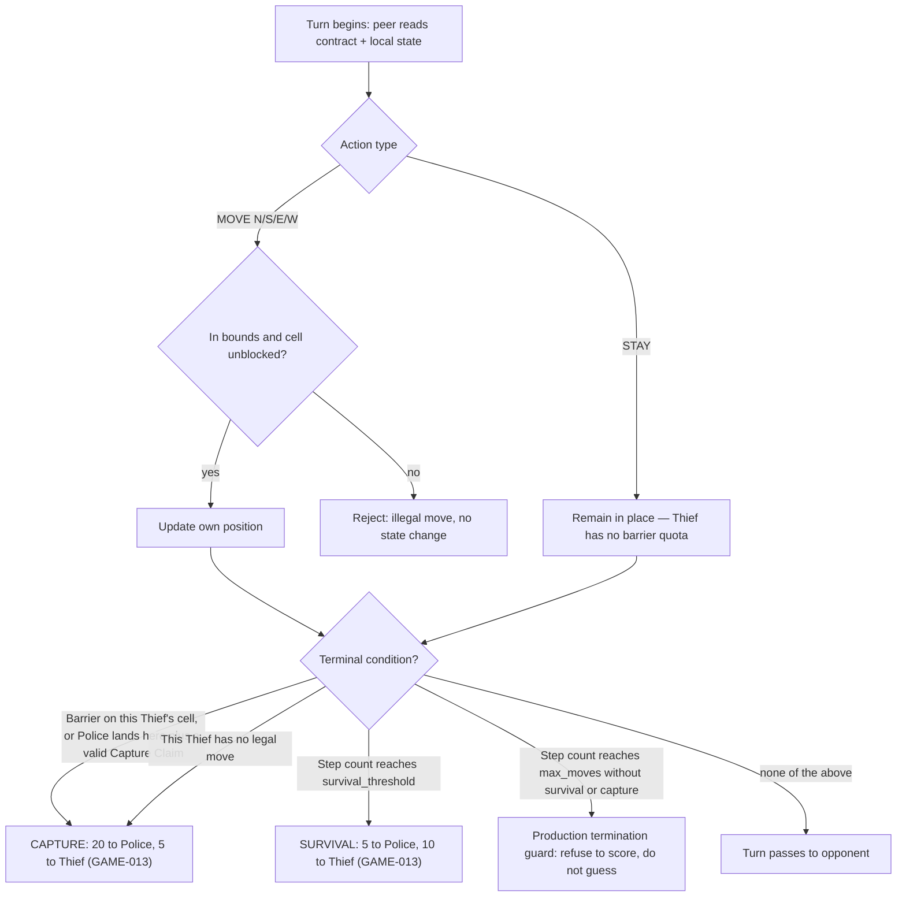

# C01 — Game Core & Configuration (Thief PLAN)

## Approach summary

A pure, deterministic domain module (`src/thief_peer/domain/`) with no network/GUI/clock/credential dependency, plus a configuration boundary (`src/thief_peer/config/`) that validates every Appendix F Fixed/Minimum/Negotiated value before Step 0. This is the component T003/T004/T028/T029 already target; this PLAN carries the mechanism-level detail moved out of the old system-wide `docs/PLAN.md`.

## Internal design

- `domain/board.py` — board geometry, position, legality of a raw move (in-bounds, non-diagonal).
- `domain/rules.py` — barrier-collision legality, capture/entrapment/no-legal-move terminal detection, the hidden-position constraint (this role's domain state never computes the opponent's true position; this Thief's own domain state detects a barrier on its own cell and its own entrapment from its own local position — it is the side entitled to know it).
- `domain/scoring.py` — the fixed GAME-013 score table and the GAME-014 production refusal path.
- `config/` — Appendix F status validator (Fixed/Minimum/Negotiated), shared-JSON/private-TOML precedence (CFG-003), per-game configuration lifecycle (CFG-009, CFG-010).

## State/responsibility ownership

Domain owns board/rules/scoring state exclusively; config owns the validated parameter snapshot every other component reads through `docs/contracts/CT-01-game-state.md`. Neither owns transport, GUI, or persistence.

## Domain test-vector table

| Case | Expected |
|---|---|
| Move N/S/E/W into an open in-bounds cell | Accepted, position updated |
| Move into a wall/edge | Rejected, no state change |
| Diagonal move | Rejected, no state change (GAME-005) |
| Barrier placed on this Thief's current cell | CAPTURE, 20/5 |
| This Thief has no legal move (all neighbors blocked/off-board) | CAPTURE, 20/5 |
| Police lands on this Thief's cell + valid Capture Claim | CAPTURE, 20/5 |
| Step count reaches `survival_threshold` | SURVIVAL, 5/10 |
| Step count reaches `max_moves` without survival/capture, and the two values diverge | Refuse to score (production termination guard) |

## Turn-adjudication flow

## Configuration shape (ADR-001)

`config/game.json` uses the negotiated nested-section shape recorded in `docs/decisions/ADR-001-shared-game-contract-shape.md`, authored and validated by T028/T003 respectively — our own engineering choice pending OPEN-001, not an official schema claim.

## Local test strategy

Unit tests per row of the domain test-vector table; property tests for legal-motion invariants and score-derivation determinism; config schema/precedence tests against the CFG-006/007/008 vectors; the production termination guard refusal path as an explicit negative test, not a skip.

## Component-level integration

Feeds `docs/contracts/CT-01-game-state.md` to every consumer. T029's local two-agent scripted run is this component's own integration gate (`planning/INTEGRATION_PLAN.md`'s `stage1_gate`) before any other component is treated as able to trust its output.

## Known risks

Byte-level Appendix F drift between the two repos if config validation logic diverges — mitigated by both repos sharing the identical `CANONICAL_REQUIREMENTS.md`/`TRACEABILITY.md` copies and by CT-01 being the only public surface. Overengineering the config layer beyond what CFG-001…010 actually require.
